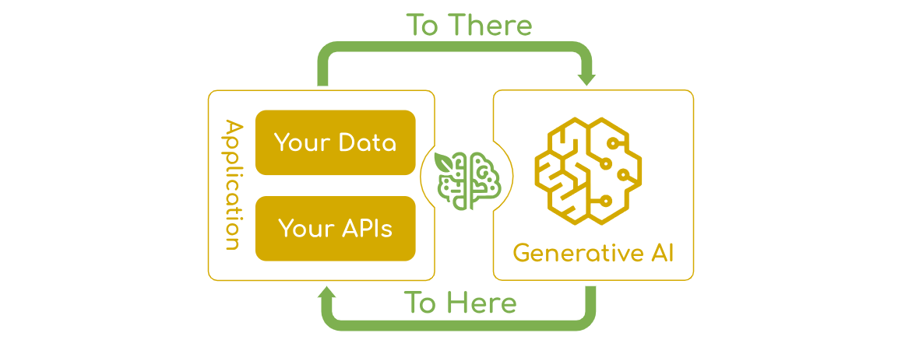
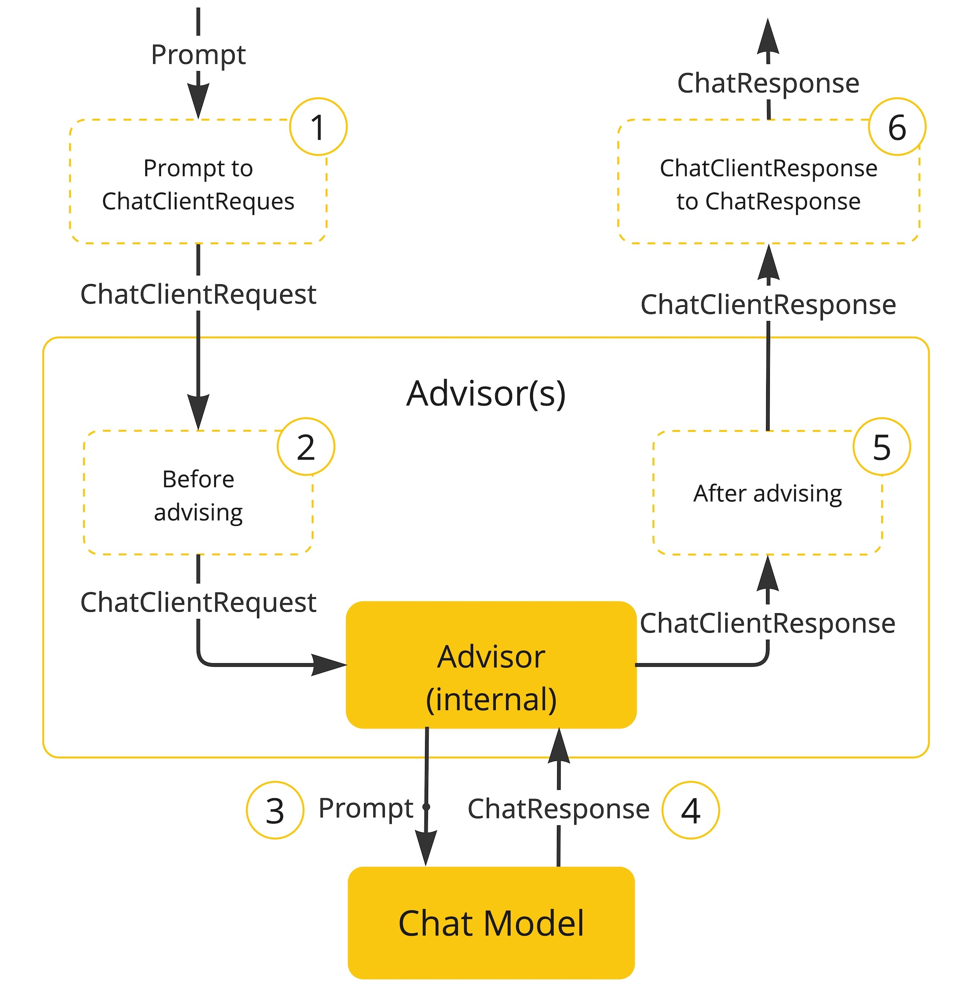
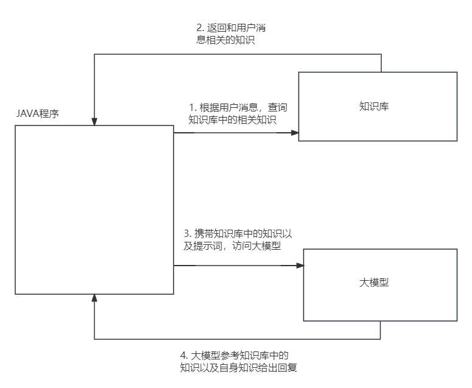
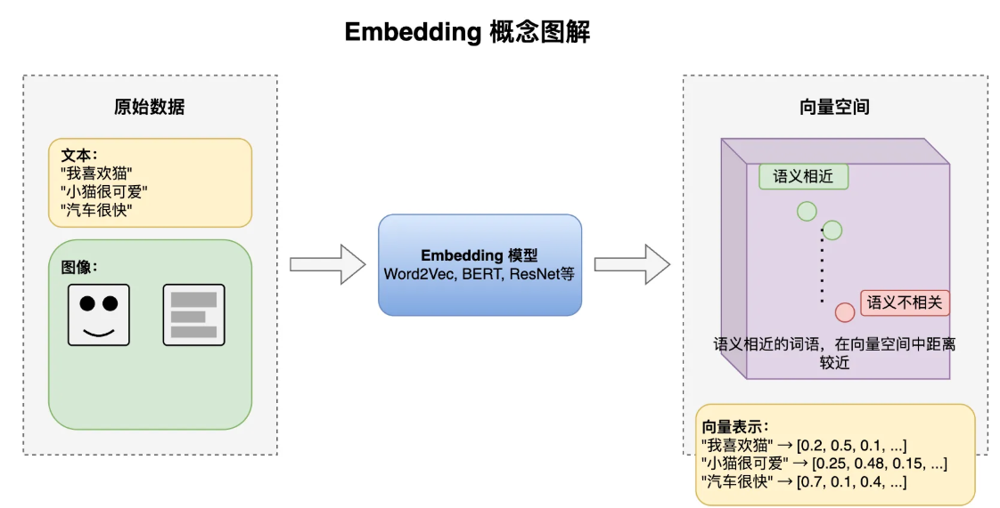
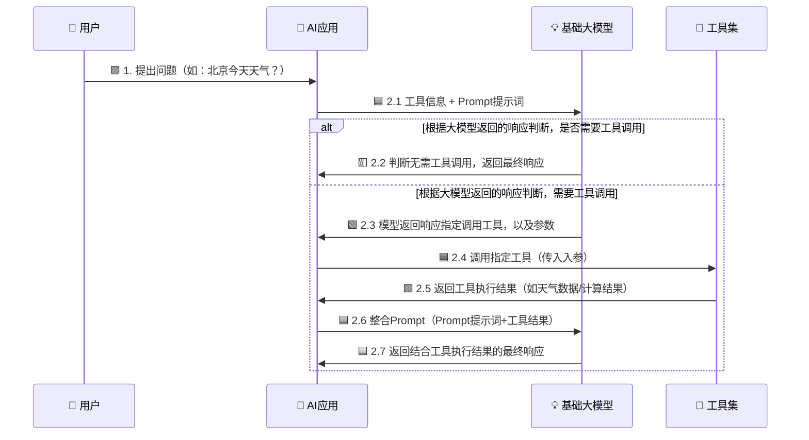

# Spring AI

本节课我们开始学习 `Spring AI 1.0.0`。

在学习之前，大家先不要把 Spring AI 想得太神秘。它本质上还是 Spring 生态里的一套开发框架，只不过它帮我们解决的问题从“访问数据库、访问 Redis”，变成了“访问大模型”。

Spring AI 官方对它的定位可以理解为三句话：

1. `Spring AI` 项目的目标，是让开发者可以更简单地开发包含人工智能能力的应用，而不需要引入不必要的复杂度。
2. 如果大家了解 Python 生态里的 `LangChain`，可以把 Spring AI 理解为 Java / Spring 生态中对标 LangChain 的一套 AI 应用开发框架。
3. Spring AI 要解决的核心问题是：`Connecting your enterprise Data and APIs with AI Models`，也就是把企业自己的数据、业务接口和 AI 模型连接起来。




使用Spring AI 所需的依赖和配置如下：

```xml
<properties>
    <spring-ai.version>1.0.0</spring-ai.version>
</properties>

<dependencyManagement>
    <dependencies>
        <!-- Spring AI BOM：统一管理 Spring AI 相关依赖版本 -->
        <dependency>
            <groupId>org.springframework.ai</groupId>
            <artifactId>spring-ai-bom</artifactId>
            <version>${spring-ai.version}</version>
            <type>pom</type>
            <scope>import</scope>
        </dependency>
    </dependencies>
</dependencyManagement>

<dependencies>
    <!-- Spring AI OpenAI 兼容接口依赖 -->
        <dependency>
            <groupId>org.springframework.ai</groupId>
            <artifactId>spring-ai-starter-model-openai</artifactId>
        </dependency>
</dependencies>
```

这里的 `spring-ai-openai-spring-boot-starter` 不一定只能访问 OpenAI 官方模型。很多国内模型平台、本地模型网关、公司内部模型服务，只要提供的是 OpenAI 兼容接口，通常都可以使用这一套配置方式接入。

```yml
spring:
  ai:
    openai:
      # 模型接口地址。可以是 OpenAI 官方地址，也可以是兼容 OpenAI 协议的第三方平台地址
      base-url: https://dashscope.aliyuncs.com/compatible-mode
      # 模型平台提供的访问密钥，用来证明“你是谁、有没有权限调用模型”
      api-key: your-api-key
      chat:
        options:
          # 具体使用哪个聊天模型，例如 gpt-4o-mini、qwen-plus、deepseek-chat 等
          model: qwen-plus
```

这里重点解释两个配置：

| 配置 | 含义 | 从哪里获取 |
|---|---|---|
| `base-url` | 模型服务的接口地址 | 模型平台控制台、公司内部模型网关文档、本地模型服务地址 |
| `api-key` | 调用模型时使用的密钥 | 模型平台控制台创建，或由公司统一分配 |

大家可以类比以前连数据库：数据库要有 `url`，模型也要有 `base-url`；数据库要有用户名密码，模型也要有 `api-key`；数据库要指定库名和驱动，模型也要指定 `model`。

## Prompt

在使用Spring AI 前，接下来我们先讲 `Prompt`，也就是提示词。因为我们使用模型时，模型到底怎么回答，很大程度由提示词决定。

这里要强调一下，本课程中所说的“模型”，主要指的是大语言模型，也就是 LLM。大语言模型有几个非常明显的特点：

- 它擅长理解自然语言，也擅长生成文本、总结文本、改写文本、抽取信息。
- 它不是数据库，不保证每次都严格返回固定结果。
- 它不是业务系统，不天然知道我们公司的数据和接口。
- 它的输出会受到上下文和提示词的强烈影响。

所以，我们和大模型交互时，不能只问一句“帮我做一下”，而要把任务、背景、要求、输出格式尽量讲清楚。

### Message 角色

现在的大模型提示词通常不是一整段纯文本，而是由多条 `Message` 组成。每条 Message 都有自己的角色。

| 角色 | 作用 | 类比 |
|---|---|---|
| `System` | 设定 AI 的人设、行为准则、背景知识和回答边界 | 幕后导演 |
| `User` | 用户提出的问题、指令或需求 | 提问的人 |
| `Assistant` | 大模型之前的回复，常用于维持多轮对话上下文 | 聊天记录里的 AI 回复 |
| `Tool` / `Function` | 工具执行后的结果，用来告诉模型工具返回了什么 | 外部系统查询结果 |

比如：

```text
System: 你是一名经验丰富的 Java 讲师，回答要适合初学者。
User: 请解释一下什么是 Spring Bean。
Assistant: Spring Bean 就是交给 Spring 容器管理的对象……
User: 那它和 new 出来的对象有什么区别？
```

这里每一行都可以看作一条消息，多条消息组合起来，才构成一次完整的 Prompt。

###  Prompt 核心要点

Spring AI 官方文档中提到，设计 Prompt 时通常需要考虑几个组成部分。

- `Instructions`：明确指令。告诉 AI 要做什么，就像我们给一个同事安排任务一样，越清晰越好。

- `External Context`：外部上下文。把相关背景、资料、约束条件补充进去，让 AI 知道当前任务发生在什么场景里。
- `User Input`：用户输入。也就是用户真正提出的问题或需求。
- `Output Indicator`：输出格式要求。告诉 AI 希望以什么格式返回，比如 JSON、表格、列表等。  // 拿到的是对象 “姓名张三，"

如果我们只是问“帮我分析一下这个病人”，模型不知道病人信息在哪里，也不知道分析目标是什么。更好的 Prompt 是：

```text
你是一名智能分诊助手。
请根据下面的患者描述，判断患者可能需要挂哪个科室。
要求：
1. 只能从 内科、外科、儿科、急诊科 中选择。
2. 给出 1 句简短理由。
3. 使用 JSON 格式返回。

患者描述：发热 3 天，咳嗽，咽痛，无明显胸痛。
```

这个 Prompt 就明显更容易得到稳定结果。

## 简单一轮对话

真正访问大模型时，Spring AI 中最核心的对象之一就是 `ChatClient`。大家可以把 `ChatClient` 类比成以前使用的 `RedissionClient` 或者 `RestTemplate`：`RestTemplate` 用来访问普通 HTTP 服务，`ChatClient` 用来访问聊天模型。


我们先来看下如何得到一个ChatClient对象

```java
import org.springframework.ai.chat.client.ChatClient;
import org.springframework.context.annotation.Bean;
import org.springframework.context.annotation.Configuration;

@Configuration
public class SpringAIConfig {

    /**
     * 创建 ChatClient 对象。
     * ChatClient.Builder 由 Spring AI 自动提供，它会读取 application.yml 中的模型配置。
     */
    @Bean
    public ChatClient chatClient(ChatClient.Builder builder) {
        return builder.build();
    }
}
```

接着定义一个 Controller 测试最简单的一轮对话：

```java
import org.springframework.ai.chat.client.ChatClient;
import org.springframework.web.bind.annotation.GetMapping;
import org.springframework.web.bind.annotation.RequestParam;
import org.springframework.web.bind.annotation.RestController;

@RestController
public class ChatController {

    private final ChatClient chatClient;

    public ChatController(ChatClient chatClient) {
        this.chatClient = chatClient;
    }

    @GetMapping("/ai")
    public String generation(@RequestParam String userInput) {
        return this.chatClient
                .prompt()
                .user(userInput)
                .call()
                .content();
    }
}
```

这段代码的调用链非常重要：`chatClient.prompt().user(userInput).call().content()`。

1. `prompt()`：开始构建一次提示词请求。
2. `user(userInput)`：添加一条用户消息。
3. `call()`：向模型发起同步调用。
4. `content()`：取出模型返回的文本内容。

写完后，可以使用 ApiFox 或浏览器访问：

```text
GET http://localhost:8080/ai?userInput=请用一句话介绍Spring AI
```

## 系统消息

接下来，我们在上一节的基础上再加入系统消息。在ChatClient中添加系统消息有三种方式：

1. 局部添加系统消息
2. 添加默认系统消息
3. 使用动态参数

局部系统消息只对当前这一次调用生效。

```java
@GetMapping("/ai/java-teacher")
public String javaTeacher(@RequestParam String question) {
    return chatClient.prompt()
            .system("你是一名经验丰富的Java讲师，回答要适合初学者，尽量使用大白话。")
            .user(question)
            .call()
            .content();
}
```

如果一个 `ChatClient` 在整个项目中都希望使用同一套系统设定，可以在构建 `ChatClient` 时设置默认系统消息。

```java
@Bean
public ChatClient javaTeacherChatClient(ChatClient.Builder builder) {
    return builder
            .defaultSystem("你是一名经验丰富的Java讲师，回答要清晰、准确、适合初学者。")
            .build();
}
```

有时候系统消息中有一部分内容是动态的。此时，我们可以在系统消息中添加占位符，在执行时动态传递参数填充系统 消息中的占位符

```java
@Bean
public ChatClient dynamicTeacherChatClient(ChatClient.Builder builder) {
    return builder
            // 这里注意，默认情况下占位符的格式是{占位符名称}
            .defaultSystem("你是一名{language}讲师，请使用{style}的方式回答问题。")
            .build();
}
```

```java
@GetMapping("/ai/dynamic-teacher")
public String dynamicTeacher(@RequestParam String question,
                             @RequestParam(defaultValue = "Java") String language,
                             @RequestParam(defaultValue = "大白话") String style) {
    return chatClient
            .prompt()
            .system(prompt -> prompt
                    .param("language", language)
                    .param("style", style))
            .user(question)
            .call()
            .content();
}
```

注意：如果系统消息中写了 `{language}`、`{style}` 这种参数占位符，但是调用时没有提供对应参数，Spring AI 会在模板渲染阶段报错。

## 结构化输出

在和模型交互的过程中，模型给我们返回的通常都是普通字符串。但是在真实项目中，我们经常不希望模型返回一段自然语言，而是希望它返回结构化的数据。

比如让模型生成某个演员的电影作品列表，如果只返回一段普通文本，后端还要自己解析；如果直接返回 Java 对象，后续代码处理就会方便很多。

Spring AI 的 `ChatClient` 提供了一个非常直接的方法：

```java
.call()
.entity(目标类型)
```

官方文档中 `entity()` 的用法看三种情况：普通对象、`List`、`Map`。

### 普通对象

官方文档中第一个例子是：生成某个演员的 5 部电影作品，并把结果映射成一个对象。

先定义一个普通 Java Bean。官方文档里使用的是 `record`，但我们课程中为了和大家前面学习的 Java Bean 保持一致，这里改成普通类。

```java
@Data
public class ActorsFilms {

    private String actor;
    private List<String> movies;
}
```

然后使用 `entity(ActorsFilms.class)` 接收结果：

```java
import org.springframework.ai.chat.client.ChatClient;
import org.springframework.web.bind.annotation.GetMapping;
import org.springframework.web.bind.annotation.RequestParam;
import org.springframework.web.bind.annotation.RestController;

@RestController
public class StructuredOutputController {

    private final ChatClient chatClient;

    public StructuredOutputController(ChatClient chatClient) {
        this.chatClient = chatClient;
    }

    /**
     * 示例请求：GET /ai/actor-films?actor=Tom Hanks
     */
    @GetMapping("/ai/actor-films")
    public ActorsFilms actorFilms(@RequestParam(defaultValue = "Tom Hanks") String actor) {
        return chatClient.prompt()
                .user(user -> user
                        .text("Generate the filmography of 5 movies for {actor}.")
                        .param("actor", actor))
                .call()
                .entity(ActorsFilms.class);
    }
}
```

这里最关键的是：

```java
.entity(ActorsFilms.class)
```

它表示让 Spring AI 尝试把模型输出映射成一个 `ActorsFilms` 对象。

### List 对象

第二种情况：如果最外层返回值本身就是一个 `List`，比如一次生成 Tom Hanks 和 Bill Murray 两个演员的电影作品，就需要使用 `ParameterizedTypeReference`。

```java
import org.springframework.core.ParameterizedTypeReference;
import org.springframework.web.bind.annotation.GetMapping;

import java.util.List;

@GetMapping("/ai/actor-films-list")
public List<ActorsFilms> actorFilmsList() {
    return chatClient.prompt()
            .user("Generate the filmography of 5 movies for Tom Hanks and Bill Murray.")
            .call()
            .entity(new ParameterizedTypeReference<List<ActorsFilms>>() {
            });
}
```

这里的重点是：

```java
.entity(new ParameterizedTypeReference<List<ActorsFilms>>() {
})
```

为什么不能直接写 `List.class`？

因为 Java 泛型存在类型擦除。如果只写 `List.class`，程序只能知道结果是一个 `List`，但不知道 `List` 里面的元素到底是什么类型。所以，当最外层结果是 `List<ActorsFilms>` 时，要用 `ParameterizedTypeReference<List<ActorsFilms>>` 把完整泛型类型告诉 Spring AI。

### Map 对象

第三种情况：如果我们不想提前定义 Java Bean，也可以让模型返回一个 `Map<String, Object>`。

下面这个例子：让模型介绍一座城市，返回一个包含若干字段的 JSON 对象。因为城市信息的字段并不固定（有的城市可能多一个字段，有的少一个），用 `Map` 接收最省事。

```java
import org.springframework.core.ParameterizedTypeReference;
import org.springframework.web.bind.annotation.GetMapping;

import java.util.Map;

@GetMapping("/ai/city-info")
public Map<String, Object> cityInfo() {
    return chatClient.prompt()
            .user("用 JSON 介绍一下北京，包含城市名称、所属国家、人口数量这几个字段")
            .call()
            .entity(new ParameterizedTypeReference<Map<String, Object>>() {
            });
}
```

这里的重点是：

```java
.entity(new ParameterizedTypeReference<Map<String, Object>>() {
})
```

`Map` 的特点是灵活，不需要提前定义类；但是缺点也很明显：字段名和字段类型没有 Java 类约束，后续取值时更容易写错，也可能需要手动类型转换。

所以实际项目中可以这样选择：

| 返回类型 | 写法 | 适合场景 |
|---|---|---|
| 普通对象 | `.entity(ActorsFilms.class)` | 最外层是一个结构稳定的对象 |
| `List<对象>` | `.entity(new ParameterizedTypeReference<List<ActorsFilms>>() {})` | 最外层是一组同类型对象 |
| `Map<String, Object>` | `.entity(new ParameterizedTypeReference<Map<String, Object>>() {})` | 临时验证、字段不稳定、结构比较动态 |

最后再强调一次对象中包含 `List` 的情况：

- `ActorsFilms` 里面有 `List<String> movies`，但最外层是 `ActorsFilms`，所以用 `.entity(ActorsFilms.class)`。
- 只有当最外层本身就是 `List<ActorsFilms>` 时，才使用 `ParameterizedTypeReference<List<ActorsFilms>>`。

## 多轮对话

前面的接口都是一问一答。用户问一句，模型答一句。问题是：真实聊天通常是多论对话。

比如：

```text
用户：我发烧三天了。
模型：还有咳嗽、咽痛吗？
用户：有咳嗽。
```

第三句话“有咳嗽”本身没有完整含义。如果模型不知道前面聊过“发烧三天”，就无法正确理解，但是我们知道模型只有短期记忆。

所以，多轮对话的核是让模型在当前请求中看到之前的聊天记录，而这就是会话记忆。实现会话记忆，本质上要解决四个问题：

1. **存在哪**？

聊天记录要存在哪里？Spring AI 中使用 `ChatMemoryRepository`接口来定义会话记忆的保存行为

2. **存多少？**

聊天记录不能无限制全部塞给模型。原因很简单：模型上下文长度有限，聊天记录越多，请求越慢、费用越高，太久之前的消息可能也没有价值。

Spring AI 中 `ChatMemory` 接口表示会话记忆，它会决定如何管理消息，比如保留最近 N 条消息。

可以这样理解二者关系：存储组件负责“消息放在哪里”，`ChatMemory` 负责“怎么读、怎么写、保留多少”。

3. **怎么存？**

对于一次聊天过程，用户发送的用户消息，以及模型返回的Assistant消息都需要保存到会话记忆中。同时ChatMemory提供了add方法帮我们将消息保存到会话记忆，但是消息的保存其实并不需要我们手动调用add方法，因为Spring AI提供的Advisor会帮助我们自动保存消息。

4. **如何隔离不同会话？**

不同用户、不同窗口、不同业务单据的聊天记录必须隔离。核心思路就是使用 `conversationId`。

比如用户 A 的会话 ID 是 `user-a-session-001`，用户 B 的会话 ID 是 `user-b-session-001`。每次调用模型时带上对应的会话 ID，Spring AI 就能把不同会话的记忆区分开。


### ChatMemoryRepository

ChatMemoryRepository帮我们实现底层的会话记忆存储，根据具体存储位置的不同，比如内存、JDBC、Cassandra、Neo4j 等，Spring AI 提供了ChatMemoryRepository接口的不同实现。在我们课程中我们就是用基于内存的ChatMemoryRepository

```java
@Configuration
public class ChatMemoryConfig {
    
    
        // 注册ChatMemoryRepository，作用是存储消息
    @Bean
    public ChatMemoryRepository chatMemoryRepository() {
        return new InMemoryChatMemoryRepository();
    }
}
```


### ChatMemory

ChatMemory实现对于会话记忆的管理，比如控制ChatMemoryRepository中存储哪些消息。在课程中，我们使用MessageWindowChatMemory该类会控制会话记忆中只保留最近的N条消息。

```java
@Configuration
public class ChatMemoryConfig {
    
    
        // 注册ChatMemoryRepository，作用是存储消息
    @Bean
    public ChatMemoryRepository chatMemoryRepository() {
        return new InMemoryChatMemoryRepository();
    }

    @Bean
    public ChatMemory chatMemory(ChatMemoryRepository chatMemoryRepository) {
        return MessageWindowChatMemory.builder()
                 // 指定ChatMemory的底层存储使用纯内存存储
                .chatMemoryRepository(chatMemoryRepository)
                // 指定窗口中最多包含的消息数量
                .maxMessages(20)
                .build();
    }
}
```


### Advisor

Spring AI 实际使用中，我们不需要每次手动调用方法保存会话中的消息，也不用把历史消息查出来再拼到 Prompt 里发送给模型。而是通过内置的Advisor自动保存会话中的消息，自动拼接会话中的消息到提示词中。

Advisor(接口) 可以理解为 `ChatClient` 调用过程中的拦截器，它们的执行原理如下：

1. 用户代码通过 `ChatClient` 发起请求。
2. 请求不会立刻到模型，而是先经过 Advisor 链。
3. Advisor 可以在请求发送前修改 Prompt，比如加入历史消息、加入检索到的知识、记录日志。
4. 修改后的请求发送给模型。
5. 模型返回响应。
6. 响应也会经过 Advisor 链，Advisor 可以记录响应日志、保存消息等。
7. 最终结果返回给 Controller。

这和大家熟悉的拦截器、过滤器思想非常像：Spring MVC 的拦截器可以在 Controller 前后做增强，Advisor 可以在大模型调用前后做增强。




#### MessageChatMemoryAdvisor


所以我们可以基于Advisor在ChatClient发消息前在提示词中添加会话历史消息，并保存用户发送的用户消息等。在收到模型响应时自动保存模型返回的助手消息。SpringAI已经提供了对应的的Advisor实现类——`MessageChatMemoryAdvisor`

MessageChatMemoryAdvisor 的使用非常简单，代码如下：只需要给 `ChatClient`指定所使用的MessageChatMemoryAdvisor即可，

```java
import org.springframework.ai.chat.client.ChatClient;
import org.springframework.ai.chat.client.advisor.MessageChatMemoryAdvisor;
import org.springframework.ai.chat.memory.ChatMemory;
import org.springframework.ai.chat.memory.InMemoryChatMemoryRepository;
import org.springframework.ai.chat.memory.MessageWindowChatMemory;
import org.springframework.context.annotation.Bean;
import org.springframework.context.annotation.Configuration;

@Configuration
public class ChatMemoryConfig {
    
    
        // 注册ChatMemoryRepository，作用是存储消息
    @Bean
    public ChatMemoryRepository chatMemoryRepository() {
        return new InMemoryChatMemoryRepository();
    }

    @Bean
    public ChatMemory chatMemory(ChatMemoryRepository chatMemoryRepository) {
        return MessageWindowChatMemory.builder()
                 // 指定ChatMemory的底层存储使用纯内存存储
                .chatMemoryRepository(chatMemoryRepository)
                // 指定窗口中最多包含的消息数量
                .maxMessages(20)
                .build();
    }

    @Bean
    public ChatClient memoryChatClient(ChatClient.Builder builder, ChatMemory chatMemory) {
        return builder
                 // 指定默认的advisor，当然也可以局部指定就像局部指定系统消息一样
                .defaultAdvisors(MessageChatMemoryAdvisor.builder(chatMemory).build())
                .build();
    }
}
```

然后定义 Controller：

```java
import org.springframework.ai.chat.client.ChatClient;
import org.springframework.ai.chat.memory.ChatMemory;
import org.springframework.web.bind.annotation.GetMapping;
import org.springframework.web.bind.annotation.RequestParam;
import org.springframework.web.bind.annotation.RestController;

@RestController
public class MemoryChatController {

    private final ChatClient memoryChatClient;

    public MemoryChatController(ChatClient memoryChatClient) {
        this.memoryChatClient = memoryChatClient;
    }

    /**
     * 示例请求：
     * GET /ai/memory?conversationId=1001&message=我叫张三
     * GET /ai/memory?conversationId=1001&message=我叫什么名字
     */
    @GetMapping("/ai/memory")
    public String memory(@RequestParam String conversationId,
                         @RequestParam String message) {
        return memoryChatClient.prompt()
                .user(message)
                 // 实现会话记忆的隔离，指定会话id
                .advisors(advisor -> advisor
                        .param(ChatMemory.CONVERSATION_ID, conversationId))
                .call()
                .content();
    }
}
```

测试时要注意：同一个 `conversationId` 才会共享记忆。换一个 `conversationId`，模型就看不到之前的聊天记录了。

#### SimpleLoggerAdvisor

同时，SpringAI还提供了另外一种Advisor——`SimpleLoggerAdvisor` 它可以帮助我们打印请求和响应日志。

```java
import org.springframework.ai.chat.client.advisor.SimpleLoggerAdvisor;

@Bean
public ChatClient loggerChatClient(ChatClient.Builder builder, ChatMemory chatMemory) {
    return builder
            .defaultAdvisors(new SimpleLoggerAdvisor())
            .buid();
}
```

它的作用不是改变模型能力，而是方便我们观察最终发送给模型的请求是什么、模型返回的响应是什么。

同时，我们还要设置日志输出级别为DEBUG，才能在控制台看到打印出的日志内容

```yml
logging:
  level:
    # 指定SimpleLoggerAdvisor日志输出级别
    org.springframework.ai.chat.client.advisor.SimpleLoggerAdvisor: DEBUG
```


## 流式响应

如果仔细观察我们访问大模型的结果，就会发现我们每次获取的都是大模型完整的回复内容。但是大家回忆一下平时我们在使用DeepSeek，ChatGPT等大模型产品时，每次的回复是一点一点显示出来，而不是一次就显示完整的回复。

这种将响应内容分成多个数据块（chunk）逐步发送给客户端，客户端可以边接收边处理，而无需等待一次接收整个响应内容的响应数据传输方式，我们称之为`流式响应`。

之所以大模型产品普遍采用流式响应，是因为：

- LLM 是逐个 token 生成文本的，如果大模型回复的文本内容比较多，那么用户可能需要等待一个未知的时长才能看到完整响应
- 但是使用流式响应可以改善用户体验，用户几乎可以立即开始阅读大模型的响应，它大大缩短了用户所看到的**首次响应**的时间

### SSE 协议

简单思考一下就会发现，流式响应的实现和普通的HTTP响应一定是不一样的，因为：

- 普通的HTTP响应式一次请求，对应一次响应，一次通信过程结束
- 但是，流式响应式一次请求，对应多次响应

流式响应的实现需要遵循一套特殊的协议 `SSE`，全称 `Server-Sent Events`：

- SSE协议基于 HTTP
- 允许服务端向客户端持续推送事件流，每一个事件流中可以包含事件类型和数据。
- 每个事件必须以两个换行符（\n\n）结尾，它表示“一个 chunk”和“下一个chunk”的物理边界
- 每个事件中的数据就代表流式响应中的一个chunk，事件类型可以作为逻辑标识，标志流式响应的结束。但是流式响应中事件类型是可选的，如果流式响应中没有事件类型也没关系，服务端在流逝响应结束后可以物理断开连接

SSE 返回给前端的数据格式大致如下：

```text
HTTP 200/OK 1.1

content-type: xxxx
......


id: 1
event: message
data: 你好   // {"content": "你好"}


id: 2
event: message
data: ，我是


id: 3
event: message
data: Spring AI


```

| 字段 | 是否必须 | 说明 |
|---|---|---|
| `data` | 必须 | 当前事件携带的数据 |
| `event` | 可选 | 事件类型，前端可按类型监听 |
| `id` | 可选 | 事件 ID，可用于断线重连 |

### Spring AI 流式接口

后端可以返回 `Flux<String>`：

```java
import org.springframework.ai.chat.client.ChatClient;
import org.springframework.http.MediaType;
import org.springframework.web.bind.annotation.GetMapping;
import org.springframework.web.bind.annotation.RequestParam;
import org.springframework.web.bind.annotation.RestController;
import reactor.core.publisher.Flux;

@RestController
public class StreamChatController {

    private final ChatClient chatClient;

    public StreamChatController(ChatClient chatClient) {
        this.chatClient = chatClient;
    }
    @GetMapping(value = "/ai/stream", produces = MediaType.TEXT_EVENT_STREAM_VALUE)
    public Flux<String> stream(@RequestParam String message) {
        return chatClient.prompt()
                .user(message)
                 // 调用call获取的是整个响应，而调用stream获取的是流式响应
                .stream()
                 // 获取流式响应中的chunk数据
                .content()
                .doOnNext(chunk -> System.out.println("模型片段：" + chunk))
                // 流式响应的末尾拼接字符串"[END]"作为自定义结束标志
                .concatWith(Flux.just("[END]"));
    }
}
```

这里重点看三个点：`stream()` 表示使用流式调用，`content()` 把模型输出转换成文本片段流，`concatWith(Flux.just("[END]"))` 在流结束后追加结束标志。

## 让模型使用你的知识

到目前为止，模型主要依赖它自己训练时学到的知识来回答问题。但是在真实业务里，光靠这点知识远远不够，因为

1. **不了解最新动态**。模型训练完成之后再发生的事情，它根本没"见过"。比如 Spring AI 官方就提到，GPT-3.5/4 的训练数据只到 2021 年 9 月，问它之后的新闻、新政策、新文档，它只会告诉你"不知道"。
2. **不具备垂直领域的专业知识**。企业内部的规章制度、项目文档、订单数据、私有业务规则，不可能出现在模型的训练数据里，模型自然也答不上来。
3. **不会调用外部系统**。比如查当前数据库里的库存、调支付接口、读实时天气，这些都不是脑子里"记住"的知识，而是需要主动去外部系统里拿。

所以光让模型"自己想"是不够的，我们必须想办法把**自己的数据**和**外部 API** 接到模型上去用。

针对这件事，Spring AI 官方在给出了三条主流的技术路线：

| 方式 | 核心思想 | 适合场景 |
|---|---|---|
| Fine Tuning（微调） | 拿你的数据去重新训练模型，改动模型内部的权重 | 想固定回答风格、专精某类任务，且团队有足够的算力和样本 |
| Prompt Stuffing（提示词塞数据） | 不动模型，回答前直接把相关资料塞进 Prompt，让模型"边看边答"。其典型工程化实现就是 `RAG` | 企业知识库问答、文档问答（最常用） |
| Tool Calling（工具调用） | 不动模型，给模型一份"工具清单"，让它在需要时主动调用我们写好的服务/接口，去拿实时数据或执行操作 | 调用外部 API、查询数据库、操作业务系统 |

简单对比一下这三条路线：

- `Fine Tuning` 是去改造模型本身，效果最深入，但成本最高，对大多数业务团队来说门槛过高。
- `Prompt Stuffing / RAG` 不改模型，只是答题前先"翻一下小抄"，是企业知识库场景下最常用的方案。
- `Tool Calling` 同样不改模型，但相当于额外给了模型"动手"的能力，让它能主动调外部系统拿数据、做事情。

后两种方式都不需要重新训练模型，部署和迭代都很轻量，是企业落地最常见的两种方式。

### RAG

RAG 全称是 `Retrieval Augmented Generation`，翻译成中文叫“检索增强生成”。

简单理解：RAG 就是给大模型配一个外挂知识库。模型回答前，先去知识库查资料，再结合查到的资料生成答案。

可以类比考试：大模型像一个学习能力很强的学生，但它不能记住所有企业内部资料。RAG 就像允许它在答题前翻我们准备好的“资料小抄”。

RAG 能解决几个核心问题：

- 解决大模型知识过期问题，知识库可以随时更新。
- 让回答更可追溯，答案可以对应到原始文档。
- 无需重新训练模型，也能让 AI 掌握企业内部知识。

RAG 基本原理如下：



流程可以拆成三步：

1. 构造知识库
2. 用户提问后，先根据问题去知识库检索相关内容。
3. 将检索到的内容和用户问题一起放进 Prompt。
4. 大模型参考这些内容生成最终回答。

接下来，我们以做一个"企业员工手册问答助手"为例，构建一个员工手册知识库，让用户可以询问考勤、请假、报销、远程办公等制度问题。

#### 知识的表示

企业知识可能来自各种文档：HTML、PDF、Word、Markdown、TXT 等。那是不是直接把这些文档原文存起来就行？当然不行。

如果直接存原文，检索时大概率只能做关键词匹配。关键词匹配有两个明显问题：

- `词汇鸿沟`：用户说“在家办公”，文档写“远程办公”，关键词可能匹配不到。 
- `缺乏语义理解`：只看词有没有出现，不理解句子真正含义。  

所以 RAG 通常会把文本转成向量。

向量可以理解为文本在数学空间中的坐标：一段文本可以表示成一个向量，含义相近的文本向量距离更近，含义差异大的文本向量距离更远。

把文本转成向量的过程叫 `Embedding`。实现 Embedding 的模型叫 `EmbeddingModel`。我们把文本输入给 EmbeddingModel，它输出对应向量。




总结一句：为了更好地按语义检索知识，我们需要先把知识文本通过 EmbeddingModel 转成向量。

这些向量要存在哪里？就需要向量数据库。常见向量数据库包括 Milvus、Chroma、Pinecone、RedisSearch、Elasticsearch。本课程中我们使用 Elasticsearch 作为向量存储。

#### 知识库的构建

知识库构建本质上是一个 `ETL` 流程。

| 阶段 | 英文 | 作用 |
|---|---|---|
| E | Extract | 读取原始文档 |
| T | Transform | 清洗、切分、转换文档 |
| L | Load | 写入目标存储，比如向量数据库 |

RAG 的 ETL 流程通常是离线处理的。也就是说，并不是用户每次提问时才临时读取所有文档、切分、向量化、写入数据库。那样太慢了。

正确流程是：提前把企业文档读取出来，切分成适合检索的小段，调用 EmbeddingModel 转成向量，写入向量数据库，用户提问时只做检索和生成。

#### 文档读取

Spring AI 中读取文档的核心接口可以简化理解为 `DocumentReader`。

| Reader | 适合读取 |
|---|---|
| `TextReader` | TXT、普通文本 |
| `JsonReader` | JSON 文件 |
| `MarkdownDocumentReader` | Markdown 文档 |
| `PagePdfDocumentReader` | PDF 文档 |
| `TikaDocumentReader` | 多种复杂文件格式 |

本课程中我们使用 `TextReader`，因为它最简单，适合先理解完整流程。

接下来我们把一份"员工手册节选"做成一个文档文件。在 `src/main/resources/document` 目录下新建 `employee-handbook.txt`，内容如下（节选，可按需扩充）：

```text
员工手册节选

考勤与工作时间：公司实行标准工作制，工作时间为周一至周五 9:00 至 18:00，中午 12:00 至 13:30 为午休时间。员工因交通、天气或其他原因无法按时到岗时，应提前通过企业微信向直属主管说明情况。未经说明且超过规定时间未到岗的，按迟到或旷工处理。

请假与审批：员工请假应提前提交申请，并说明请假类型、起止时间和请假原因。病假需在返岗后补充病假证明或就诊记录。年假、事假、调休等申请由直属主管审批。连续请假超过三天的，还需要部门负责人确认。

报销与发票：员工因公产生的交通、住宿、会议等费用，可以在费用发生后 30 天内提交报销申请。申请时应上传真实、完整、合规的发票和费用说明。报销单据应与实际业务一致。个人消费、无关招待、无法说明业务用途的费用，不属于公司报销范围。

远程办公：员工因特殊情况需要远程办公时，应提前向直属主管申请，并说明远程办公日期、工作安排和联系方式。远程办公期间，员工应保持工作时间内在线，及时响应会议、消息和任务协作。涉及客户资料、合同、财务数据等敏感信息时，应使用公司批准的设备和网络环境。

信息安全：员工不得将公司账号、密码、验证码提供给他人，也不得使用私人网盘保存公司内部资料。离职、转岗或项目结束时，应按要求归还设备、移交文档，并删除个人设备中保存的公司敏感信息。
```

读取代码如下：

```java
import org.springframework.ai.document.Document;
import org.springframework.ai.reader.TextReader;
import org.springframework.core.io.Resource;
import org.springframework.core.io.ResourceLoader;
import org.springframework.stereotype.Service;

import java.util.List;

@Service
public class DocumentReadService {

    private final ResourceLoader resourceLoader;

    public DocumentReadService(ResourceLoader resourceLoader) {
        this.resourceLoader = resourceLoader;
    }

    public List<Document> readEmployeeHandbook() {
        Resource resource = resourceLoader.getResource("classpath:document/employee-handbook.txt");
        TextReader textReader = new TextReader(resource);
        textReader.getCustomMetadata().put("source", "employee-handbook.txt");
        return textReader.get();
    }
}
```

`Document` 可以理解为 Spring AI 对"知识片段"的统一抽象。它通常包含 `text` 文本内容和 `metadata` 元数据，比如来源文件、页码、分类、时间等。在我们这个案例里，`TextReader` 读出来后就是一个 `Document`，`text` 就是整份员工手册节选，`metadata` 里带上了 `source=employee-handbook.txt`，方便后面追溯每段答案来自哪个文件。

#### 文档转化

读取出来的文档往往比较长，不适合直接写入向量库，需要先做切分。

但是这里有个非常关键的问题先要想清楚：**为什么必须切？整篇直接灌进去不行吗？**

我们结合刚才那份员工手册文档看，至少有三个原因：

1. **一个向量只能"代表"一段语义，整篇文档算出的向量会"平均化"**
   
2. **大模型有上下文窗口上限**
   
3. **不切分还会带来噪声和成本问题**

Spring AI 中负责文档转换的统一接口是 `DocumentTransformer`：

```java
public interface DocumentTransformer extends Function<List<Document>, List<Document>> {

    default List<Document> transform(List<Document> transform) {
        return apply(transform);
    }
}
```

 Spring AI 官方 `ETL Pipeline` 文档里提供的切分文档的DocumentTransformer只有一个  `TokenTextSplitter`，它包含如下参数：

- `chunkSize`（默认 800）：**每个 chunk 的目标 token 数**。切分时以这个值作为参考长度。
- `minChunkSizeChars`（默认 350）：**chunk 的最小字符数**。切分时只会在大于这个长度之后再去找标点切分点，避免切出过短的小碎片。
- `minChunkLengthToEmbed`（默认 5）：**chunk 被保留的最小长度**。切完之后如果一段比这个值还短，就直接丢弃，不会进入最终结果。
- `maxNumChunks`（默认 10000）：**一份文档最多切成多少段**。超过就停止切分，主要起兜底保护作用，防止异常文本切出几十万段。
- `keepSeparator`（默认 true）：**是否保留分隔符**（主要是换行 `\n`）。`true` 时保留，文档段落格式更接近原文；`false` 时去掉，文本更紧凑。

这里要注意：Spring AI 1.x 的 `TokenTextSplitter` **没有** `withPunctuationMarks` 配置方法，句子边界字符在源码中是固定的：英文句号 `.`、英文问号 `?`、英文感叹号 `!` 和换行 `\n`。也就是说，它不能直接通过 builder 配置中文句号 `。`、中文问号 `？`、中文感叹号 `！`、中文分号 `；`。

了解了参数，再大致说一下它的切分思路：先按 `chunkSize` 切出候选 chunk；**只有**当剩余 token 数**超过** `chunkSize` 时，才会在 `minChunkSizeChars` 之后、最靠后的一个内置边界字符处截断，让 chunk 尽量落在句子边界上；最后过滤掉长度小于 `minChunkLengthToEmbed` 的小碎片。完整的规则细节可以参考附录的[TokenTextSplitter 完整切分规则](#tokentextsplitter-完整切分规则)。

针对我们的"员工手册"案例，可以这样来定义TokenTextSplitter：

```java
import org.springframework.ai.document.Document;
import org.springframework.ai.transformer.splitter.TokenTextSplitter;
import org.springframework.stereotype.Service;

import java.util.List;

@Service
public class DocumentSplitService {

    public List<Document> split(List<Document> documents) {
        // 使用 builder 方式构造 TokenTextSplitter，可读性更好
        TokenTextSplitter splitter = TokenTextSplitter.builder()
                // 员工手册每个小节都不长，这里把目标长度调小，方便按小节附近切开
                .withChunkSize(160)
                // 小节段落通常在百字以上，80 个字符后再找边界，避免切得太碎
                .withMinChunkSizeChars(80)
                // 切完之后，长度小于 5 个字符的 chunk 会被直接丢弃（基本是噪声）
                .withMinChunkLengthToEmbed(5)
                // 示例文档较短，100 段已经足够作为保护上限
                .withMaxNumChunks(100)
                // 保留换行等分隔符，让段落格式更接近原文（方便后续阅读和调试）
                .withKeepSeparator(true)
                .build();

        return splitter.apply(documents);
    }
}
```

切分参数没有"万能值"，但对中文知识库类 RAG 项目，有几条建议：

1. **chunk 大小要跟文档粒度匹配**
   像员工手册这种每个小节本来就不长的文档，可以先从 100~300 token 开始；长篇文章或报告再考虑 300~800 token。太小语义不完整，太大则容易把多个制度主题混在一个向量里。
2. **chunk 之间保留 10%~20% 的重叠（chunk overlap）**
   切分时让相邻 chunk 共享一小段内容（比如 50~150 token），可以避免一句关键描述刚好被切到两段之间、导致两段都检索不命中。重叠比例过大则会浪费存储和 token 成本。
3. **优先按"语义边界"切，而不是按字符硬切**
   能按标题切就按标题切，能按段落切就按段落切，再退而求其次按句子切。`TokenTextSplitter` 会优先在内置的英文标点和换行处做边界对齐。
4. **不同类型文档应使用不同切分策略**
   - 结构化文档（Markdown、HTML）：优先按章节、标题切。
   - 长篇文章（PDF、Word）：按段落 + 句子切，加 overlap。
   - 问答、FAQ 类：以"一条 QA"为最小单元，不强切。
   - 代码：按函数/类切，避免切断函数体。
6. **切分不是一次性工作，要持续监控**
   线上跑一段时间后，看哪些用户问题召回不到、或者召回了无关内容，回过头调整 chunk 大小、overlap、预切分策略和段落结构，是一个迭代过程。

#### 文档写入

文档写入的核心接口是 `DocumentWriter`：

```java
public interface DocumentWriter extends Consumer<List<Document>> {

    default void write(List<Document> documents) {
        accept(documents);
    }
}
```

在 RAG 中，我们通常写入的是向量数据库，所以更常用的是 `VectorStore`。

```java
public interface VectorStore extends DocumentWriter, VectorStoreRetriever {

    void add(List<Document> documents);

    // 其他方法暂时先不关注
}
```

`VectorStore` 可以理解为 Spring AI 对向量数据库的统一抽象。底层可以是 Elasticsearch、Redis、Chroma、Milvus 等，不同的向量数据库有不同的VectorStore实现。

我们使用 Elasticsearch 存储向量，需要引入依赖：

```xml
    <dependency>
        <groupId>org.springframework.ai</groupId>
        <artifactId>spring-ai-starter-vector-store-elasticsearch</artifactId>
    </dependency>
```

这里没有单独写 `<version>`，是因为前面已经通过 `spring-ai-bom` 统一管理了 Spring AI 相关依赖的版本。

同时还需要配置 Embedding 模型。因为写入向量库时，文本必须先转成向量。

```yml
spring:
  ai:
    openai:
      base-url: https://dashscope.aliyuncs.com/compatible-mode
      api-key: your-api-key
      chat:
        options:
          model:qwen-plus
      embedding:
        options:
          model: text-embedding-v3
          dimensions: 1024 
    vectorstore:
      elasticsearch:
        index-name: spring-ai-docs
        dimensions: 1024

  elasticsearch:
    uris: http://ip地址:9200
```

| 参数 | 含义 |  |
|---|---|---|
| `index-name` | Elasticsearch 索引名 |  |
| `dimensions` | 向量维度，必须和 Embedding 模型输出维度一致 |  |
| `spring.elasticsearch.uris` | Elasticsearch 服务地址 |  |

`VectorStore` 在保存文档时，并不是直接把文本原样写入向量库。它会先调用配置好的 Embedding 模型，把文档文本转成向量，然后再把向量和文档内容一起保存到向量数据库。

```java
import org.springframework.ai.document.Document;
import org.springframework.ai.vectorstore.VectorStore;
import org.springframework.stereotype.Service;

import java.util.List;

@Service
public class DocumentWriteService {

    private final VectorStore vectorStore;

    public DocumentWriteService(VectorStore vectorStore) {
        this.vectorStore = vectorStore;
    }

    public void write(List<Document> documents) {
        // add方法会先完成Embedding向量化，再写入向量数据库
        vectorStore.add(documents);
    }
}
```

#### 完整 ETL Controller

把读取、切分、写入串起来：

```java
import org.springframework.ai.document.Document;
import org.springframework.ai.reader.TextReader;
import org.springframework.ai.transformer.splitter.TokenTextSplitter;
import org.springframework.ai.vectorstore.VectorStore;
import org.springframework.core.io.Resource;
import org.springframework.core.io.ResourceLoader;
import org.springframework.web.bind.annotation.PostMapping;
import org.springframework.web.bind.annotation.RestController;

import java.util.List;

@RestController
public class RagEtlController {

    private final ResourceLoader resourceLoader;
    private final VectorStore vectorStore;

    public RagEtlController(ResourceLoader resourceLoader, VectorStore vectorStore) {
        this.resourceLoader = resourceLoader;
        this.vectorStore = vectorStore;
    }

    @PostMapping("/ai/rag/etl")
    public String etl() {
        Resource resource = resourceLoader.getResource("classpath:document/employee-handbook.txt");
        TextReader textReader = new TextReader(resource);
        textReader.getCustomMetadata().put("source", "employee-handbook.txt");
        List<Document> documents = textReader.get();

        TokenTextSplitter splitter = TokenTextSplitter.builder()
                .withChunkSize(160)
                .withMinChunkSizeChars(80)
                .withMinChunkLengthToEmbed(5)
                .withMaxNumChunks(100)
                .withKeepSeparator(true)
                .build();
        List<Document> splitDocuments = splitter.apply(documents);

        vectorStore.add(splitDocuments);

        return "ETL完成，写入文档片段数量：" + splitDocuments.size();
    }
}
```

#### 知识检索理论

文档中的知识在经过了ETL流程后，就以向量的形式存储到了向量数据库中。当用户提出问题后，如何从向量数据库中找到和用户问题相关的知识呢？其实，思路也很简单，就是将用户的问题也用同一个向量模型转化为向量，然后计算用户的问题向量与知识库中向量的相似度，相似度越高，则说明改向量所代表的知识与用户问题越相关。

如何判断向量之间的相关性呢？通过`余弦相似度`，其值基于向量点积和模长推导，对应的公式如下：
$$
\cos\theta = \frac{\vec{a} \cdot \vec{b}}{|\vec{a}| \cdot |\vec{b}|}
$$


其中$\vec{a}$和 $\vec{b}$是两个非零向量，$\theta$ 是它们的夹角，$\vec{a} \cdot \vec{b}$是点积，$|\vec{a}|$、$|\vec{b}|$是向量模长。

1. 当 cos*θ*=1 时，*θ*=0∘，两向量方向完全相同（相似度最高）。
2. 当 cos*θ*=0 时，*θ*=90∘，两向量垂直（无任何方向关联）。
3. 当 cos*θ*=−1 时，*θ*=180∘，两向量方向完全相反（相似度最低）。

#### 知识检索及自动注入的实现

首先需要引入如下依赖：

```xml
<dependency>
    <groupId>org.springframework.ai</groupId>
    <artifactId>spring-ai-advisors-vector-store</artifactId>
</dependency>
```


知识入库后，用户提问时就要做两件事：

1. 从向量数据库检索相关知识。
2. 把检索到的知识放进 Prompt，让模型参考后回答。

Spring AI 提供了 `QuestionAnswerAdvisor` 帮我们完成这个流程。

简单理解：`QuestionAnswerAdvisor` 是一个专门用于 RAG 问答的 Advisor，它会在调用模型前，根据用户问题去 `VectorStore` 检索相关文档，并把文档内容**加入 Prompt**。

```java
import org.springframework.ai.chat.client.ChatClient;
import org.springframework.ai.chat.client.advisor.vectorstore.QuestionAnswerAdvisor;
import org.springframework.ai.vectorstore.SearchRequest;
import org.springframework.ai.vectorstore.VectorStore;
import org.springframework.web.bind.annotation.GetMapping;
import org.springframework.web.bind.annotation.RequestParam;
import org.springframework.web.bind.annotation.RestController;

@RestController
public class RagChatController {

    private final ChatClient chatClient;
    private final VectorStore vectorStore;

    public RagChatController(ChatClient chatClient, VectorStore vectorStore) {
        this.chatClient = chatClient;
        this.vectorStore = vectorStore;
    }

    @GetMapping("/ai/rag/chat")
    public String ragChat(@RequestParam String question) {
        QuestionAnswerAdvisor advisor = QuestionAnswerAdvisor
                // 设置用来访问向量数据库的VectorStore对象
                .builder(vectorStore)
                 // 这只查询请求
                .searchRequest(SearchRequest.builder()
                        .topK(5)
                        .similarityThreshold(0.7)
                        .build())
                .build();

        return chatClient.prompt()
                 // 设置实现检索，以及将检索结果自动拼接到提示词的Advisor对象
                .advisors(advisor)
                .user(question)
                .call()
                .content();
    }
}
```

这里重点理解两个参数：

| 参数 | 作用 |
|---|---|
| `topK` | 最多检索几个相关片段 |
| `similarityThreshold` | 相似度低于阈值的片段不要 |

如果 `topK` 太小，可能漏掉关键信息；如果太大，Prompt 会变长，噪声也会增加。如果阈值太高，可能查不到内容；如果太低，可能把不相关内容塞给模型。

RAG 调优很多时候就是在调这些参数，以及调文档切分策略。

### Tool Calling

前面 RAG 解决的是“让模型看我们的知识”。但是很多业务场景中，模型不只是要看资料，还要调用系统能力。

比如查询今天北京天气、查询某个订单状态、创建一条待办事项、调用挂号接口、根据患者 ID 查询病历摘要。

这就需要 `Tool Calling`，也叫工具调用。

Spring AI 官方提到，Tools 主要用于两类场景：

1. `Information Retrieval`：信息检索。让模型调用工具查询外部信息，例如天气、库存、订单、病历。
2. `Taking Actions`：执行动作。让模型调用工具完成某个操作，例如创建工单、发送消息、提交表单。

#### 代码层面什么是 Tool

在 Spring AI 中，代码层面可以把一个 Java 方法暴露成 Tool。

也就是说：一个带有工具描述的方法，就是模型可以选择调用的能力。

最常用的是声明式定义，也就是使用 `@Tool` 注解。

```java
import org.springframework.ai.tool.annotation.Tool;
import org.springframework.ai.tool.annotation.ToolParam;
import org.springframework.stereotype.Component;

@Component
public class WeatherTools {

    @Tool(description = "根据城市名称查询当前天气")
    public String getWeather(
            @ToolParam(description = "城市名称，例如北京、上海、广州") String city) {
        if ("北京".equals(city)) {
            return "北京今天晴，气温 18 到 28 摄氏度。";
        }
        return city + "今天多云，气温 20 到 26 摄氏度。";
    }
}
```

| 注解 | 作用 |
|---|---|
| `@Tool` | 标记当前方法可以作为工具暴露给模型，并描述工具用途 |
| `@ToolParam` | 描述方法参数含义，帮助模型正确生成工具入参 |

这里要特别注意：模型不是直接读 Java 代码。模型主要根据工具名称、工具描述、参数描述来判断是否调用工具。所以描述一定要清楚。

#### 工具调用过程

工具调用的整体流程如下：



用大白话讲：应用先把“有哪些工具可用”告诉模型；模型根据用户问题判断要不要调用工具；如果需要调用，模型返回工具名和参数；Spring AI 根据工具名和参数调用对应 Java 方法；工具返回结果；Spring AI 再把工具结果交给模型；模型基于工具结果组织最终回答。

所以真正执行工具的不是模型本身，而是我们的 Java 应用。

如果让我们定义的Tool生效呢？只需要把定义好的tool设置给ChatClient对象即可

```java
import org.springframework.ai.chat.client.ChatClient;
import org.springframework.web.bind.annotation.GetMapping;
import org.springframework.web.bind.annotation.RequestParam;
import org.springframework.web.bind.annotation.RestController;

@RestController
public class ToolChatController {

    private final ChatClient chatClient;
    private final WeatherTools weatherTools;

    public ToolChatController(ChatClient chatClient, WeatherTools weatherTools) {
        this.chatClient = chatClient;
        this.weatherTools = weatherTools;
    }

    @GetMapping("/ai/tool/weather")
    public String weather(@RequestParam String question) {
        return chatClient.prompt()
                .user(question)
                // tools 方法可以接收一个或多个工具对象
                // Spring AI 会自动扫描其中标了 @Tool 的方法并注册给本次调用
                .tools(weatherTools)
                .call()
                .content();
    }
}
```

当用户问"北京今天天气怎么样"时，模型会发现普通语言模型本身不知道实时天气，于是选择调用 `getWeather` 工具。

## 附录

### Prompt 优化技巧

下面补充一些常见 Prompt 技巧。大家先不用死记，先理解它们分别解决什么问题。

给 AI 提供清晰的任务描述和角色定位，帮助模型理解背景和期望。

```text
系统：你是一位经验丰富的 Python 教师，擅长向初学者解释编程概念。
用户：请解释 Python 中的列表推导式，包括基本语法和 2-3 个实用示例。
```

提供足够的上下文信息和期望输出格式，减少模型不确定性。

```text
请提供一个社交媒体营销计划，针对一款新上市的智能手表。计划应包含：
1. 目标受众描述
2. 三个内容主题
3. 每个平台的内容类型建议
4. 发布频率建议

示例格式：
目标受众：[描述]
内容主题：[主题1]，[主题2]，[主题3]
平台策略：[平台] - [内容类型] - [频率]
```

引导模型分步骤思考，提高复杂问题的准确性。

```text
问题：一个商店售卖 T 恤，每件 15 元。如果购买 5 件以上可以享受 8 折优惠。小明买了 7 件 T 恤，他需要支付多少钱？

请一步步思考解决这个问题：
1. 首先计算 7 件 T 恤的原价
2. 确定是否符合折扣条件
3. 如果符合，计算折扣后的价格
4. 得出最终支付金额
```

通过提供几个输入输出示例，帮助模型理解任务模式。

```text
我将给你一些情感分析的例子，然后请你按照同样的方式分析新句子的情感倾向。

输入："这家餐厅的服务太差了，等了一个小时才上菜"
输出：负面，因为描述了长时间等待和差评服务

输入："新买的手机屏幕清晰，电池也很耐用"
输出：正面，因为赞扬了产品的多个方面

现在分析这个句子：
"这本书内容还行，但是价格有点贵"
```

让模型检查自己的输出，提高复杂任务的可靠性。

```text
解决以下概率问题：
从一副标准扑克牌中随机抽取两张牌，求抽到至少一张红桃的概率。

首先给出你的解答，然后：
1. 检查你的推理过程是否存在逻辑错误
2. 验证你使用的概率公式是否正确
3. 检查计算步骤是否有误
4. 如果发现任何问题，提供修正后的解答
```

当答案需要依据材料时，要求模型说明依据，降低胡编乱造概率。

```text
请解释光合作用的过程及其在植物生长中的作用。在回答中：
1. 提供光合作用的科学定义
2. 解释主要的化学反应
3. 描述影响光合作用效率的关键因素
4. 说明其对生态系统的重要性

对于任何可能需要具体数据或研究支持的陈述，请明确指出这些信息的来源，并说明这些信息的可靠性。
```

要求模型从不同角色或专业视角分析问题，让答案更全面。

```text
分析“城市应该禁止私家车进入市中心”这一提议：

请从以下 4 个不同角度分析：
1. 环保专家视角
2. 经济学家视角
3. 市中心商户视角
4. 通勤居民视角

对每个视角：
- 提供支持该提议的 2 个论点
- 提供反对该提议的 2 个论点
- 分析可能的折中方案
```

### TokenTextSplitter 完整切分规则

日常使用时，可以把 `TokenTextSplitter` 理解为一个“按 token 长度切分、尽量保持语句完整”的工具。它的大致过程如下：

1. 先把文档转换成 token，并以 `chunkSize` 作为每段的目标长度。
2. 文档较长时，先取出一段候选文本；如果其中有合适的英文标点或换行，并且已经达到 `minChunkSizeChars`，就优先在这里切开，让边界尽量自然。
3. 如果找不到合适的边界，就按当前长度直接切分，剩余内容继续留给下一段处理。
4. 根据 `keepSeparator` 决定是否保留换行等分隔符，并丢弃短于 `minChunkLengthToEmbed` 的零碎片段。
5. 重复上述过程，直到文档处理完，或达到 `maxNumChunks` 设置的段数上限。

需要注意：Spring AI 1.x 默认识别的边界主要是英文句号 `.`、问号 `?`、感叹号 `!` 和换行 `\n`，不包含中文标点 `。`、`？`、`！`、`；`。因此中文文档最好保留清晰的段落换行，或在切分前先按标题、段落等语义边界预切分。

### 工业级 RAG 常见增强方案

课堂中我们只展示了最基础的 RAG：用户问题进入系统后，直接到向量数据库检索相关片段，然后把片段塞进 Prompt 交给大模型回答。但在真实工业级场景中，RAG 往往会做很多增强，常见方案如下：

- 查询改写（Query Rewrite）：先让模型把用户口语化、模糊、不完整的问题改写成更适合检索的标准问题，提高召回质量。
- 多查询扩展（Multi-Query）：针对同一个用户问题生成多个不同表达方式的问题，分别检索后合并结果，减少“问法不同导致搜不到”的问题。
- HyDE（Hypothetical Document Embeddings）：先让模型根据问题生成一段“假想答案/假想文档”，再用这段文本去做向量检索，适合用户问题很短但语义不充分的场景。
- 混合检索（Hybrid Search）：同时使用向量检索和关键词检索，向量检索擅长语义相似，关键词检索擅长精确匹配专有名词、编号、术语，两者互补。   
- 元数据过滤（Metadata Filter）：检索时根据文档来源、时间、部门、权限、业务类型等元数据先过滤范围，避免把不该看的或不相关领域的知识召回。
- 上下文窗口扩展（Context Window Expansion）：检索命中某个片段后，把它前后的相邻片段也一起带上，解决单个片段上下文不完整的问题。
- ReRank（重排序/精排）：向量库相似度通常是“粗排”，它只比较“问题向量”和“文档向量”在向量空间里的距离，速度快但判断较粗；ReRank 会把用户问题和候选文档成对输入给专门的重排模型，让模型更细致地判断“这段文档是否真的能回答这个问题”，再重新排序，所以叫“精排”。
- 多路召回（Multi-Retriever）：同时从向量库、数据库、搜索引擎、知识图谱等多个来源召回信息，再统一融合。

