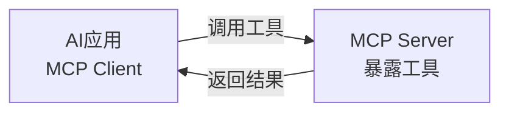
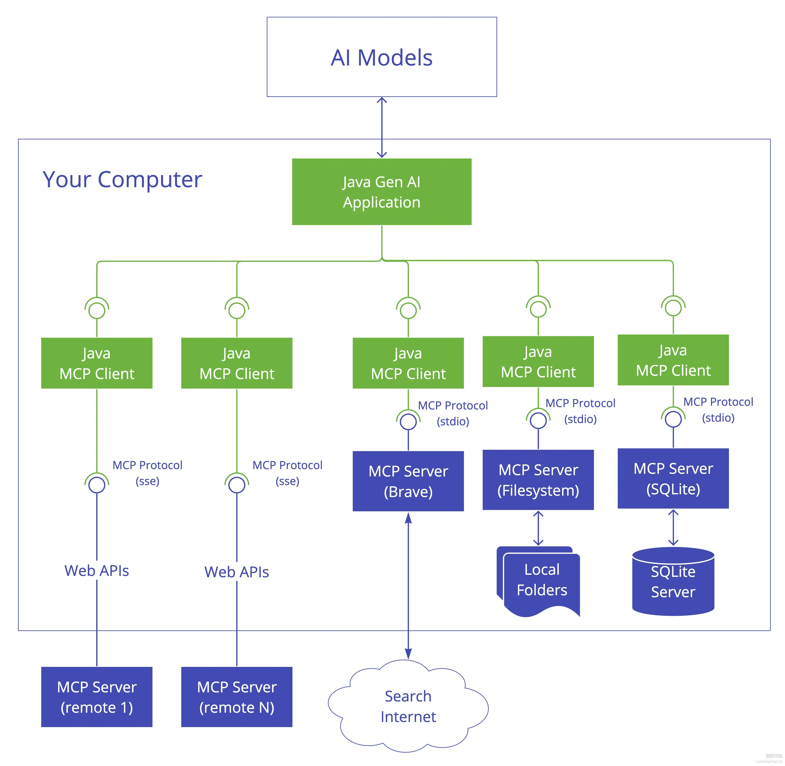
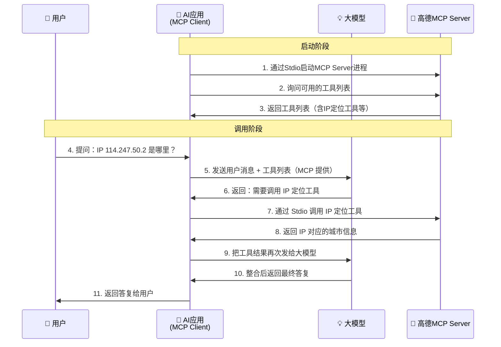
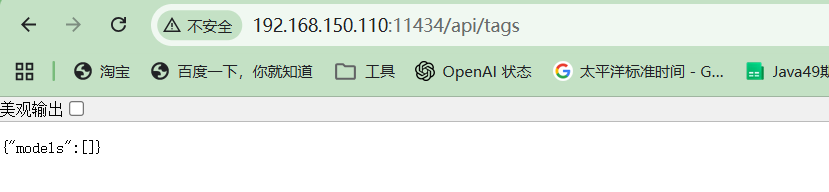
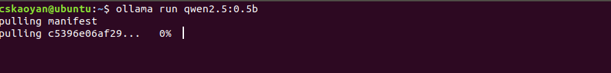
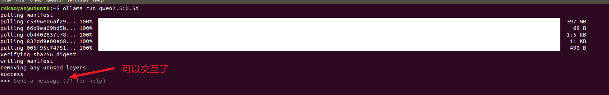

# Spring AI-2

在 Spring AI 的第一阶段，我们已经学习了 Spring AI 的核心使用方式：与大模型交互、Prompt、结构化输出、多轮对话、流式响应、RAG、Tool Calling 等。

但是仅靠这些还不够，在实际项目开发中，我们还会遇到以下三类问题：

1. **工具调用受限**：我们的 Tool 只能在自己的 Java 项目里被大模型调用，没办法跨语言、跨项目复用 —— 怎么解决？
2. **模型能力受限**：到目前为止我们只让模型处理文字，但实际场景里用户经常会传图片、传音频 —— 怎么解决？
3. **模型部署受限**：我们一直在调阿里云、OpenAI 的在线 API，但在很多场景下我们需要把模型部署在自己的服务器上 —— 怎么解决？

这三个问题，分别对应了本节课要讲的三个知识点：**MCP、多模态、模型私有化部署**。

---

## MCP

我们先回到第一个问题。在前面学习 Tool Calling 的时候，我们写过类似这样的工具：

```java
public class WeatherTools {
    @Tool(description = "根据城市名查询天气")
    public String getWeather(String city, String date) {
        // 调天气接口
        return "晴，25度";
    }
}
```

这个工具写得很好，但它有明显的局限：

- **语言限制**：这个工具只能在 Java 项目里被大模型调用。如果另一个团队用 Python 写 AI 应用，他们没法直接用我们写好的这个工具。
- **难以复用**：今天我要查天气，自己实现一遍；明天另一个团队也要查天气，他们也要从头实现一遍

那有没有一种方式，让工具的开发和使用变成"标准化"的？任何人开发的工具，任何人都可以拿来直接给自己的 AI 用 —— 就像 USB 接口一样，谁的设备都能插上去 , **MCP**协议就是为此而诞生的。

MCP 的全称是 **Model Context Protocol（模型上下文协议）**，是由 Anthropic 公司（也就是 Claude 的开发公司）在 2024 年提出的一套**开放协议**。

它的核心作用是：**统一 AI 应用和外部工具/数据源的交互方式**。

它的存在意义在于：

- **跨语言**：MCP 是一个协议（类似 HTTP），任何语言都可以实现，不再受 Java、Python 等语言的限制
- **能复用**：一个 MCP 工具开发好之后，任何 AI 应用都可以接入使用
- **生态丰富**：因为是开放协议，全世界的开发者都在贡献 MCP 工具，我们用别人写好的就行


###  MCP 的 C/S 架构

MCP 协议采用的是 **C/S 架构（客户端/服务端架构）**。这里有两个核心角色：

- **MCP Server（服务端）**：负责把工具"对外暴露"出来。具体来说，谁实现了一个工具（比如查天气），就把这个工具包在一个 MCP Server 里面，然后启动这个 Server。
- **MCP Client（客户端）**：负责"调用"工具。我们的 AI 应用（比如基于 Spring AI 写的应用）就充当 MCP Client，去连接 MCP Server，发现 Server 上有哪些工具可用，然后让大模型按需调用。



那 MCP Client 和 MCP Server 之间到底通过什么方式通信呢？这就涉及到 MCP 的两种通信方式。



#### 通信方式一：Stdio（标准输入输出）

Stdio 通信方式是基于操作系统的标准输入和标准输出来传递消息的。它的工作过程是：

- MCP Client 在本地把 MCP Server 作为**子进程**启动起来
- MCP Client 通过往这个子进程的标准输入（stdin）写数据来发送请求
- MCP Server 通过往自己的标准输出（stdout）写数据来返回响应

简单说，就是 Client 和 Server 之间通过"管道"通信，**两者必须运行在同一台机器上**。

> **易混淆点：标准输入不就是键盘、标准输出不就是控制台吗？**
>
> 键盘和屏幕只是 stdin/stdout 的**默认连接对象**，不是它们的本质。stdin 本质上是"进程读数据的入口"，stdout 是"进程写数据的出口"，至于这两头接的是什么，是可以被替换的。比如命令行里的管道 `cat data.txt | sort`，前一个程序的标准输出直接成了后一个程序的标准输入，全程没有键盘和屏幕参与。
>
> MCP 的 Stdio 模式正是利用了这一点：Client 把 Server 作为子进程启动时，操作系统把 Server 的 stdin/stdout 接到了**与 Client 之间的管道**上，而不是接到键盘和屏幕。于是 Client 把请求写进 Server 的 stdin，Server 把响应写到自己的 stdout 流回 Client —— 这是一条**进程间通信的专用数据通道**，并非给人看的控制台。也正因为 stdout 被协议数据占用了，这类 Server 的日志通常改打到 stderr，以免污染数据。

还有一个小问题：**为什么是 Client 启动 Server，而不是 Server 自己独立运行？**

原因是：**Stdio 本质上是基于操作系统的管道通信**，而管道通信有一个硬性约束 —— **必须是父子进程关系才能建立**。所以在 Stdio 模式下，必然是其中一方把另一方拉起来。MCP 协议规定：**由 Client 把 Server 作为子进程启动**。

#### 通信方式二：SSE 

这种方式是基于 HTTP 协议进行通信的，Client 和 Server 可以分别部署在不同的机器上，通过网络访问。

这种模式下，**MCP Server 是独立部署、独立启动的一个 HTTP 服务**（比如就是一个普通的 Spring Boot 应用）。MCP Client 不需要去启动 Server，只需要知道 Server 的 URL 地址，通过 HTTP 协议发送请求即可。这就和我们平时调用一个普通的 Web 服务非常类似。

MCP Client会和MCP Server的通信有两个不同的方向：

- MCP Client ——> MCP Server：当MCP Client主动和MCP Server通信时(比如查询MCP Server提供的工具列表，或者发起调用请求等场景)，MCP Client需要和MCP Server建立连接，并发起POST请求，通过HTTP响应拿到请求的结果
- MCP Server ——> MCP Client：当MCP Server主动和MCP Client通信时(比如MCP Server主动通知MCP Client 工具列表发生变化，或者MCP Server通知MCP Client执行进度等场景)，MCP Client会在启动向MCP Server发起GET 请求并建立长连接，MCP Server可以通过返回SSE 响应的方式主动和MCP Client进行通信

**两种通信方式的对比：**

| 通信方式 | 部署形式 | Server 由谁启动 | Server 生命周期 |
|---------|---------|----------------|----------------|
| Stdio | Client 和 Server 在同一台机器 | Client 把 Server 作为子进程拉起 | Client 退出，Server 也退出 |
| SSE / HTTP | Client 和 Server 通过网络通信 | Server 独立部署、独立启动 | Server 长期运行，与 Client 无关 |

####  发现MCP 服务

我们刚才说了，MCP 一大好处就是"别人写的工具我们可以直接用"。那这些"别人写好的 MCP Server"去哪里找呢？

主要有两个渠道：

**渠道一：MCP 服务市场(stdio)**

服务市场就像一个"应用商店"，里面收录了大量开发者贡献的 MCP Server。比较有名的有：

- **MCP.so**：社区维护的 MCP 服务市场，收录了大量 MCP Server
- **Smithery**：另一个非常流行的 MCP 服务市场
- **modelscope MCP 广场**：阿里魔搭社区维护的 MCP 服务市场，国内访问较快

需要特别说明的是：**绝大多数 MCP 服务市场，提供的都是"本地下载 MCP 服务端代码并运行"的方式**。

也就是说，你在市场上找到一个心仪的 MCP Server，市场上给你的不是一个现成的远程地址，而是一行安装命令（比如 npm install），你需要把这个 Server 下载到自己的本地机器上。然后你的 AI 应用就用 Stdio 方式连接它。

**渠道二：云服务平台提供的云端 MCP**

###  MCP 的实现

Spring AI 本身就支持MCP协议，接下来我们基于Spring AI用两个案例分别演示：

- **案例一**：作为 MCP Client，调用**别人**实现的 MCP Server —— 高德地图 MCP Server
- **案例二**：作为 MCP Server，**自己**实现一个查天气的 MCP Server，并让另一个项目去调用它

####  案例一：调用别人的 MCP Server

我们这个案例要实现的功能是：**根据一个公网 IP，让大模型告诉我们这个 IP 对应哪个城市**。

大模型自己肯定不知道某个 IP 对应哪儿，但是高德地图官方提供了一个 MCP Server，里面就有"IP 定位"的工具，我们直接用它就行。

**第一步：本地安装高德地图 MCP Server**

因为我们前面说过，绝大多数 MCP Server 都是本地运行的，受限于上课环境（没有可用的远端 MCP），我们也使用本地运行的方式。

打开命令行，执行下面这条命令安装高德地图官方 MCP Server：

```bash
npm install -g @amap/amap-maps-mcp-server --registry=https://registry.npmmirror.com
```

这条命令的含义是：通过 npm 全局安装高德地图官方提供的 MCP Server 包。`--registry` 参数指定从国内的 npm 镜像源下载，速度更快。

安装成功之后，这个 MCP Server 就在我们本机上准备好了（注意此时还没启动，等下我们的 AI 应用启动时会通过 Stdio 方式自动把它拉起来）。

**第二步：在 Spring Boot 项目中引入 MCP Client 依赖**

```xml
<dependency>
    <groupId>org.springframework.ai</groupId>
    <artifactId>spring-ai-starter-mcp-client</artifactId>
</dependency>
```

这个依赖就是 Spring AI 提供的 MCP Client Starter，引入后我们就具备了连接 MCP Server 的能力。

**第三步：添加 MCP Client 的 yml 配置**

```yaml
spring:
  ai:
    mcp:
      client:
        stdio:
          servers-configuration: classpath:mcp-servers/servers.json  # MCP Server 配置文件路径
```

每个配置项的含义都已经在注释中说明。这里最关键的是最后一个 `servers-configuration`，它指向一个文件 `servers.json`，这个文件里到底是什么呢？

**第四步：编写 servers.json 配置文件**

`servers.json` 这个文件的作用，就是告诉 MCP Client：**我要连接哪些 MCP Server，每个 Server 怎么启动**。

这个文件可以从两个地方获取：

- **从 MCP 服务市场**：在 MCP.so、modelscope 等市场上，每个 MCP Server 的详情页会直接给出可以拷贝的 servers.json 配置片段
- **从 MCP Server 官方文档**：比如高德地图的 MCP Server 文档里也提供了对应的配置

对于我们案例里的高德地图 MCP Server，在 `src/main/resources/mcp-servers/` 目录下创建 `servers.json`，内容如下：

```json
{
  "mcpServers": {
    "amap-maps": {
      "command": "npx.cmd",
      "args": [
        "-y",
        "@amap/amap-maps-mcp-server"
      ],
      "env": {
        "AMAP_MAPS_API_KEY": "你自己的高德地图API Key"
      }
    }
  }
}
```

简单解释一下：

- `mcpServers` 下可以配置多个 MCP Server，每个 Server 有一个名字（比如这里的 `amap-maps`）
- `command` + `args`：通过什么命令启动这个 MCP Server。这里就是用 `npx` 跑刚才我们 npm 安装好的包
- `env`：环境变量。高德地图的 MCP Server 需要一个 API Key 才能调用高德的接口，我们要把自己的 Key 填在这里（去高德开放平台 https://lbs.amap.com 免费申请即可）

到这一步，配置就完成了。Spring AI 启动时会自动读 yml → 读 servers.json → 通过 Stdio 方式启动高德 MCP Server → 建立连接 → 获取 Server 上的所有工具。

**第五步：编写配置类，把 MCP 的工具注册到 ChatClient**

```java
@Configuration
public class McpClientConfig {

    /**
     * 构建 ChatClient，并注入 MCP Client 提供的所有工具
     *
     * @param builder ChatClient 的构建器
     * @param toolCallbackProvider Spring AI 自动注入的工具回调提供者，
     *                             它会把 MCP Server 上的所有工具自动转换为 ToolCallback
     */
    @Bean
    public ChatClient chatClient(ChatClient.Builder builder,
                                 ToolCallbackProvider toolCallbackProvider) {
        ToolCallback[] toolCallbacks = toolCallbackProvider.getToolCallbacks();
        return builder
                // 把 MCP Server 上的工具，全部注入给 ChatClient
                .defaultToolCallbacks(toolCallbacks)
                .build();
    }
}
```

这里有一个关键点：`ToolCallbackProvider` 是 Spring AI 自动帮我们注入的 Bean，它内部包含了从所有 MCP Server 上发现到的工具列表。我们把它注入到 ChatClient 之后，**大模型就可以自动选择并调用这些 MCP 工具**了，效果就跟我们前面学过的 `@Tool` 注解定义的本地工具一模一样。

**第六步：编写 Controller 测试**

```java
@RestController
public class McpController {

    private final ChatClient chatClient;

    public McpDemoController(ChatClient chatClient) {
        this.chatClient = chatClient;
    }

    @GetMapping("/ip2city")
    public String ip2city(String ip) {
        // 用户消息，让大模型查这个 IP 所在的城市
        // 大模型会自动判断需要调用高德 MCP 的 IP 定位工具
        return chatClient.prompt()
                .user("请帮我查一下 IP 地址 " + ip + " 对应的城市是哪个")
                .call()
                .content();
    }
}
```

启动项目，访问 `http://localhost:8080/ip2city?ip=114.247.50.2`，就能看到大模型返回的城市信息。


到这里你可能会有疑问：我就写了几行配置和代码，为什么大模型就能调用高德的工具了？整个过程中数据是怎么流转的？

我们用一个时序图来梳理：



整个流程的关键点：

- **启动阶段**：MCP Client 通过 Stdio 把 MCP Server 拉起来，并查询有哪些工具
- **调用阶段**：MCP 工具和我们前面学的 `@Tool` 定义的工具用法完全一样 —— 大模型决定要不要用，决定了就让 MCP Client 去调

####  案例二：实现自己的 MCP Server

学完了"调用别人的 MCP Server"，我们再来学"自己实现一个 MCP Server"。

我们要实现的 MCP Server 功能很简单：**根据时区名查询当前时间**。

⚠️ **注意：MCP Server 要放在一个新的 SpringBoot 工程里**（和案例一的 MCP Client 工程区分开），因为它们是两个独立的进程。

这里我们要让自己实现的 MCP Server 以 **SSE/HTTP 方式** 对外提供服务，这样它就是一个独立运行的 Web 服务，任何机器上的 MCP Client 都能通过 HTTP 连过来调用它，更接近企业级真实场景。

**第一步：在新工程中引入 MCP Server 依赖**

```xml
<!-- WebMVC 版本的 MCP Server Starter，对外提供基于 HTTP 的 MCP 服务 -->
<dependency>
    <groupId>org.springframework.ai</groupId>
    <artifactId>spring-ai-starter-mcp-server-webmvc</artifactId>
</dependency>
```

**第二步：添加 MCP Server 的 yml 配置**

```yaml
spring:
  ai:
    mcp:
      server:
        enabled: true                 # 启用 MCP Server
        name: time-mcp-server      # MCP Server 的名称
server:
  port: 8081                          # MCP Server 监听的端口，Client 通过这个端口连过来
```


```java
public class TimeService {


    /**
     * 返回当前时间
     */
    @Tool(description = "获取当前指定时区的时间，返回精确到秒的日期字符串，格式为yyyy-MM-dd HH:mm:ss")
    public String getTime(@ToolParam(description = "指定的时区名称, 比如Asia/Shanghai") String zone) {
        System.out.println("方法被调用了！");

        DateTimeFormatter dateTimeFormatter = null;
        ZoneId zoneId = null;
        try {
            dateTimeFormatter = DateTimeFormatter.ofPattern("yyyy-MM-dd HH:mm:ss");
            zoneId = ZoneId.of(zone);
            return ZonedDateTime.now(zoneId).format(dateTimeFormatter);
        } catch (Exception e) {
            e.printStackTrace();
            return "获取" + zone + "时区的时间失败";
        }

    }
}

```

这里用到的 `@Tool` 和 `@ToolParam` 注解，跟我们之前学 Tool Calling 时一模一样，**完全没有任何特殊的写法**。这一点正是 MCP 的优点：写工具的方式完全没变，只是部署形态变了而已。

**第四步：编写配置类，把工具注册为 MCP Server 提供的工具**

```java
@Configuration
public class WeatherMcpServerConfig {

    /**
     * 把 WeatherService 中的工具方法，注册为 MCP Server 对外暴露的工具
     *
     * 注意：这里必须返回 List<ToolCallback> 或者 ToolCallbackProvider，
     * 才能被 MCP Server Starter 自动识别并发布。
     */
    @Bean
    public List<ToolCallback> weatherToolCallbacks() {
        // 通过 ToolCallbacks.from() 工具方法，把 WeatherService 中所有的 @Tool 方法
        // 自动转换为 ToolCallback 对象，并放进 List
        return List.of(ToolCallbacks.from(new WeatherService()));
    }
}
```

**第五步：启动 MCP Server**

**第六步：在 MCP Client 工程中追加这个新的 Server 配置**

现在回到案例一的 MCP Client 工程，我们要让它**同时连接两个 MCP Server**：
- 高德地图 MCP Server（Stdio 方式）
- 我们自己的时间 MCP Server（SSE/HTTP 方式）

由于这两个 Server 的通信方式不同，配置位置也不同：

- Stdio 方式的高德 MCP Server 继续放在 `servers.json`
- SSE 方式的时间 MCP Server 直接在 yml 中配置

修改 MCP Client 工程的 yml：

```yaml
spring:
  ai:
    mcp:
      client:
        stdio:
          servers-configuration: classpath:mcp-servers/servers.json
        # SSE/HTTP 方式的 MCP Server，直接在 yml 中配置
        sse:
          connections:
            time-mcp-server:                         # 给这个 Server 起个名字
              url: http://localhost:8081            # Server 的访问地址（如果 Server 在远程机器上就改成对应 IP）
```

简单解释 SSE 配置：

- `connections` 下可以配置多个 SSE 方式的 MCP Server
- `url`：MCP Server 的访问基地址，由于这里我们 Server 也部署在本机，所以是 `localhost:8081`。生产环境改成实际的远程地址即可

至此，MCP Client 启动之后，通过 Stdio 启动并连接高德 MCP Server，通过 HTTP 连接我们自己的天气 MCP Server。所有 Server 上的工具都会被汇总到 `ToolCallbackProvider` 中，对大模型而言看到的就是"一堆可用的工具"，不区分来源。

**第七步：测试调用**

写一个新的接口测试：

```java
@GetMapping("/time")
public String weather(@RequestParam String zone) {
    return chatClient.prompt()
            .user("请帮我查询 " + zone + "当前的时间")
            .call()
            .content();
}
```

访问 `http://localhost:8080/time?zone=GMT+8`，可以看到大模型自动调用了我们自己实现的工具。

⚠️ 测试前需要保证 **MCP Server 工程已经启动**（监听 8081 端口），否则 Client 启动时会连接失败。

---

## 多模态

我们之前学的所有内容，无论是 Prompt、还是 RAG、还是 Tool Calling，**输入和输出的核心都是"文字"**。

但是在现实世界里，信息的载体远远不止文字。你随便打开微信聊天界面看看，里面有：文字、图片、语音、视频、文件 …… 每一种都是不同形式的信息。我们把这些不同形式的信息，称为不同的**"模态"（Modality）**。

那什么是**多模态**呢？**多模态就是指模型能够同时处理多种形式的信息**。

我们之前学的大模型（比如通义千问标准版、GPT-4 文本版）严格来说叫**"大语言模型"（LLM）**，它们只能处理文字输入、产生文字输出。

而**"多模态大模型"** 在大语言模型的基础上，增加了对图片、音频、视频等其他模态的理解能力。比较有名的多模态模型有：

- 阿里 **qwen-vl** 系列、**qwen-omni** 系列：图像、视频、语音理解
- OpenAI **GPT-4o**：图、文、音的全模态模型
- Google **Gemini**：同样支持多模态输入

下面我们用阿里的 **qwen-omni-turbo** 模型，演示一个"上传图片让模型描述图片内容"的案例。

`qwen-omni-turbo` 是通义千问的一个多模态模型，支持图像、音频、视频的输入，输出文本。

**第一步：在 yml 中配置多模态模型**

```yaml
spring:
  ai:
    openai:
      base-url: https://dashscope.aliyuncs.com/compatible-mode
      api-key: ${DASHSCOPE_API_KEY}
      chat:
        options:
          model: qwen-omni-turbo     # 指定多模态模型
```

**第二步：编写 Controller**

```java
@RestController
public class MultiModalController {

    private final ChatClient chatClient;

    public MultiModalController(ChatClient.Builder builder) {
        this.chatClient = builder.build();
    }

    /**
     * 多模态接口：接收用户消息 + 上传的图片，返回模型对图片的理解（流式）
     *
     * @param message 用户文字消息，比如"这张图片里有什么？"
     * @param image   用户上传的图片文件
     * @return Flux<String> 流式响应，逐字返回模型的回答
     */
    @PostMapping(value = "/image-understand",
                 produces = MediaType.TEXT_EVENT_STREAM_VALUE)
    public Flux<String> understandImage(@RequestParam String message,
                                        MultipartFile image) throws IOException {

        // 1. 把上传的图片包装为 Spring AI 中的 Media 对象
        //    第一个参数是图片的 MIME 类型（image/jpeg、image/png 等）
        //    第二个参数是图片的内容资源
        Media imageMedia = Media.builder()
                .mimeType(MimeType.valueOf(image.getContentType()))
                .data(image.getResource())
                .build();

        // 2. 调用 ChatClient，注意 user() 方法的参数：
        //    可以同时传入文字内容和 Media 对象（也就是图片）
        //    这就是"多模态输入"的体现 —— 输入既有文字又有图片
        return chatClient.prompt()
                .user(promptUserSpec -> promptUserSpec
                        .text(message)            // 文字部分
                        .media(imageMedia))       // 图片部分
                .stream()                          // 使用流式响应
                .content();
    }
}
```

代码的核心在于 `user()` 这一段：通过 `media()` 方法把图片附加到用户消息里。大模型在拿到这个请求后，会**同时理解**用户的文字描述和图片内容，给出综合的回答。

测试时，可以用 ApiFox 或者 Postman 发起 `multipart/form-data` 请求：
- `message`：填一段文字，比如"请描述这张图片"
- `image`：上传一张本地图片文件

返回值是流式响应，前端会逐字看到模型对图片的理解。

---

## 模型私有化部署


到目前为止，我们用的所有模型都是"在线 API"形式：写好 API Key，调用阿里云、OpenAI 等厂商的远程接口。

但是在实际项目中，这种"在线 API"在很多场景下是不能用的，因为：

**1. 数据安全和隐私要求高的场景**

像金融、政府、军工这些行业，业务数据通常都是高度敏感的。如果调用外部 API，意味着每次请求都要把用户数据通过公网发给第三方厂商，这是绝大多数企业的合规体系所不允许的。

**2. 网络隔离的场景**

有些企业的内网是和外网完全物理隔离的（俗称"内外网物理隔离"），根本没法访问 OpenAI、阿里云的接口。这种情况下，云端 API 是天然用不了的，必须用本地部署的模型。

**3. 成本控制的场景**

云端 API 通常按 token 计费，一旦应用规模上去（比如每天百万级调用），成本会非常高。而私有化部署的模式是"一次性买/租 GPU，长期使用，调用次数不限"，对于**调用量极大的场景**，长期下来成本反而更低。

**4. 定制和稳定性要求高的场景**

云端 API 偶尔会有限流、不稳定的情况，且模型版本可能会被厂商更新，导致同样的 prompt 突然出现行为变化。私有化部署的模型，**版本完全由自己控制**，不会出现一觉醒来模型行为变了的情况。

### Ollama 介绍

知道了为什么要私有化部署，下一个问题就是：**怎么部署？**

如果让我们自己从零搭建 GPU 服务、加载模型、写推理引擎，难度很大。好在已经有现成的工具帮我们做这件事，其中最流行的一个就是 —— **Ollama**。

**Ollama 是一个开源的本地大模型运行框架**，它把"下载模型 + 加载模型 + 提供 API"这一整套流程封装到了一个命令行工具里。你只需要执行一条命令，就能在自己的电脑上跑起来一个大模型。

Ollama 支持很多主流的开源模型，比如：**Llama 系列**（Meta 开源），**Qwen 系列**（阿里通义千问开源版），**DeepSeek 系列**，**Mistral 系列**

**Gemma**（Google 开源）....

官网地址：**https://ollama.com**，在官网首页，你可以看到所有支持的模型的完整列表，每个模型都有不同的规模（比如 0.5b、7b、72b，代表参数量），数字越小越省资源、越快，但能力也越弱。

### 通过 Ollama 部署运行本地模型

下面以 **Linux 系统** 为例（生产环境一般都是 Linux 服务器），讲解部署的完整过程。

**第一步：下载 Ollama**

打开 Ollama 官网的下载页 https://ollama.com/download，**注意选择正确的平台**：

- macOS：下载 .zip 包
- Windows：下载 .exe 安装包
- **Linux**：下载 tgz 压缩包（我们这里用 Linux）

在我们当前的课程中，我们使用 Linux 版本, 因为我们所使用的ubuntu系统比较老了，所以我们就使用给大家提供的文件来运行ollama-linux-amd64或者ollama-linux-arm64文件

**第二步：安装 Ollama**

**1）定义软连接**

```bash
sudo ln -sf 你的ollama-linux-arm64或者ollama-linux-amd64文件路径 /usr/local/bin/ollama
```

在/user/local/bin目录下创建一个软连接，然后就可以使用ollama命令了

**2）验证安装**

```bash
ollama -v
```

如果输出版本号，说明安装成功。

⚠️ **特别注意**：如果输入 `ollama -v` 提示"command not found"，是因为 `/usr/local/bin/` 没有加入 PATH 环境变量。这种情况下需要配置 PATH 环境变量：

```bash
export PATH=$PATH:/usr/local/bin
```

把这一行加到 `~/.bashrc` 文件末尾，然后 `source ~/.bashrc` 让它生效。

**3）配置 Ollama 相关的环境变量**

`~/.bashrc` 文件末尾配置两个专门给 Ollama 用的环境变量：

```bash
export OLLAMA_HOST=0.0.0.0:11434
export OLLAMA_MODELS=$HOME/ollama
```

分别解释下这两个环境变量的含义：

- **OLLAMA_MODELS**：指定 Ollama 把下载下来的模型文件**存放在哪里**。模型文件通常都很大（小则几 GB，大则几十 GB），默认会放在用户主目录下，磁盘可能不够。这里我们指定到 `$HOME/ollama`，可以根据自己服务器实际的磁盘情况自由调整。
- **OLLAMA_HOST**：指定 Ollama 服务**监听的地址和端口**。`0.0.0.0` 表示监听所有网卡（即允许其他机器来访问，不只是本机），`11434` 是 Ollama 的默认端口。如果只填 `127.0.0.1:11434`，那就只允许本机访问。

配置完后，启动 Ollama 服务：

```bash
ollama serve
```

到这一步，Ollama 本身就部署完成了，但是还没有任何模型可以用。启动成功后可以通过浏览器访问http://ip:11434/api/tags



**第三步：下载并运行模型**

我们这里下载一个轻量级模型 `qwen2.5:0.5b` 作为演示（只有约 400MB，跑起来不需要 GPU）。

打开 Ollama 官网，搜索 `qwen2.5`，进入模型详情页，选择 `0.5b` 规格，可以看到对应的命令：

```bash
ollama run qwen2.5:0.5b
```

执行这条命令，会发生两件事：

- **第一次执行**：Ollama 检测到本地没有这个模型，会**先去远程仓库下载**（耗时取决于网速和模型大小），下载完后自动运行



- **后续执行**：模型已经在本地了，直接运行，不会再下载



运行成功后，命令行进入一个交互式对话界面，你可以直接和模型聊天。按 Ctrl+D 退出对话，但模型服务仍在 11434 端口上运行，等着别人调用。

###  Spring AI 与 Ollama 整合

模型在本地跑起来了，下一步就是用 Spring AI 去调用它。

**第一步：引入 Maven 依赖**

```xml
<dependency>
    <groupId>org.springframework.ai</groupId>
    <artifactId>spring-ai-starter-model-ollama</artifactId>
</dependency>
```

这个 starter 专门用来对接 Ollama，里面封装了和 Ollama 接口通信的所有细节。

**第二步：添加 yml 配置**

```yaml
spring:
  ai:
    ollama:
      base-url: http://192.168.1.100:11434    # Ollama 服务地址，改为你部署 Ollama 的机器 IP
      chat:
        options:
          model: qwen2.5:0.5b                  # 指定使用的模型，必须是已经在 Ollama 中下载过的
```

注意：

- `base-url` 就是 Ollama 服务的访问地址。如果 Ollama 部署在本机就写 `http://localhost:11434`，部署在其他机器就写远程 IP。
- `model` 必须是你前面用 `ollama run` 下载过的模型，否则会报"模型不存在"。

**第三步：编写一个简单的 Controller 测试**

```java
@RestController
public class OllamaController {

    private final ChatClient chatClient;

    public OllamaController(ChatClient.Builder builder) {
        // 直接基于注入的 builder 构建 ChatClient
        // 框架会根据 yml 中的 spring.ai.ollama.* 配置自动把 OllamaChatModel 装好
        this.chatClient = builder.build();
    }

    /**
     * 简单一轮对话，测试本地部署的 Ollama 模型是否可用
     */
    @GetMapping("/ollama/chat")
    public String chat(@RequestParam String message) {
        return chatClient.prompt()
                .user(message)
                .call()
                .content();
    }
}
```

启动 Spring Boot 项目，访问 `http://localhost:8080/ollama/chat?message=你好，请介绍一下你自己`，就能看到本地 Ollama 模型返回的内容。

### Ollama常用命令

学会了如何把 Ollama 跑起来还不够，在实际使用过程中我们还经常需要做这些事情：看看本地都装了哪些模型、删掉一个不用的模型、查看模型详情、看看现在哪些模型正在跑等。这些都通过 Ollama 自带的命令行就能完成。

下面分类介绍最常用的几个命令。

**1. 服务相关**

```bash
# 启动 Ollama 服务（前台启动，会一直占着当前终端）
ollama serve

# 查看 Ollama 版本
ollama -v
```

`ollama serve` 是 Ollama 服务的启动命令，启动后默认监听 `11434` 端口，所有的模型调用都要通过它。生产环境一般会把它注册为 systemd 服务在后台运行。

**2. 模型下载与运行**

```bash
# 仅下载模型，不运行（适合提前把模型准备好）
ollama pull qwen2.5:0.5b

# 下载并运行模型（如果本地没有会自动先 pull）
ollama run qwen2.5:0.5b
```

简单解释：

- `pull` 和 `run` 的区别：`pull` 只下载不启动，`run` 下载完会立刻进入对话；
- 模型名称的格式是 `模型名:版本/规模`，比如 `qwen2.5:0.5b` 表示通义千问 2.5 的 0.5B 参数版本，不同规模文件大小差别非常大；

**3. 模型管理**

```bash
# 查看本地已安装的所有模型
ollama list

# 查看当前正在运行（已加载到内存）的模型
ollama ps

# 查看某个模型的详细信息（参数量、模板、license 等）
ollama show qwen2.5:0.5b

# 删除一个本地模型，释放磁盘空间
ollama rm qwen2.5:0.5b
```

这几个命令对应学生熟悉的 Linux/Docker 思维：

- `ollama list` 类似 `docker images`，看本地装了什么
- `ollama ps` 类似 `docker ps`，看现在跑了什么
- `ollama rm` 类似 `docker rmi`，删除占空间的模型

**4. 一份速查表**

| 命令 | 作用 | 类比 |
|------|------|------|
| `ollama serve` | 启动 Ollama 服务 | 启动数据库服务 |
| `ollama pull <model>` | 下载模型 | `docker pull` |
| `ollama run <model>` | 下载并运行 / 直接对话 | `docker run` |
| `ollama list` | 列出本地所有模型 | `docker images` |
| `ollama ps` | 查看正在运行的模型 | `docker ps` |
| `ollama show <model>` | 查看模型详情 | `docker inspect` |
| `ollama rm <model>` | 删除本地模型 | `docker rmi` |

熟记这张表，日常 Ollama 的运维基本都能搞定。
