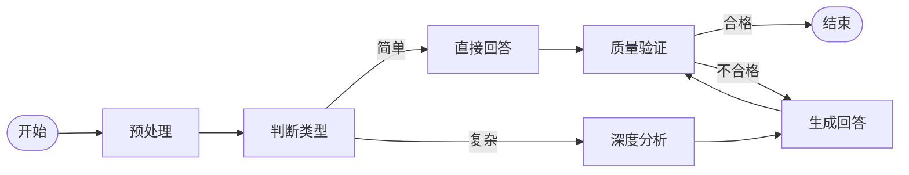
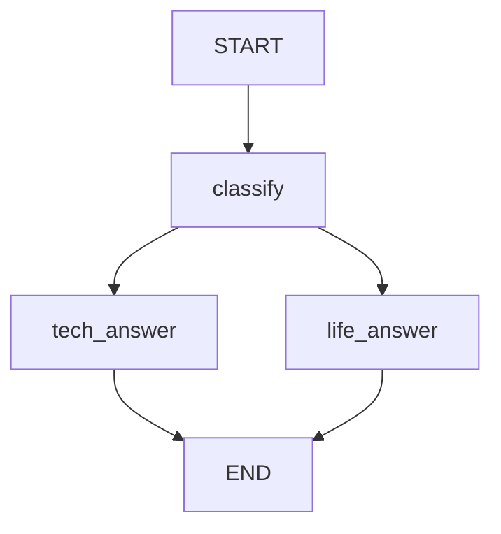
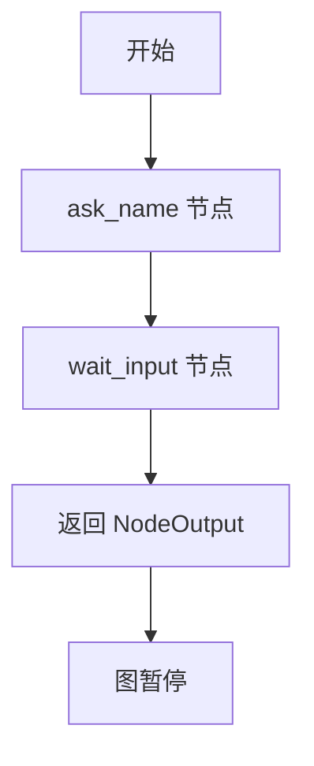
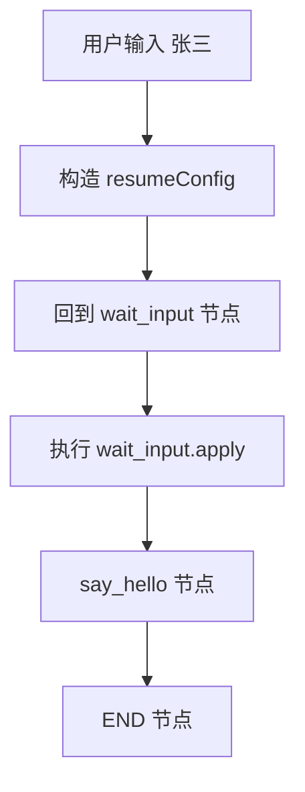
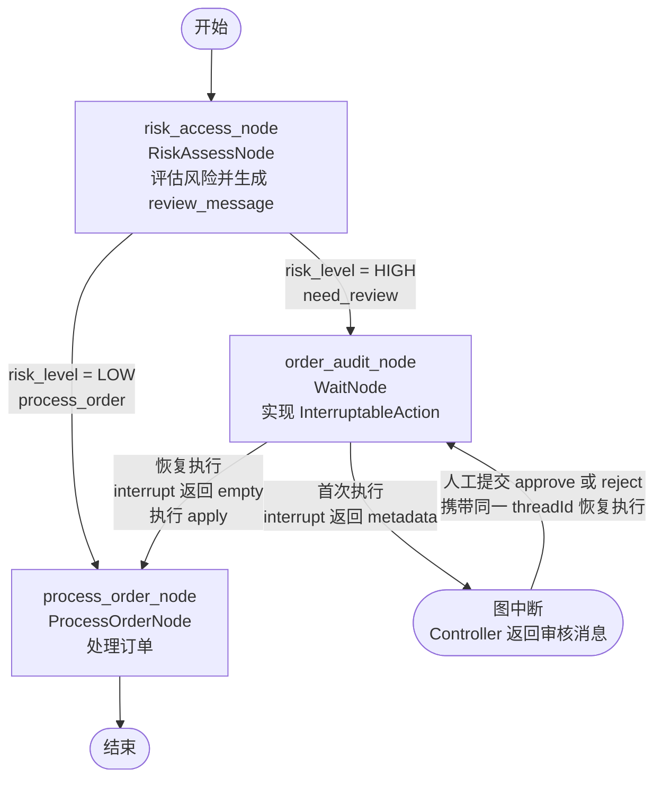

# Spring AI Alibaba

**Spring AI Alibaba 是专门用来构建 Agent 智能体应用的框架。**

什么是 Agent？关于Agent，目前还没有非常严格的定义，所以大家对于Agent的理解会有所差异：

- 工业界现在普遍把 能用 LLM 做多步决策、可调工具、有记忆”的系统都叫 Agent
- Anthropic在他们的官方博客中也指出"智能体"一词有多种定义方式。部分客户将其定义为能长期独立运行、通过调用各类工具完成复杂任务的完全自主系统；另一些客户则用该术语描述遵循预设工作流的规范性实现方案。

但是，通常严格意义上来说AI Agent**本质上是一个**能自主感知环境、规划决策、调用工具并执行任务的软件实体**，判断是否是一个Agent主要看以下几点：

- 有没有行动能力：能调用工具、通过工具访问API、数据库，网页的能力。
- 是否可以自主感知环境：能否根据当前目标，通过工具，自主获取所需的信息
- 是否可以自主决策：下一步逻辑是否是由当前环境，做出动态决策
- 是否有闭环：观察 -> 决策 -> 行动 -> 反馈 -> 再决策。

我们可以通过以下伪代码来理解Agent(ReAct模式):

```python
# ReAct 的核心是：思考下一步 -> 调用工具 -> 观察结果 -> 再思考。

def react_agent(user_goal, tools):
    """
    ReAct = Reason + Act + Observe

    适合：
    - 搜索类任务
    - 工具调用任务
    - 代码修改任务
    - 需要边执行边观察的任务
    """

    # 保存完整上下文，包括用户目标、每轮思考、动作和观察结果
    context = {
        "goal": user_goal,
        "steps": []
    }

    while True: # 差多的步骤的数量
        # 1. 让模型根据当前上下文决定下一步
        #    可能是：调用某个工具，也可能是：直接给出最终答案
        decision = llm_decide_next_action(context)

        # 2. 如果模型认为任务完成，就返回最终答案
        if decision.type == "final_answer":
            return decision.content

        # 3. 如果模型选择调用工具，则取出工具名称和参数
        tool_name = decision.tool_name
        tool_args = decision.tool_args

        # 4. 执行工具调用，例如搜索、读文件、写代码、运行测试等
        observation = tools[tool_name].run(tool_args)

        # 5. 把这一轮的“思考、行动、观察”写回上下文
        #    下一轮模型会基于这些信息继续判断
        context["steps"].append({
            "thought": decision.reasoning,
            "action": {
                "tool": tool_name,
                "args": tool_args
            },
            "observation": observation
        })
```

Spring AI Alibaba 所实现的ReactAgent就是一种ReAct模式的Agent实现，同时它还实现了Workflow工作流编排的功能。接下来我们主要学习这两个功能

在使用Spring AI Alibaba 之前，我们需要引入如下依赖(底层基于千问模型)：

```xml
<dependency>
    <groupId>com.alibaba.cloud.ai</groupId>
    <artifactId>spring-ai-alibaba-agent-framework</artifactId>
    <version>1.1.2.0</version>
</dependency>

<dependency>
    <groupId>com.alibaba.cloud.ai</groupId>
    <artifactId>spring-ai-alibaba-starter-dashscope</artifactId>
    <version>1.1.2.0</version>
</dependency>
```

并添加如下配置：

```yml
spring:
  application:
    name: alibaba
  ai:
    dashscope:
      api-key: 你的apikey
      base-url:  https://dashscope.aliyuncs.com
      chat:
        options:
          model: qwen-plus
```

## ReactAgent

虽然ReactAgent实现了经典的ReAct模式，但是它在实际开发中它具有较大的局限性，因为：

- 想要控制和模型交互的上下文，控制循环的次数(控制成本)，记录日志信息，工具调用的参数校验和权限校验，知识库检索，以及沙箱环境等等功能，就需要将我们的代码"嵌入"到ReactAgent的执行过程中。
- 虽然ReactAgent提供了类似于"拦截器"的扩展机制，可以让我们的代码"嵌入到"ReactAgent执行过程中，但是这样一来，核心代码就分散到了各个"拦截器"中，尤其是涉及到复杂业务的时候，不利于代码的维护。远没有自己实现ReAct循环来的方便。

所以在实际开发中，很少直接使用ReactAgent实现智能体。但是，一些简单的工作可以让它实现。所以接下来，我们就来学习ReactAgent的基本使用

### 简单的一轮对话

最基本的 ReactAgent，只需要配置一个大模型，就可以实现与模型的简单交互(一轮对话)。

**ReactAgent 的构建：**

```java


@Autowired
ChatModel chatModel;

// 构建 ReactAgent
ReactAgent agent = ReactAgent.builder()
    .name("my_agent")       // Agent 的名称
    .model(chatModel)       // 指定使用的大模型
    .build();
```

**ReactAgent 的调用：**

```java
// 调用 Agent，传入用户消息，返回模型的回复
AssistantMessage response = agent.call("你好，请介绍一下你自己");
System.out.println(response.getText());
```

就这么简单，两步就完成了：构建 Agent → 调用 Agent。

### 包含System Prompt & Instruction

在实际开发中，我们通常需要给 Agent 设定一个"角色"或者"行为规范"。这就需要用到 System Prompt 和 Instruction。

**它们的区别是什么？**

- **System Prompt（系统提示词）**：定义 Agent 的角色和整体行为框架。比如"你是一个专业的医疗助手"。
- **Instruction（指令）**：定义 Agent 在具体任务中的行为指导。比如"请用中文回答，回答控制在100字以内"。它更偏向具体的任务要求。

打个比方：System Prompt 就像是给员工定的"岗位职责"，而 Instruction 就像是给员工布置的"具体任务要求"。

**ReactAgent 的构建：**

```java
ReactAgent agent = ReactAgent.builder()
    .name("medical_agent")
    .model(chatModel)
    // 系统提示词：定义角色
    .systemPrompt("你是一个专业的医疗健康助手，擅长回答健康相关的问题。")
    // 指令：定义具体行为要求
    .instruction("请用通俗易懂的语言回答用户的健康问题，回答控制在200字以内。" +
                 "如果问题超出你的能力范围，请建议用户去医院就诊。")
    .build();
```

**ReactAgent 的调用：**

```java
AssistantMessage response = agent.call("最近总是头疼是怎么回事？");
System.out.println(response.getText());
```

### 会话记忆

默认情况下，Agent 是"没有记忆"的。每次调用都是独立的，它不会记得之前说过什么。

但在实际场景中，我们需要 Agent 能记住对话上下文。比如用户说"我叫张三"，下次问"我叫什么"时，Agent 应该能回答出来。

要实现会话记忆，需要两个东西：
1. **BaseCheckpointSaver**：负责保存对话状态（可以理解为"记忆存储器"）, 但是BaseCheckPointSaver本身是个接口，他可以有不同的实现类比如MemorySaver可以将会话记忆保存在内存中
2. **threadId**：会话 ID，用来区分不同的对话，从而实现会话记忆的隔离

**ReactAgent 的构建：**

```java
ReactAgent agent = ReactAgent.builder()
    .name("memory_agent")
    .model(chatModel)
    .instruction("你是一个友好的助手，请记住用户告诉你的信息。")
    // 配置记忆存储器
    .saver(new MemorySaver())
    .build();
```

**ReactAgent 的调用：**

```java
// 创建运行配置，指定会话 ID
RunnableConfig config = RunnableConfig.builder()
    .threadId("conversation_001")  // 同一个 threadId 表示同一个对话
    .build();

// 第一次对话
agent.call("你好，我叫张三", config);

// 第二次对话（同一个 threadId，Agent 能记住之前的内容）
AssistantMessage response = agent.call("我叫什么名字？", config);
System.out.println(response.getText());
// 输出：你叫张三。
```

注意：如果换一个 threadId，Agent 就不会记得之前的对话了，因为那就相当于另一个会话"聊天窗口"。

### 工具调用

大模型本身是没有"动手能力"的，它只能生成文本。但是通过工具调用（Tool Calling），我们可以让 Agent 具备"执行操作"的能力。

比如：大模型不知道今天几号，但我们可以给它一个"获取当前时间"的工具，当用户问"今天几号"时，Agent 会自动调用这个工具获取答案。

**定义工具：**

使用 `@Tool` 注解将一个方法标记为工具：

```java
public class DateTimeTools {

    @Tool(description = "获取当前的日期和时间")
    public String getCurrentDateTime() {
        return LocalDateTime.now().toString();
    }
}
```

注意：`@Tool` 注解的 `description` 非常重要，它告诉大模型这个工具是干什么的、什么时候该用。

**ReactAgent 的构建：**

```java
ReactAgent agent = ReactAgent.builder()
    .name("tool_agent")
    .model(chatModel)
    .instruction("你是一个有用的助手，可以帮用户查询时间和设置闹钟。")
    // 传入工具实例
    .methodTools(new DateTimeTools())
    .saver(new MemorySaver())
    .build();
```

**ReactAgent 的调用：**

```java
RunnableConfig config = RunnableConfig.builder()
    .threadId("tool_demo")
    .build();

// Agent 会自动判断需要调用工具，获取当前时间后再回答
AssistantMessage response = agent.call("现在几点了？", config);
System.out.println(response.getText());
```

整个过程是这样的：用户提问 → Agent 判断需要调用工具 → 调用工具获取结果 → 将结果整合后回答用户。这一切都是自动完成的。

### 结构化输出

有时候我们希望模型 返回的不是一段自然语言文本，而是一个结构化的 JSON 对象，方便程序直接使用。

比如：让 Agent 从一段文字中提取联系人信息，返回 `{name, email, phone}` 格式的数据。

使用 `outputType` 方法即可实现：

**ReactAgent 的构建：**

```java
// 定义输出结构（一个普通的 Java 类）
@Data
public class ContactInfo {
    @JsonPropertyDescription("用户姓名")
    private String name;
    @JsonPropertyDescription("用户邮箱")
    private String email;
    @JsonPropertyDescription("用户手机号")
    private String phone;
    // getter 和 setter 省略
}

// 构建 Agent，指定输出类型
ReactAgent agent = ReactAgent.builder()
    .name("extractor_agent")
    .model(chatModel)
    .instruction("你是一个信息提取助手，请从用户提供的文本中提取联系人信息。")
    // 指定结构化输出类型
    .outputType(ContactInfo.class)
    .saver(new MemorySaver())
    .build();
```

**ReactAgent 的调用：**

```java
RunnableConfig config = RunnableConfig.builder()
    .threadId("extract_demo")
    .build();

AssistantMessage response = agent.call(
    "张三的邮箱是zhangsan@example.com，电话是13800138000", config);
System.out.println(response.getText());
// 输出：{"name": "张三", "email": "zhangsan@example.com", "phone": "13800138000"}
```

框架会自动将 Java 类转换为 JSON 格式说明，告诉大模型应该按什么格式输出。但是，模型返回的仍然只是一个JSON字符串，我们如何得到我们想要的对象呢？

```java
BeanOutputConverter<T> converter = new BeanOutputConverter<>(outputType);
ContactInfo contactInfo = converter.convert(message.getText());
```

### 流式响应

ReactAgent也可以实现流式响应如下：

```java
 ReactAgent medicalAgent = ReactAgent.builder()
                .name("medical_agent")
                .model(chatModel)
                // 系统提示词：定义角色
                .systemPrompt("你是一个专业的医疗健康助手，擅长回答健康相关的问题。")
                // 指令：定义具体行为要求
                .instruction("请用通俗易懂的语言回答用户的健康问题，回答控制在200字以内。" +
                        "如果问题超出你的能力范围，请建议用户去医院就诊。")
                .build();

        RunnableConfig config = RunnableConfig.builder()
                .threadId("extract_demo")
                .build();

		// 调用streamMesasages方法，Flux<Message> 中的每个Message对象都包含模型响应的一个chunk字符串
        Flux<Message> messageFlux = medicalAgent.streamMessages("最近总是头疼是怎么回事？");
		// 订阅消费每个Message输出其文本内容
        messageFlux.map(message -> message.getText()).subscribe(System.out::println);
```

##  Workflow 工作流

前面我们介绍了经典的ReAct模式的Agent。它的执行有一个非常大的特征是，下一步到底做什么，根据上一步的结果反馈来决定。也就是走一步，看一步，因此Agent的执行具有很大的不确定性。而且每一步都需要通过模型来决定，Token的消耗也是很大的。


但是在实际开发中，许多领域的业务，比如金融、医疗，以及大部分的垂直领域，都有比较固定的总体流程。例如：

- **银行贷款审批**：用户提交贷款申请后，系统通常会按照“资料校验 → 征信查询 → 风险评估 → 人工复核 → 给出审批结果”的流程依次处理。

- **医院门诊分诊**：患者描述症状后，系统通常会按照“采集患者信息 → 判断病情紧急程度 → 推荐就诊科室 → 生成分诊结果”的流程依次处理。

这类业务的整体步骤和执行顺序是明确的，只有部分节点需要借助大模型进行分析和判断。因此，我们可以**预先定义好执行流程**，让不同的 ReactAgent 扮演不同的角色，按照既定顺序协同完成任务，这就是 **Agent Workflow（工作流）**。也是Spring AI Alibaba实现的另一个非常重要的功能！

### 图的概念

假设我们有这样一个复杂的工作流：

> 用户提交一个问题 → 首先对问题进行预处理 → 然后判断问题类型：如果是简单问题，直接回答；如果是复杂问题，先做深度分析，分析完再生成回答 → 最后对回答进行质量验证：如果质量合格就输出，不合格就重新生成回答。

这个流程画成流程图大概是这样的：



很显然这个预定义的工作流式比较复杂的。但是，如果仔细观察这个流程图，你会发现：**它其实就是一个有向图！**

- 每个处理步骤就是图中的一个**节点**
- 步骤之间的箭头就是图中的**边**
- 有些边是无条件的（预处理完一定到判断类型）
- 有些边是有条件的（根据判断结果走不同的路）

于是，实现一个复杂的工作流，就变成了**实现一个有向图**。Spring AI Alibaba 就可以帮我们构造任意复杂的工作流，即任意的一张图！

###  图的定义

可以通过 `new StateGraph()` 得到一个 StateGraph 对象：

```java
StateGraph graph = new StateGraph();
```

但很显然，这个对象现在什么都没有。要想让它真的能表示一个复杂的图，还需要给它添加三个关键要素：

- **状态（State）**：存储整个图运行过程中需要用到的数据（比如用户消息），或者图中产生的数据。具体实现上它是一个 `Map<String, Object>`。
- **节点（Node）**：图中的每个节点是一个执行逻辑单元，完成某一项特定的功能。它接受当前 State 作为输入，执行某些操作（如调用 LLM 或自定义逻辑），并将结果更新到 State 中，供其他节点使用。
- **边（Edge）**：定义节点间的控制流，实现分支逻辑。它决定了一个节点执行完之后，下一个要执行的节点是谁。

简而言之：**Node 完成工作，Edge 告诉下一步该做什么，State 存储图执行过程中的数据。**

接下来我们分别学习节点和边的实现。

####  节点（Node）

节点通过实现 `NodeAction` 接口来定义：

```java
public interface NodeAction {
    // 入参 state：当前图的状态对象，可以从中读取数据
    // 返回值 Map：要更新到状态中的数据（key-value 形式）
    Map<String, Object> apply(OverAllState state) throws Exception;
}
```

下面是一个 NodeAction 的实现示例：

```java
// 写作节点：调用 writerAgent 生成文章
public class WriterNode implements NodeAction {

    private final ReactAgent writerAgent;

    public WriterNode(ChatModel chatModel) {
        this.writerAgent = ReactAgent.builder()
            .name("writer_agent")
            .model(chatModel)
            .description("专业写作 Agent")
            .instruction("你是一位知名作家，擅长写作和创作。请根据用户提供的要求完成文章。")
            .build();
    }

    @Override
    public Map<String, Object> apply(OverAllState state) throws Exception {
        // 从图的状态中获取用户要求，并调用模型生成文章
        String input = state.value("input", "").toString();
        String userMessage = "请根据以下要求完成文章：\n" + input;
        AssistantMessage article = writerAgent.call(userMessage);

        // 只把模型返回的文本内容放入图的 OverAllState
        return Map.of("article", article.getText());
    }
}

// 评审节点：读取写作节点的结果，调用 reviewerAgent 审核并修改文章
public class ReviewerNode implements NodeAction {

    private final ReactAgent reviewerAgent;

    public ReviewerNode(ChatModel chatModel) {
        this.reviewerAgent = ReactAgent.builder()
            .name("reviewer_agent")
            .model(chatModel)
            .description("专业文章评审 Agent")
            .instruction("""
                你是一位知名评论家，擅长对文章进行评论和修改。
                请对用户提供的文章进行审核和修改。
                最终只返回修改后的文章，不要包含任何评论信息。
                """)
            .build();
    }

    @Override
    public Map<String, Object> apply(OverAllState state) throws Exception {
        // 从图的状态中获取写作节点生成的文章
        String article = state.value("article")
            .orElseThrow(() -> new IllegalStateException("未找到待评审文章"))
            .toString();

        // 在用户消息中说明任务并附上文章，调用模型完成评审和修改
        String userMessage = "请审核并修改以下文章：\n" + article;
        AssistantMessage reviewedArticle = reviewerAgent.call(userMessage);
        return Map.of("reviewed_article", reviewedArticle.getText());
    }
}
```

**将节点加入图：**

```java
// 使用 node_async 包装后添加到图中
import static com.alibaba.cloud.ai.graph.action.AsyncNodeAction.node_async;

graph.addNode("writer", AsyncNodeAction.node_async(new WriterNode(chatModel)));
graph.addNode("reviewer", AsyncNodeAction.node_async(new ReviewerNode(chatModel)));
```

`AsyncNodeAction.node_async` 是一个工具方法，将同步的 NodeAction 包装为异步执行。这是添加节点的标准方式。

**特殊节点 START 和 END：**

一个图中本身就包含两个特殊节点：
-  `StateGraph.START`：图的起点，表示工作流从这里开始
- `StateGraph.END`：图的终点，表示工作流到这里结束

我们不需要手动创建它们，只需要在**定义边的时候引用**即可。

####  边（Edge）

**普通边：**

普通边表示无条件的流转，即"A 节点执行完，一定执行 B 节点"。

```java
// 语法：addEdge(源节点名称, 目标节点名称)
graph.addEdge(StateGraph.START, "writer");   // 开始 → 写作
graph.addEdge("writer", "reviewer");         // 写作 → 评审
graph.addEdge("reviewer", StateGraph.END);    // 评审 → 结束
```

**条件边：**

条件边表示根据某个条件决定下一步走哪个节点，即"A 节点执行完，根据条件决定走 B 还是走 C"。

```java
import static com.alibaba.cloud.ai.graph.action.AsyncEdgeAction.edge_async;

// 语法：addConditionalEdges(源节点, 条件函数, 路由映射)
graph.addConditionalEdges(
    "condition_node",  // 源节点：从哪个节点出发
    // 条件函数：根据状态返回一个字符串，表示走哪条路
    AsyncEdgeAction.edge_async(state -> {
        String type = state.value("question_type", "simple").toString();
        return type;  // 返回 "simple" 或 "complex"
    }),
    // 路由映射：条件函数返回值 → 目标节点
    Map.of(
        "simple", "direct_answer",    // 返回 "simple" → 走 direct_answer 节点
        "complex", "deep_analysis"    // 返回 "complex" → 走 deep_analysis 节点
    )
);
```

**并行边：**

一个节点可以有多个出边，表示同时执行多个后续节点：

```java
// 一个节点同时连接多个后续节点（并行执行）
graph.addEdge("start_node", List.of("agent1", "agent2", "agent3"));
```


**聚合边**：

```java
// 多个并行节点汇聚到一个节点
graph.addEdge(List.of("agent1", "agent2", "agent3"), "aggregator");
```


### 图的编译

图定义完成后，还不能直接执行，需要先调用 `compile()` 方法将 `StateGraph` 编译成可执行的 `CompiledGraph`：

```java
// 编译图
CompiledGraph compiledGraph = graph.compile();
```


### 图的运行

**构建 RunnableConfig：**

RunnableConfig 包含图执行时所需的运行配置，其中 `threadId` 用来标识和区分不同的工作流执行。后面配置 `Saver` 后，框架还会通过 `threadId` 关联和恢复相应的 Checkpoint：

```java
// threadId 的含义：标识一次完整的工作流执行
RunnableConfig runnableConfig = RunnableConfig.builder()
    .threadId("workflow-001")
    .build();
```

**运行图：**

```java
// 准备输入数据
Map<String, Object> input = Map.of("input", "帮我写一篇100字左右描写春天的散文");

// 执行图，作为输入的input中的key,value会自动被保存到OverAllState对象中
Optional<OverAllState> result = compiledGraph.invoke(input, runnableConfig);

// 获取结果
result.ifPresent(state -> {
    // 获取写作节点生成的原始文章
    state.value("article").ifPresent(article -> {
        System.out.println("原始文章：" + article);
    });

    // 获取评审节点修改后的文章
    state.value("reviewed_article").ifPresent(reviewedArticle -> {
        System.out.println("评审后文章：" + reviewedArticle);
    });
});
```

这里需要注意的是：图的每一次执行，在图的内部都会自动产生一个状态对象(OverAllState对象)，该状态对象被图中的各个节点所共用！


### 综合案例


下面给出一个完整的 Web 版综合案例，包含三个节点：问题分类节点、技术回答节点和生活回答节点。

**1. 定义节点：**

```java
// 模型的结构化分类结果
@Data
public class ClassificationResult {
    @JsonPropertyDescription("问题类别，只能是 TECH 或 LIFE")
    private String category;

    @JsonPropertyDescription("做出该分类的简短原因")
    private String reason;
}

// 问题分类节点：使用 ReactAgent 调用大模型理解问题语义并分类
public class ClassifyNode implements NodeAction {

    private final ReactAgent classifyAgent;
    private final BeanOutputConverter<ClassificationResult> converter;

    public ClassifyNode(ChatModel chatModel) {
        this.classifyAgent = ReactAgent.builder()
            .name("question_classifier")
            .model(chatModel)
            .instruction("""
                你是一个问题分类专家，请根据用户问题的真实意图进行分类：
                1. TECH：编程、软件、硬件、网络、人工智能等技术问题；
                2. LIFE：健康、饮食、出行、学习、职场等日常生活问题。
                不要只依赖关键词，要结合上下文和语义判断。
                """)
            .outputType(ClassificationResult.class)
            .build();
        this.converter = new BeanOutputConverter<>(ClassificationResult.class);
    }

    @Override
    public Map<String, Object> apply(OverAllState state) throws Exception {
        String input = state.value("input", "").toString();

        // 交给模型理解问题语义，并将 JSON 响应转换为 Java 对象
        String userMessage = "请对以下用户问题进行分类：\n" + input;
        AssistantMessage response = classifyAgent.call(userMessage);
        ClassificationResult result = converter.convert(response.getText());

        return Map.of(
            "category", result.getCategory(),
            "classify_reason", result.getReason()
        );
    }
}

// 技术回答节点：使用技术领域 Agent 专业地回答
public class TechAnswerNode implements NodeAction {
    private final ReactAgent techAgent;

    public TechAnswerNode(ChatModel chatModel) {
        this.techAgent = ReactAgent.builder()
                .name("tech_agent")
                .model(chatModel)
                .instruction("你是一个技术专家，请准确、专业地回答用户的技术问题。")
                .build();
    }

    @Override
    public Map<String, Object> apply(OverAllState state)
            throws Exception {
        String input = state.value("input", "").toString();
        String userMessage = "请回答以下技术问题：\n" + input;
        AssistantMessage response = techAgent.call(userMessage);
        return Map.of("answer", response.getText());
    }
}

// 生活回答节点：使用生活领域 Agent 亲切地回答
public class LifeAnswerNode implements NodeAction {
    private final ReactAgent lifeAgent;

    public LifeAnswerNode(ChatModel chatModel) {
        this.lifeAgent = ReactAgent.builder()
            .name("life_agent")
            .model(chatModel)
            .instruction("你是一个生活顾问，请亲切、实用地回答用户的生活问题。")
            .build();
    }

    @Override
    public Map<String, Object> apply(OverAllState state)
            throws Exception {
        String input = state.value("input", "").toString();
        String userMessage = "请回答以下生活问题：\n" + input;
        AssistantMessage response = lifeAgent.call(userMessage);
        return Map.of("answer", response.getText());
    }
}
```

**2. 构建图并配置为 Spring Bean：**

```java
@Configuration
public class WorkflowConfig {

    @Bean
    public CompiledGraph qaWorkflow(ChatModel chatModel) throws Exception {

        // 构建图
        StateGraph graph = new StateGraph();

        // 添加节点
        graph.addNode("classify", node_async(new ClassifyNode(chatModel)));
        graph.addNode("tech_answer", node_async(new TechAnswerNode(chatModel)));
        graph.addNode("life_answer", node_async(new LifeAnswerNode(chatModel)));

        // 添加边
        graph.addEdge(StateGraph.START, "classify");
        // 条件边：classify 执行完后，根据 category 决定走技术节点还是生活节点
        graph.addConditionalEdges(
            "classify",
            AsyncEdgeAction.edge_async(state ->
                state.value("category", "life").toString()),  // 返回 "tech" 或 "life"
            Map.of(
                "tech", "tech_answer",   // 技术问题 → 技术回答节点
                "life", "life_answer"    // 生活问题 → 生活回答节点
            )
        );
        graph.addEdge("tech_answer", StateGraph.END);
        graph.addEdge("life_answer", StateGraph.END);

        // 当前工作流不涉及中断恢复，使用默认编译配置即可
        return graph.compile(CompileConfig.builder().build());
    }
}
```

**3. Controller 层：**

```java
@RestController
@RequestMapping("/api/qa")
public class QaController {

    private final CompiledGraph qaWorkflow;

    public QaController(CompiledGraph qaWorkflow) {
        this.qaWorkflow = qaWorkflow;
    }

    @PostMapping
    public Map<String, Object> ask(@RequestBody Map<String, String> request) {
        String question = request.get("question");
        String threadId = request.getOrDefault("threadId", UUID.randomUUID().toString());

        RunnableConfig config = RunnableConfig.builder()
            .threadId(threadId)
            .build();

        Optional<OverAllState> result = qaWorkflow.invoke(
            Map.of("input", question), config);

        return result.map(state -> Map.of(
            "answer", state.value("answer").orElse("无法回答"),
            "category", state.value("category").orElse("unknown"),
            "threadId", threadId
        )).orElse(Map.of("error", "执行失败"));
    }
}
```

### 自定义 FlowAgent

上面的综合案例直接把 `StateGraph` 编译成了 `CompiledGraph`，然后在 Controller 中调用。

如果我们希望把任意自定义工作流也封装成 Agent，就可以继承 `FlowAgent`，并在 `buildSpecificGraph` 方法中返回自己定义的 `StateGraph`。这样一来，这个工作流就具备了 Agent 的调用入口，可以像其他 Agent 一样被 使用

还是以前面的问答 workflow 为例，等效的 `FlowAgent` 可以这样实现：

```java
package com.example.qa;

import com.alibaba.cloud.ai.graph.CompileConfig;
import com.alibaba.cloud.ai.graph.StateGraph;
import com.alibaba.cloud.ai.graph.action.AsyncEdgeAction;
import com.alibaba.cloud.ai.graph.action.AsyncNodeAction;
import com.alibaba.cloud.ai.graph.agent.Agent;
import com.alibaba.cloud.ai.graph.agent.flow.agent.FlowAgent;
import com.alibaba.cloud.ai.graph.agent.flow.builder.FlowGraphBuilder;
import com.alibaba.cloud.ai.graph.exception.GraphStateException;
import org.springframework.ai.chat.model.ChatModel;

import java.util.HashMap;
import java.util.List;
import java.util.Map;

public class QaWorkflowAgent extends FlowAgent {

    private final ChatModel chatModel;

    public QaWorkflowAgent(ChatModel chatModel, CompileConfig compileConfig) {
        super(
            "qa_workflow_agent",
            "根据问题类型路由到技术回答节点或生活回答节点",
            compileConfig,
            List.<Agent>of()
        );
        this.chatModel = chatModel;
    }

@Override
    protected StateGraph buildSpecificGraph(FlowGraphBuilder.FlowGraphConfig config) throws GraphStateException {
        StateGraph graph = new StateGraph(config.getName(), HashMap::new);

        graph.addNode("classify", AsyncNodeAction.node_async(new ClassifyNode(chatModel)));
        graph.addNode("tech_answer", AsyncNodeAction.node_async(new TechAnswerNode(chatModel)));
        graph.addNode("life_answer", AsyncNodeAction.node_async(new LifeAnswerNode(chatModel)));

        graph.addEdge(StateGraph.START, "classify");
        graph.addConditionalEdges(
                "classify",
                AsyncEdgeAction.edge_async(state ->
                        state.value("category", "life").toString()),
                Map.of(
                        "tech", "tech_answer",
                        "life", "life_answer"
                )
        );
        graph.addEdge("tech_answer", StateGraph.END);
        graph.addEdge("life_answer", StateGraph.END);

        return graph;
    }
}
```

注意：`buildSpecificGraph` 方法只负责**定义图结构并返回 `StateGraph`**，不要在这个方法里手动调用 `graph.compile(...)`。`FlowAgent` 在执行 `invoke` 或 `stream` 时，会自动完成图初始化和编译，编译配置来自构造 `QaWorkflowAgent` 时传入的 `CompileConfig`。

然后把这个自定义 Agent 注册为 Spring Bean：

```java
package com.example.qa;

import com.alibaba.cloud.ai.graph.CompileConfig;
import org.springframework.ai.chat.model.ChatModel;
import org.springframework.context.annotation.Bean;
import org.springframework.context.annotation.Configuration;

@Configuration
public class QaAgentConfig {

    @Bean
    public QaWorkflowAgent qaWorkflowAgent(ChatModel chatModel) {
        CompileConfig compileConfig = CompileConfig.builder().build();

        return new QaWorkflowAgent(chatModel, compileConfig);
    }
}
```

调用方式也从调用 `CompiledGraph` 变成了调用 Agent：

```java
package com.example.qa;

import com.alibaba.cloud.ai.graph.OverAllState;
import com.alibaba.cloud.ai.graph.RunnableConfig;
import org.springframework.web.bind.annotation.PostMapping;
import org.springframework.web.bind.annotation.RequestBody;
import org.springframework.web.bind.annotation.RequestMapping;
import org.springframework.web.bind.annotation.RestController;

import java.util.Map;
import java.util.Optional;
import java.util.UUID;

@RestController
@RequestMapping("/api/qa-agent")
public class QaAgentController {

    private final QaWorkflowAgent qaWorkflowAgent;

    public QaAgentController(QaWorkflowAgent qaWorkflowAgent) {
        this.qaWorkflowAgent = qaWorkflowAgent;
    }

    @PostMapping
    public Map<String, Object> ask(@RequestBody Map<String, String> request) {
        String question = request.get("question");
        String threadId = request.getOrDefault("threadId", UUID.randomUUID().toString());

        RunnableConfig config = RunnableConfig.builder()
            .threadId(threadId)
            .build();

        Optional<OverAllState> result = qaWorkflowAgent.invoke(
            Map.of("input", question), config);

        return result.map(state -> Map.of(
            "answer", state.value("answer").orElse("无法回答"),
            "category", state.value("category").orElse("unknown"),
            "threadId", threadId
        )).orElse(Map.of("error", "执行失败"));
    }
}
```

这两种写法的图结构是等效的：



---

## Human-In-The-Loop（人工介入）

Human-In-The-Loop（人工介入）是指在工作流执行过程中，**暂停执行，等待人工确认或输入后再继续**。

什么场景需要 Human-In-The-Loop？
- 敏感操作确认：比如 Agent 要删除数据，需要用户确认"你确定要删除吗？"
- 信息补充：比如 Agent 需要用户提供更多信息才能继续
- 质量审核：比如 Agent 生成了一个方案，需要人工审核通过后才执行

要实现 Human-In-The-Loop，核心是两个步骤：

1. **中断（Interrupt）**：图执行到某个节点时暂停，保存当前状态，并返回当前图的状态对象(OverAllState对象)
2. **恢复执行（Resume）**：收到用户输入后，从断点处恢复执行(接着之前保存的状态继续执行)

这就像你在玩游戏时按了暂停键（断点），等你准备好了再按继续（恢复）。底层"存档"机制其实是由BaseCheckPointer实现的，它保证了暂停后状态不会丢失。

我们可以基于`InterruptableAction`接口 实现 Human-In-The-Loop 

### 具体实现

使用 InterruptableAction 方式实现 Human-In-The-Loop，核心思路是：**专门定义一个"等待节点"，该节点同时实现 `InterruptableAction` 接口和 `AsyncNodeAction` 接口**。

- `InterruptableAction` 接口提供 `interrupt()` 方法 —— 决定是否中断
- `NodeAction` 接口提供 `apply()` 方法 —— 恢复后执行的逻辑

**InterruptableAction 接口定义（源码）：**

```java
public interface InterruptableAction {
    // 返回 Optional.empty() → 不中断，继续执行 apply()
    // 返回 InterruptionMetadata → 触发中断，图暂停
    Optional<InterruptionMetadata> interrupt(String nodeId, OverAllState state, RunnableConfig config);
}
```

用来实现中断的这个专门的节点定义如下：

```java
public class WaitNode implements AsyncNodeAction, InterruptableAction {

    // 返回 Optional.empty() → 不中断，继续执行 apply()
    // 返回 InterruptionMetadata → 触发中断，图暂停
    @Override
    public Optional<InterruptionMetadata> interrupt(String nodeId,
                                                    OverAllState state,
                                                    RunnableConfig config) {
        // 有恢复标记 → 说明这是中断后的恢复执行
        if (config.metadata(RunnableConfig.HUMAN_FEEDBACK_METADATA_KEY).isPresent()) {
            // 关键：判断到恢复标记后，立刻删除这个标记
            // 否则本次恢复流程里如果再次遇到 WaitNode，会被误判为恢复执行，从而跳过新的中断
            config.metadata().ifPresent(metadata ->
                metadata.remove(RunnableConfig.HUMAN_FEEDBACK_METADATA_KEY));
            return Optional.empty();
        }
        // 无恢复标记 → 首次进入，触发中断
        return Optional.of(InterruptionMetadata.builder(nodeId, state).build());
    }

    // 节点正常执行时的apply方法，返回的map中的键值对会被放入State对象
    @Override
    public CompletableFuture<Map<String, Object>> apply(OverAllState state) {
        // 恢复后执行：传递状态即可，图会根据边定义流转到下一个节点，也可以什么都不做
        return CompletableFuture.completedFuture(Map.of());
    }
}
```

这个等待节点的职责很单一：**首次进入时中断图的执行，恢复后由该节点出发，继续流转到下一个节点**。

注意这里删除恢复标记非常重要。主要是为了不影响后续其他节点的中断！

定义完 WaitNode 之后，我们先看一个非常简单的例子，不通过 Web 接口，只在普通方法中调用图。

先定义三个节点，每个节点单独负责一件事：

```java
public class AskNameNode implements NodeAction {

    @Override
    public Map<String, Object> apply(OverAllState state) {
        System.out.println("请用户输入姓名");
        return Map.of("question", "你的姓名是什么？");
    }
}

public class SayHelloNode implements NodeAction {

    @Override
    public Map<String, Object> apply(OverAllState state) {
        String name = state.value("name", "同学").toString();
        return Map.of("answer", "你好，" + name);
    }
}
```

其中 `wait_input` 节点直接使用前面定义的 `WaitNode`。接着把这三个节点串成一张图：

```java
StateGraph graph = new StateGraph();

graph.addNode("ask_name", AsyncNodeAction.node_async(new AskNameNode()));
graph.addNode("wait_input", new WaitNode());
graph.addNode("say_hello", AsyncNodeAction.node_async(new SayHelloNode()));

graph.addEdge(StateGraph.START, "ask_name");
graph.addEdge("ask_name", "wait_input");
graph.addEdge("wait_input", "say_hello");
graph.addEdge("say_hello", StateGraph.END);

// HITL 中断后需要保存当前节点和状态，恢复时还要读取这些数据，
// 因此编译图时必须配置 CheckpointSaver
CompiledGraph compiledGraph = graph.compile(CompileConfig.builder()
    .saverConfig(SaverConfig.builder().register(new MemorySaver()).build())
    .build());


```

这里使用 `MemorySaver` 将 Checkpoint 保存在内存中。图发生中断时，框架会保存当前节点和状态；恢复执行时，再根据相同的 `threadId` 读取之前保存的 Checkpoint。生产环境也可以根据需要替换为 Redis、MySQL 等持久化实现。

第一次调用时，还没有设置恢复标记(因为还未触发中断)。图执行到 `wait_input` 时，`WaitNode.interrupt()` 会返回 `InterruptionMetadata`，图在这里暂停：

```java

String threadId = "demo-thread-001";
RunnableConfig firstConfig = RunnableConfig.builder()
    .threadId(threadId)
    .build();

// 调用invokeAndGetOutput方法获取本地图执行的最后一个节点信息，NodeOutput对象中也会包含OverAllState对象
Optional<NodeOutput> firstOutput = compiledGraph.invokeAndGetOutput(Map.of(), firstConfig);

if (firstOutput.isPresent() && !firstOutput.get().isEND()) {
    System.out.println("发生中断，中断节点：" + firstOutput.get().node());
    System.out.println("当前状态：" + firstOutput.get().state().data());
}
```

这里使用的是 `invokeAndGetOutput`，不是 `invoke`。二者的区别是：

- `invoke(...)` 返回 `Optional<OverAllState>`，你只能拿到状态对象
- `invokeAndGetOutput(...)` 返回 `Optional<NodeOutput>`，除了能拿到状态对象，还能知道最后停在哪个节点

`NodeOutput` 的核心字段包括：

- `node()`：最后输出来自哪个节点。如果中断发生在 `wait_input`，这里就是 `wait_input`
- `state()`：当前图的状态对象，也就是中断或结束时保存下来的 OverAllState
- `isEND()`：是否已经到达 `END` 节点。如果 `isEND()` 为 `false`，通常说明这次调用停在了某个业务节点或等待节点；对于 WaitNode 场景，就可以据此判断发生了中断

因此，第一次调用可以通过 `!firstOutput.get().isEND()` 判断发生了中断。

第一次调用的执行过程如下：



此时最后一个 `NodeOutput` 来自 `wait_input`，并且 `isEND()` 为 `false`。这说明图没有跑到 `END` 节点，而是在 `wait_input` 这里发生了中断。

第二次调用时，使用同一个 `threadId`，并设置 `resume()` 标记，同时通过 `addStateUpdate` 把用户输入合并到状态对象中：

```java
RunnableConfig resumeConfig = RunnableConfig.builder()
    .threadId(threadId)
    // 添加恢复标记
    .resume()
    // 在OverAllState中合并用户输入的信息
    .addStateUpdate(Map.of("name", "张三"))
    .build();

Optional<NodeOutput> resumeOutput = compiledGraph.invokeAndGetOutput(Map.of(), resumeConfig);

if (resumeOutput.isPresent() && resumeOutput.get().isEND()) {
    System.out.println("执行完成：" + resumeOutput.get().state().value("answer", ""));
}
```

第二次恢复的执行过程如下：



第二次恢复调用时，图从 checkpoint 恢复到 `wait_input`，WaitNode 识别到恢复标记后先删除该标记，再返回 `Optional.empty()`，然后执行 `apply()`，继续流转到 `say_hello` 和 `END`。


### 中断恢复后读取恢复前的数据

接下来，还是基于上面的例子，我们来测试一下在中断恢复之后能否读取到中断触发前OverAllState对象中的数据，我们只需要对SayHelloNode稍作修改即可验证：

```java
public class SayHelloNode implements NodeAction {

    @Override
    public Map<String, Object> apply(OverAllState state) {
        //读取AskNameNode节点放入OverAllState对象的question属性的值
        Optional<Object> question = state.value("question");
        question.ifPresentOrElse(System.out::println, () -> System.out.println("没有值"));
        
        String name = state.value("name", "同学").toString();
        return Map.of("answer", "你好，" + name);
    }
}
```

然后继续执行整个图

```java
String threadId = "demo-thread-001";
RunnableConfig firstConfig = RunnableConfig.builder()
    .threadId(threadId)
    .build();

// 调用invokeAndGetOutput方法获取本地图执行的最后一个节点信息，NodeOutput对象中也会包含OverAllState对象
Optional<NodeOutput> firstOutput = compiledGraph.invokeAndGetOutput(Map.of(), firstConfig);

if (firstOutput.isPresent() && !firstOutput.get().isEND()) {
    System.out.println("发生中断，中断节点：" + firstOutput.get().node());
    System.out.println("当前状态：" + firstOutput.get().state().data());
}
```

```java
RunnableConfig resumeConfig = RunnableConfig.builder()
    .threadId(threadId)
    // 添加恢复标记
    .resume()
    // 在OverAllState中合并用户输入的信息
    .addStateUpdate(Map.of("name", "张三"))
    .build();

Optional<NodeOutput> resumeOutput = compiledGraph.invokeAndGetOutput(Map.of(), resumeConfig);

if (resumeOutput.isPresent() && resumeOutput.get().isEND()) {
    System.out.println("执行完成：" + resumeOutput.get().state().value("answer", ""));
}
```

我们会发现，SayHelloNode**并未能成功读取**AskNameNode节点放入OverAllState对象的question属性的值！

出现这个问题的原因，是因为StateGraph对象有一个特殊的要求：中断恢复后，要想从恢复的OverStateAll对象中读取到之前的属性值，那么这些属性必须提前注册才可以，注册方式如下所示：

```java
// 在创建StateGraph对象的时候注册中断恢复后需要被读取到的key
StateGraph graph = new StateGraph(() -> Map.of(
        // key的名字  key的合并策略
        "question", KeyStrategy.REPLACE
));
```


### 综合案例：智能订单处理

下面用一个完整案例来演示上述原理。场景：

- 用户提交一个订单请求
- 系统先通过 **risk_access_node** 做风险评估；如果是高风险订单，RiskAssessNode 同时生成 `review_message`
- 如果是低风险订单 → 条件边直接进入 **process_order_node**，不中断并完成处理
- 如果是高风险订单 → 条件边进入 **order_audit_node**，图中断并等待人工审核
- 人工审核后 → 从 order_audit_node 恢复执行，再进入 process_order_node，根据审核结果完成处理

关键点：
1. **有选择的中断**：低风险不中断，高风险才中断
2. **审核消息由风险评估节点生成**：RiskAssessNode 判断为高风险时把 `review_message` 写入状态，Controller 只负责透传
3. **恢复后跳转到订单处理节点**：中断发生在 order_audit_node，恢复后流转到 process_order_node

**案例流程图：**



以下代码可以直接复制到 Spring Boot 项目中运行（需要已引入 spring-ai-alibaba-agent-framework 依赖）。

**1. 风险评估结果类：**

```java
package com.example.order;

import com.fasterxml.jackson.annotation.JsonPropertyDescription;
import lombok.Data;
import lombok.NoArgsConstructor;

@Data
@NoArgsConstructor
public class RiskResult {
    @JsonPropertyDescription("订单风险评估结果，取HIGH或者LOW")
    private String riskLevel;  // "HIGH" 或 "LOW"
    @JsonPropertyDescription("给出风险评估结论的原因")
    private String reason;
}
```

**2. 风险评估节点：**

```java
package com.example.order;

import com.alibaba.cloud.ai.graph.OverAllState;
import com.alibaba.cloud.ai.graph.action.NodeAction;
import com.alibaba.cloud.ai.graph.agent.ReactAgent;
import org.springframework.ai.chat.messages.AssistantMessage;
import org.springframework.ai.chat.model.ChatModel;
import org.springframework.ai.converter.BeanOutputConverter;

import java.util.HashMap;
import java.util.Map;

public class RiskAssessNode implements NodeAction {

    private final ReactAgent riskAgent;
    private final BeanOutputConverter<RiskResult> converter;

    public RiskAssessNode(ChatModel chatModel) {
        this.riskAgent = ReactAgent.builder()
            .name("risk_assess_agent")
            .model(chatModel)
            .instruction("你是订单风险评估员，请根据订单金额和商品信息判断风险等级。" +
                         "满足以下任一条件判定为HIGH：订单金额大于5000元，或订单包含敏感商品；" +
                         "订单金额不大于5000元且不包含敏感商品时判定为LOW。" +
                         "reason必须说明判定依据；低风险时也要说明金额和商品均未触发高风险规则。" +
                         "请严格按照以下JSON格式返回，不要输出JSON以外的内容：" +
                         "{\"riskLevel\":\"HIGH或LOW\",\"reason\":\"具体判定依据\"}")
            .outputType(RiskResult.class)
            .build();
        this.converter = new BeanOutputConverter<>(RiskResult.class);
    }

    @Override
    public Map<String, Object> apply(OverAllState state) throws Exception {
        String orderInfo = state.value("order_info", "").toString();
        String userOrder = "用户的订单信息如下：\n" + orderInfo;
        AssistantMessage response = riskAgent.call(userOrder);
        RiskResult result = converter.convert(response.getText());

        Map<String, Object> output = new HashMap<>();
        output.put("risk_level", result.getRiskLevel());
        output.put("risk_reason", result.getReason());
        if ("HIGH".equals(result.getRiskLevel())) {
            String message = orderInfo + ", 该订单风险较高，请输入approve或者reject, 审核通过或者拒绝该订单";
            output.put("review_message", message);

        }
        return output;
    }
}
```

**3. 等待审核节点（实现 InterruptableAction）：**

```java
package com.example.order;

import com.alibaba.cloud.ai.graph.OverAllState;
import com.alibaba.cloud.ai.graph.RunnableConfig;
import com.alibaba.cloud.ai.graph.action.AsyncNodeAction;
import com.alibaba.cloud.ai.graph.action.InterruptableAction;
import com.alibaba.cloud.ai.graph.action.InterruptionMetadata;

import java.util.HashMap;
import java.util.Map;
import java.util.Optional;
import java.util.concurrent.CompletableFuture;

public class WaitReviewNode implements AsyncNodeAction, InterruptableAction {

    @Override
    public Optional<InterruptionMetadata> interrupt(String nodeId,
                                                    OverAllState state,
                                                    RunnableConfig config) {
        if (config.metadata(RunnableConfig.HUMAN_FEEDBACK_METADATA_KEY).isPresent()) {
            config.metadata().ifPresent(metadata ->
                metadata.remove(RunnableConfig.HUMAN_FEEDBACK_METADATA_KEY));
            return Optional.empty();  // 恢复执行，不中断
        }
        return Optional.of(InterruptionMetadata.builder(nodeId, state).build());  // 首次，中断
    }

    @Override
    public CompletableFuture<Map<String, Object>> apply(OverAllState state) {
        return CompletableFuture.completedFuture(Map.of());
    }
}
```

**4. 订单处理节点：**

```java
package com.example.order;

import com.alibaba.cloud.ai.graph.OverAllState;
import com.alibaba.cloud.ai.graph.action.NodeAction;

import java.util.HashMap;
import java.util.Map;

public class ProcessOrderNode implements NodeAction {

    @Override
    public Map<String, Object> apply(OverAllState state) throws Exception {
        String orderInfo = state.value("order_info", "").toString();
        String riskLevel = state.value("risk_level", "LOW").toString();
        String riskReason = state.value("risk_reason", "").toString();
        String reviewResult = state.value("review_result", "").toString();

        Map<String, Object> output = new HashMap<>();

        // 高风险订单首次到达时还没有人工审核结果：生成给审核人员看的消息，随后由条件边进入中断节点
        if ("HIGH".equals(riskLevel) && reviewResult.contains("拒绝") || "HIGH".equals(riskLevel)  && reviewResult.contains("reject")) {
            output.put("process_status", "REJECTED");
            output.put("process_result", "订单未通过人工审核，系统已取消后续履约。订单信息：" + orderInfo);
            output.put("next_action", "通知用户订单审核未通过，并记录审核结果：" + reviewResult);
            return output;
        }

        if ("HIGH".equals(riskLevel)) {
            output.put("process_status", "MANUAL_APPROVED");
            output.put("process_result", "高风险订单已通过人工审核，可以继续履约。订单信息：" + orderInfo);
            output.put("next_action", "标记为人工审核通过，进入仓库拣货和支付确认流程");
            output.put("audit_note", reviewResult);
            return output;
        }

        output.put("process_status", "AUTO_APPROVED");
        output.put("process_result", "低风险订单自动通过，系统直接进入履约流程。订单信息：" + orderInfo);
        output.put("next_action", "进入仓库拣货和支付确认流程");
        return output;
    }
}
```

**5. 图的构建与 Controller（完整可运行）：**

```java
package com.example.order;

import com.alibaba.cloud.ai.graph.*;
import com.alibaba.cloud.ai.graph.action.AsyncEdgeAction;
import com.alibaba.cloud.ai.graph.action.AsyncNodeAction;
import com.alibaba.cloud.ai.graph.checkpoint.config.SaverConfig;
import com.alibaba.cloud.ai.graph.checkpoint.savers.MemorySaver;
import org.springframework.ai.chat.model.ChatModel;
import org.springframework.context.annotation.Bean;
import org.springframework.context.annotation.Configuration;
import org.springframework.web.bind.annotation.*;

import java.util.Map;
import java.util.Optional;
import java.util.UUID;

@Configuration
public class OrderWorkflowConfig {

    @Bean
    public CompiledGraph orderWorkflow(ChatModel chatModel) throws Exception {
      // 1.  定义图
        StateGraph stateGraph = new StateGraph(() -> Map.of(
                // key的名字  key的合并策略
                "order_info", KeyStrategy.REPLACE,
                "risk_level", KeyStrategy.REPLACE,
                "risk_reason", KeyStrategy.REPLACE
        ));

        // 1.1 添加节点
        stateGraph.addNode("risk_access_node",
                AsyncNodeAction.node_async(new RiskAssessNode(chatModel)));

        // 1.2 添加节点
        stateGraph.addNode("order_audit_node", new WaitNode());

        // 1.3 订单处理节点
        stateGraph.addNode("process_order_node",
                AsyncNodeAction.node_async(new ProcessOrderNode()));

        // 1.2 添加边
        stateGraph.addEdge(StateGraph.START, "risk_access_node");
        stateGraph.addConditionalEdges("risk_access_node",
                // 条件函数
                AsyncEdgeAction.edge_async(overAllSate -> {
                    String value = overAllSate.value("risk_level", "HIGH");
                    if ("LOW".equals(value)) {
                        return "process_order";
                    }
                    return "need_review";
                }),
                // 路由映射
                Map.of(
                   "process_order", "process_order_node",
                   "need_review", "order_audit_node"
                ));
        stateGraph.addEdge("order_audit_node", "process_order_node");
        stateGraph.addEdge("process_order_node", StateGraph.END);

        // 2. 编译图
        CompileConfig compileConfig = CompileConfig
                .builder()
                .saverConfig(SaverConfig.builder().register(new MemorySaver()).build())
                .build();
        CompiledGraph compiledGraph = stateGraph.compile(compileConfig);

        // 3. 返回编译好的图
        return compiledGraph;
    }
}

@RestController
@RequestMapping("/api/order")
public class OrderController {

    private final CompiledGraph orderWorkflow;

    public OrderController(CompiledGraph orderWorkflow) {
        this.orderWorkflow = orderWorkflow;
    }

    @PostMapping("/chat")
    public Map<String, Object> chat(@RequestBody Map<String, String> request) {
		  // 获取待处理的订单信息
        String input = request.get("input");

        // threadId
        String threadId = request.get("threadId");

        // 审核结果
        String resume = request.get("resume");
        /*
            isResume：
             true: 是在处理审批
             false: 处理全新的订单
         */
        boolean isResume = !StringUtils.hasText(input) ? true : false;

        if (!isResume) {
            // 从头开始处理订单
            RunnableConfig runnableConfig = RunnableConfig
                    .builder()
                    .threadId(threadId)
                    .build();

            Optional<NodeOutput> nodeOutput
                    = thirdGraph.invokeAndGetOutput(Map.of("order_inf", input), runnableConfig);
            NodeOutput node = nodeOutput.get();
            OverAllState state = node.state();
            if (!node.isEND()) {
                // 触发了中断
                return Map.of(
                        "type", "interrupt",
                        "threadId", threadId,
                        "node", node.node(),
                        "message", state.value("review_message", "").toString(),
                        "risk_level", state.value("risk_level", "").toString(),
                        "risk_reason", state.value("risk_reason", "").toString()
                );
            }

            // 没有触发中断
            return Map.of(
                    "type", "normal",
                    "threadId", threadId,
                    "process_status", state.value("process_status", "").toString(),
                    "process_result", state.value("process_result", "").toString(),
                    "next_action", state.value("next_action", "").toString());
        }

        // 处理审批结果
        RunnableConfig runnableConfig = RunnableConfig
                .builder()
                // 设置threadId
                .threadId(threadId)
                // 表示图的恢复执行
                .resume()
                // 将审批结果放入恢复后的OverAllState对象中
                .addStateUpdate(Map.of("review_result", resume))
                .build();
        Optional<OverAllState> result = thirdGraph.invoke((Map<String, Object>) null, runnableConfig);
        OverAllState overAllState = result.get();
        return  Map.of(
                "type", "normal",
                "threadId", threadId,
                "process_status", overAllState.value("process_status", "").toString(),
                "process_result", overAllState.value("process_result", "").toString(),
                "next_action", overAllState.value("next_action", "").toString());
    }
}
```

这个 Controller 只有一个 `/api/order/chat` 方法。前端根据上一次响应的 `type` 决定下一次请求字段：

- 如果后端返回 `type=normal`，说明图已经正常执行完成，前端展示 `process_result` 即可
- 如果后端返回 `type=interrupt`，说明图在 `wait_review` 节点中断了，前端需要展示 process_order 节点生成的 `review_message`，并保留后端返回的 `threadId`
- 用户第一次提交订单时，把订单内容放在 `input` 字段中
- 如果上一次响应是 `type=interrupt`，用户再次发送审核意见时，把审核意见放在 `resume` 字段中，并必须带上同一个 `threadId`

Controller 的判断逻辑也很直接：

- 请求中有 `resume`：说明这是恢复执行，必须使用上一次中断返回的 `threadId`，并构造 `RunnableConfig.builder().threadId(threadId).resume().addStateUpdate(...)`
- 请求中没有 `resume`：说明这是首次执行，如果前端没有传 `threadId`，后端就生成一个新的 `threadId`，并把 `input` 写入图输入的 `order_info`
- 调用统一使用 `invokeAndGetOutput`，然后通过 `nodeOutput.isEND()` 判断是否中断
- 如果 `isEND()` 为 `false`，返回 `type=interrupt`，其中 `message` 直接取自状态中的 `review_message`
- 如果 `isEND()` 为 `true`，返回 `type=normal`

两条执行路径总结：

**路径一：低风险订单（不中断）**

```
前端请求：{ "input": "订单金额300，商品：普通鼠标" }
→ Controller 判断没有 resume，正常启动图
→ risk_assess 判定 LOW
→ 进入 process_order
→ ProcessOrderNode 返回 AUTO_APPROVED、process_result、next_action
→ Controller 返回 type=normal
```

**路径二：高风险订单（中断 + 恢复后跳转到其他节点）**

```
前端请求：{ "input": "订单金额8000，商品：敏感设备" }
→ Controller 判断没有 resume，正常启动图
→ risk_assess 判定 HIGH
→ 条件边到 wait_review
→ wait_review.interrupt() 返回 metadata，图中断
→ Controller 发现 nodeOutput.isEND() 为 false
→ 从状态读取 review_message，返回 type=interrupt、threadId、message、risk_reason 给前端

前端再次请求：{ "threadId": "上次返回的threadId", "resume": "approved" }
→ Controller 判断有 resume，构造 resumeConfig
→ 框架恢复到 wait_review，并把 review_result 合并到 state
→ wait_review.interrupt() 删除恢复标记并返回 empty
→ wait_review.apply() 透传审核结果
→ 通过边流转到 process_order
→ ProcessOrderNode 根据 review_result 返回 MANUAL_APPROVED 或 REJECTED
→ Controller 返回 type=normal
```
