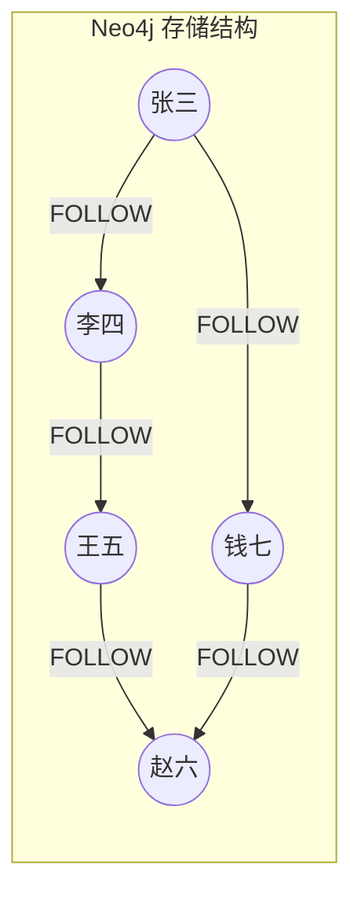
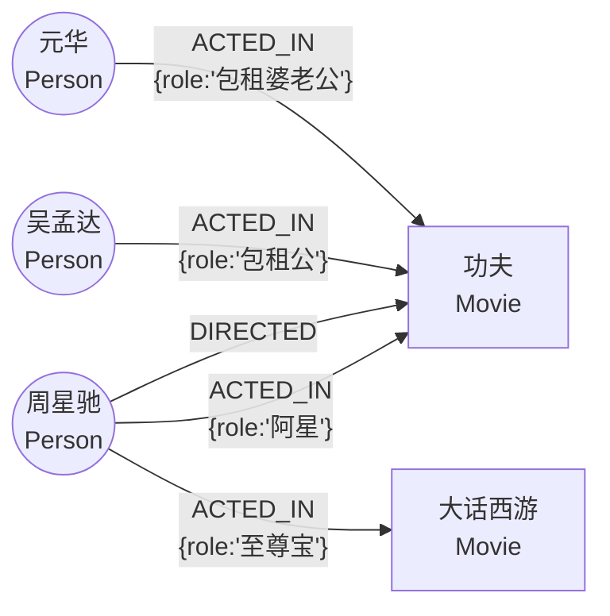
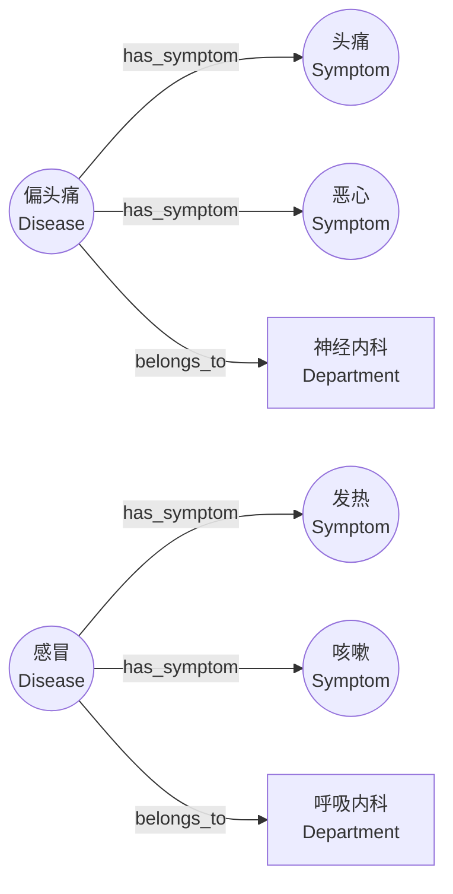

# 图数据库

> 在我们的医疗分诊项目中，医疗知识图谱是使用图数据库来存储的。所以在进入项目之前，我们需要先学习图数据库的相关知识。

## 引例

假设我们要做一个"社交网络"系统，需要存储用户之间的关注关系，用来存储数据的数据库表如下：

```sql
-- 用户表
CREATE TABLE user (
    id BIGINT PRIMARY KEY,
    name VARCHAR(64)
);

-- 关注关系表
CREATE TABLE follow (
    id BIGINT PRIMARY KEY,
    from_user_id BIGINT,
    to_user_id BIGINT
);
```


数据大概长这样：

**user 表：**

| id | name |
|----|------|
| 1  | 张三 |
| 2  | 李四 |
| 3  | 王五 |
| 4  | 赵六 |
| 5  | 钱七 |

**follow 表：**

| id | from_user_id | to_user_id |
|----|-------------|------------|
| 1  | 1           | 2          |
| 2  | 2           | 3          |
| 3  | 3           | 4          |
| 4  | 1           | 5          |
| 5  | 5           | 4          |


即：张三关注了李四、李四关注了王五、王五关注了赵六、张三关注了钱七、钱七关注了赵六。

现在问题来了：如果我们要查询**张三到赵六之间，最短的关注链路是什么？**，这个关注链路如果要从MySQL中查出来，我们大概只能使用穷举的思路：

- 查询，张三是否直接关注了赵六，查到结束，否则继续——> 查询直接关注的情况

```sql
SELECT * FROM follow WHERE from_user_id = 1 AND to_user_id = 4;
```

- 若1没查到，在查询张三—>x, x—>赵六的情况，查到结束，否则继续 ——> 查询关注路径中间隔一人的情况

```sql
SELECT * FROM follow f1
JOIN follow f2 ON f1.to_user_id = f2.from_user_id
WHERE f1.from_user_id = 1 AND f2.to_user_id = 4;
```


- 若2没查到，在查询张三—>x, x—>y, y—>赵六的情况，查到结束，否则继续 ——>查询关注路径中间隔两人的情况

```sql
SELECT * FROM follow f1
JOIN follow f2 ON f1.to_user_id = f2.from_user_id
JOIN follow f3 ON f2.to_user_id = f3.from_user_id
WHERE f1.from_user_id = 1 AND f3.to_user_id = 4;
```

....

看出问题了吗？

1. **每多一层关系，就要多一次 JOIN**。如果要查 6 层关系，就需要 6 次 JOIN，SQL 写起来极其复杂。
2. **性能急剧下降**。每次 JOIN 都是一次全表扫描或索引查找，层数越多性能越差。
3. **层数不确定**。我们事先不知道两个人之间隔了几层，所以无法写出一个固定的 SQL。

所以总结一下，问题的核心是什么呢？ 核心在于关系数据库中并没有存储**所有数据之间的关系**！

- 虽然表面上看，关注表存储了用户之间的关注关系，但是它只存储了用户之间的直接关注关系，而并没有直接存储用户之间非直接的关注关系
- 因此必须通过Join运算才能计算这种逻辑上存在的非直接的关注关系，
- 也就是说，真正的数据之间的联系，是被计算出来的，因此，关系越复杂，计算量越大

那么问题来了，假如我们就是需要快速获取这种数据之间的复杂关系，怎么办呢？其实思路很简单，我们把数据以及其关系物理存储即可，于是我们就引出了一种全新的数据库——图数据库！

图数据库天生就是为"关系"设计的。因为图数据库的底层存储结构就是按照"节点-关系"来组织和存储的。同样的关注数据，在图数据库中的存储结构如下：



每个圆圈是一个**节点**（Node），每条箭头是一条**关系**（Relationship）。和MySQL这样的关系数据库的关键区别在于：在 Neo4j 这样的图数据库中，每个节点通过物理指针直接指向和它有关系的节点，关系不是被计算出来的，而是**直接挂在节点上**。

所以当我们要查"张三到赵六的最短路径"时：
- 从张三节点出发，直接沿着指针走到李四、钱七（不需要搜索任何表）
- 从李四沿指针走到王五，从钱七沿指针走到赵六（找到了！）
- 每一跳都是 O(1) 的指针访问，整个过程不涉及任何 JOIN 运算

用 Cypher（图数据库的查询语言）一行就能搞定：

```cypher
MATCH path = shortestPath((a:User {name:'张三'})-[:FOLLOW*]-(b:User {name:'赵六'}))
RETURN path
```

## 图数据库中的基本概念

在关系型数据库中，数据存储涉及：数据库、表、字段、数据行。在图数据库中，也有一套对应的概念体系：

| 关系型数据库 | 图数据库 | 说明 |
|------------|---------|------|
| 数据库 | 数据库 | 一样的概念，一个独立的数据存储空间 |
| 表 | 标签（Label） | 用来对节点分类，类似于"这个节点属于哪张表" |
| 数据行 | 节点（Node） | 图中的一个实体，比如一个人、一部电影 |
| 字段/列 | 属性（Property） | 节点或关系上的键值对数据 |
| 外键关联 | 关系（Relationship） | 两个节点之间的连接，有方向、有类型 |

下面逐一介绍：

###  标签（Label）

标签就是一个纯粹的名称，用来给节点分类。你可以把它理解为一个"类型名称"——它本身没有任何其他东西，不像 MySQL 的表那样还要定义列名、列类型、约束等。

比如在一个电影数据库中，我们可能有这些标签：
- `Person` —— 表示这个节点是一个人
- `Movie` —— 表示这个节点是一部电影

**和 MySQL 的表有什么区别？**

MySQL 的表 = 名称 + 结构定义（列名、类型、约束），而图数据库的标签 = 只有名称。

具体来说：
- **不需要预先定义**：MySQL 中必须先 `CREATE TABLE` 才有这张表。但在图数据库中，标签不需要提前创建，直接用就可以，标签会自动生成
- **标签没有结构**：和数据库表不同，表必须有结构，但是一个标签只代表某种类型的名称，标识节点的类型。
- **一个节点可以属于多个标签**：比如一个节点可以同时是 `Person` 和 `Director`（既是人，又是导演）

### 节点（Node）

节点是图数据库中的基本数据单位，代表一个实体。类比 MySQL 中的一行数据。

和标签一样，节点不需要提前定义结构。你可以随时创建一个节点，给它任意的标签和属性：

```cypher
# 创建一个具有name,born属性的节点，节点的标签为Person
CREATE (n:Person {name: '周星驰', born: 1962})
# 创建一个具有title，released属性的节点，节点的标签为Movie
CREATE (m:Movie {title: '功夫', released: 2004})
```

同样是 `Person` 标签的节点，一个可以有 `born` 属性，另一个可以没有——图数据库不强制要求同一标签下的节点具有相同的属性。

**节点的唯一标识：**

每个节点在创建时，图数据库会自动分配一个内部 ID（类似 MySQL 的自增主键）。但在实际使用中，我们通常通过节点的属性来标识它（比如通过 `name` 属性查找节点），而不是直接使用内部 ID。

###  属性（Property）

属性是节点或关系上的键值对数据，类比 MySQL 中的字段值。

比如：
- Person 节点的属性：`{name: "周星驰", born: 1962}`
- Movie 节点的属性：`{title: "功夫", released: 2004, genre: "动作喜剧"}`

属性是完全自由的：
- 不需要提前声明有哪些属性
- 不需要指定属性的数据类型

**属性支持的数据类型：**

虽然属性不需要预先声明类型，但属性值本身是有类型的。Neo4j 支持以下数据类型：

| 类型 | 说明 | Cypher 中的写法示例 |
|------|------|-------------------|
| INTEGER | 整数 | `123`、`-5` |
| FLOAT | 浮点数 | `3.14`、`-0.5` |
| STRING | 字符串 | `'hello'`、`"world"` |
| BOOLEAN | 布尔值 | `true`、`false` |
| DATE | 日期 | `date('2024-03-15')` |
| TIME | 时间 | `time('12:30:00')` |
| DATETIME | 日期时间 | `datetime('2024-03-15T12:30:00')` |
| DURATION | 时间段 | `duration('P1Y2M3D')` 表示1年2月3天 |
| LIST | 列表（同类型元素） | `[1, 2, 3]`、`['a', 'b']` |

使用示例：

```cypher
CREATE (m:Movie {
  title: '功夫',
  released: 2004,
  rating: 8.5,
  isClassic: true,
  releaseDate: date('2004-12-23'),
  tags: ['动作', '喜剧', '功夫']
})
```

注意：LIST 中的元素必须是同一种类型，不能混合（比如不能 `[1, 'abc', true]`）。

### 关系（Relationship）

关系**连接**两个**节点**，表示它们之间的联系。关系有三个要素：
- **方向**：从哪个节点指向哪个节点
- **类型**：这是什么关系（用一个名称表示）
- **属性**（可选）：关系本身也可以携带数据

**举例：**

```Cypher
(n:Person {name: '周星驰', born: 1962})-[:ACTED_IN {role: '阿星'}]->(m:Movie {title: '功夫', released: 2004})
```
这条关系表示：周星驰出演了功夫这部电影关系的类型为ACTED_IN，并且关系上有一个属性 `role`（角色名）= "阿星"。

```Cypher
(n:Person {name: '周星驰', born: 1962})-[:DIRECTED]->(m:Movie {title: '功夫', released: 2004})
```
这条关系表示：周星驰导演了功夫这部电影。这条关系没有额外属性。

**关系的特点：**

- 关系必须有方向（从谁指向谁）
- 关系必须有类型（是什么关系）
- 关系的属性是可选的，可以有也可以没有
- 两个节点之间可以有多种不同类型的关系（比如周星驰既是功夫的演员，又是功夫的导演）

Cypher

关于标签，结点，属性的命名，习惯上采用驼峰命名方式

关于关系的命名，习惯上采用JAVA语言的常量命名方式

图数据库中所有的命名都是大小写敏感的

### 用一张图来理解



从这张图可以看出：
- 一个人可以出演多部电影（一对多）
- 一部电影可以有多个演员（多对多）
- 同一个人和同一部电影之间可以有多种关系（周星驰既演了功夫又导了功夫）
- 关系可以带属性，也可以不带

## Neo4j 图数据库

Neo4j 是目前最流行的图数据库，就像 MySQL 是最流行的关系型数据库一样。

- 开源图数据库，社区版免费
- 使用 Cypher 查询语言（类比 MySQL 的 SQL）
- 提供 Web 管理界面（类比 MySQL 的 Navicat / phpMyAdmin）
- 支持 ACID 事务

Cypher 是 Neo4j 的查询语言，就像 SQL 是 MySQL 的查询语言一样。接下来，我们按照类似 SQL 的分类方式来学习 Cypher：

### 数据操作 — 创建（类比 INSERT）

####  创建节点

```cypher
CREATE (变量:标签 {属性名1: 值1, 属性名2: 值2, ...})
```

语法解释：
- `()` 表示一个节点
- `变量` 是变量名（类比 SQL 中的别名，可省略），表示当前正在创建节点名称
- `:标签` 是节点的标签
- `{...}` 是属性（键值对）

**怎么理解变量名？**

变量名就是给节点起一个临时名称，方便在同一条 Cypher 语句的后续部分引用它。比如：

```cypher
// 添加完节点后，返回节点的name属性值
CREATE (p:Person {name: '周星驰', born: 1962})
RETURN p.name
```

这里：`p` 指向匹配到的 Person 节点，所以可以用 `p.name` 取出节点的 name 属性

**创建节点举例：**

```cypher
CREATE (p:Person {name: '周星驰', born: 1962})  // 或者可以省略变量 CREATE (:Person {name: '周星驰', born: 1962})
CREATE (m:Movie {title: '功夫', released: 2004}) // 或者可以省略变量 CREATE (:Movie {title: '功夫', released: 2004})
```

#### 创建关系

```cypher
// 先找到两个已有的节点，然后创建关系
MATCH (a:标签A {条件}), (b:标签B {条件})
CREATE (a)-[r:关系类型 {属性}]->(b)

// 也可以在创建节点的同时创建关系
CREATE (a:标签A {属性})-[:关系类型]->(b:标签B {属性})
```

语法解释：
- `MATCH` 关键字用来**查找已存在的节点或关系**，类比 SQL 中的 `SELECT`。它按照给定的模式（标签、属性、关系等）在图中匹配出符合条件的节点或关系，并把它们赋值给变量，供后续使用
- 上面第一种写法中，`MATCH` 先把符合条件的两个节点 a 和 b 找出来，然后 `CREATE` 在它们之间创建关系
- `-[:关系类型]->` 表示一条有方向的关系
- `->` 表示方向：从左边节点指向右边节点
- 关系的属性是可选的

**举例：**

```cypher
// 找到周星驰和功夫，创建出演关系（带属性）
MATCH (p:Person {name: '周星驰'}), (m:Movie {title: '功夫'})
CREATE (p)-[:ACTED_IN {role: '阿星'}]->(m)

// 创建节点的同时创建关系（不带属性）
CREATE (p:Person {name: '元华'})-[:ACTED_IN{role: '包租公'}]->(m:Movie {title: '功夫'})
```

当然，如果创建关系时MATCH (a:标签A {条件}), (b:标签B {条件})查询出的不是两个节点，而是两个节点集合，那么neo4j会为满足MATCH (a:标签A {条件})的m个节点，和满足MATCH (b:标签B {条件})添加的n个节点创建都创建关系，一共是m x n个关系

### 数据操作 — 查询（类比 SELECT）

数据准备：

```cypher
// 创建演员节点
CREATE (:Person {name: '周星驰', born: 1962});
CREATE (:Person {name: '吴孟达', born: 1952});
CREATE (:Person {name: '元华', born: 1950});
CREATE (:Person {name: '黄圣依', born: 1983});
CREATE (:Person {name: '张柏芝', born: 1980});

// 创建电影节点
CREATE (:Movie {title: '功夫', released: 2004});
CREATE (:Movie {title: '少林足球', released: 2001});
CREATE (:Movie {title: '喜剧之王', released: 1999});
CREATE (:Movie {title: '大话西游', released: 1995});
CREATE (:Movie {title: '长江七号', released: 2008});

// 创建电影类型节点
CREATE (:Type {name: '喜剧'});
CREATE (:Type {name: '动作'});
CREATE (:Type {name: '爱情'});
CREATE (:Type {name: '科幻'});

// 创建演员出演电影的关系
MATCH (p:Person {name: '周星驰'}), (m:Movie {title: '功夫'})
CREATE (p)-[:ACTED_IN {role: '阿星'}]->(m);

MATCH (p:Person {name: '元华'}), (m:Movie {title: '功夫'})
CREATE (p)-[:ACTED_IN {role: '包租公'}]->(m);

MATCH (p:Person {name: '黄圣依'}), (m:Movie {title: '功夫'})
CREATE (p)-[:ACTED_IN {role: '芳儿'}]->(m);

MATCH (p:Person {name: '周星驰'}), (m:Movie {title: '少林足球'})
CREATE (p)-[:ACTED_IN {role: '五师兄'}]->(m);

MATCH (p:Person {name: '吴孟达'}), (m:Movie {title: '少林足球'})
CREATE (p)-[:ACTED_IN {role: '明锋'}]->(m);

MATCH (p:Person {name: '周星驰'}), (m:Movie {title: '喜剧之王'})
CREATE (p)-[:ACTED_IN {role: '尹天仇'}]->(m);

MATCH (p:Person {name: '张柏芝'}), (m:Movie {title: '喜剧之王'})
CREATE (p)-[:ACTED_IN {role: '柳飘飘'}]->(m);

MATCH (p:Person {name: '吴孟达'}), (m:Movie {title: '喜剧之王'})
CREATE (p)-[:ACTED_IN {role: '卧底'}]->(m);

MATCH (p:Person {name: '周星驰'}), (m:Movie {title: '大话西游'})
CREATE (p)-[:ACTED_IN {role: '至尊宝'}]->(m);

MATCH (p:Person {name: '吴孟达'}), (m:Movie {title: '大话西游'})
CREATE (p)-[:ACTED_IN {role: '二当家'}]->(m);

MATCH (p:Person {name: '周星驰'}), (m:Movie {title: '长江七号'})
CREATE (p)-[:ACTED_IN {role: '周铁'}]->(m);

// 创建电影所属类型的关系
MATCH (m:Movie {title: '功夫'}), (t:Type {name: '喜剧'})
CREATE (m)-[:BELONGS_TO]->(t);

MATCH (m:Movie {title: '功夫'}), (t:Type {name: '动作'})
CREATE (m)-[:BELONGS_TO]->(t);

MATCH (m:Movie {title: '少林足球'}), (t:Type {name: '喜剧'})
CREATE (m)-[:BELONGS_TO]->(t);

MATCH (m:Movie {title: '少林足球'}), (t:Type {name: '动作'})
CREATE (m)-[:BELONGS_TO]->(t);

MATCH (m:Movie {title: '喜剧之王'}), (t:Type {name: '喜剧'})
CREATE (m)-[:BELONGS_TO]->(t);

MATCH (m:Movie {title: '喜剧之王'}), (t:Type {name: '爱情'})
CREATE (m)-[:BELONGS_TO]->(t);

MATCH (m:Movie {title: '大话西游'}), (t:Type {name: '喜剧'})
CREATE (m)-[:BELONGS_TO]->(t);

MATCH (m:Movie {title: '大话西游'}), (t:Type {name: '爱情'})
CREATE (m)-[:BELONGS_TO]->(t);

MATCH (m:Movie {title: '长江七号'}), (t:Type {name: '喜剧'})
CREATE (m)-[:BELONGS_TO]->(t);

MATCH (m:Movie {title: '长江七号'}), (t:Type {name: '科幻'})
CREATE (m)-[:BELONGS_TO]->(t);

```

####  查询

**通用语法：**

```cypher
MATCH (变量:标签 {条件})  图模式的匹配
WHERE 额外条件   过滤条件
RETURN 变量.属性, ...  查询返回的数据
```

`MATCH` 是查询的核心关键字，用来实现图模式的匹配，查询结果是和指定模式匹配的**所有数据**。换句话说，查询到的结果到底包含哪些数据，由查询的图模式决定，图模式中只包含节点查询结果中就只包含节点，图模式中包含关系，查询结果中就即包含节点，也包含节点之间的关系。

`WHERE`也是查询的核心关键字，用来针对满足match查询的结果，继续匹配查询条件， where中可以使用的条件就多了>, <, =,!=，AND OR NOT，IN等等都可以使用

`RETURN`表示返回查询结果


**查询只包含节点的图模式：**

```cypher
// 通用：查询某个标签的所有节点
MATCH (变量:标签)
RETURN 变量.属性

// 举例：查询所有电影
MATCH (m:Movie)
RETURN m.title, m.released

// 查询满足特定属性条件的节点(在属性中直接写条件)
MATCH (变量:标签 {属性名: 值})
RETURN 变量
                 
MATCH (p:Person {name: '周星驰'})
RETURN  p
```

**查询包含关系的图模式**

因为图模式中包含关系，所以查询结果中也会包含节点之间的关系

```cypher
// 查询某些A标签节点与某些B标签节点之间的关系, 以及关系所关联的两个节点
MATCH (a:标签A {条件})-[r1:关系类型]->(b:标签B {条件})
RETURN b.属性
                                
// 查询周星驰出演了哪些电影
MATCH (p:Person {name: '周星驰'})-[r1:ACTED_IN]->(m:Movie)                                               
RETURN m.title
                                               
                                               
```


```cypher
// 扩展：图模式中的模式可以很复杂比如可以包含多个关系,比如包含两个关系的多跳查询
MATCH (a:标签A {条件})-[r1:关系类型1]->(b:标签B {条件})-[r2:关系类型2]->(c:标签C {条件})

// 两跳查询：查询周星驰出演的电影属于哪些类型
MATCH (p:Person {name: '周星驰'})-[:ACTED_IN]->(m:Movie)-[:BELONGS_TO]->(t:Type)
RETURN m.title, t.name
```

**where查询**

where查询的作用是继续针对match查询的结果做过滤

```cypher
// 用 WHERE 子句写条件
MATCH 图模式
WHERE 条件1 AND 条件2, ....
RETURN 变量

MATCH (m:Movie)
WHERE m.released > 2000
RETURN m.title

MATCH (p:Person)-[r1:ACTED_IN]->(m:Movie)
where p.name="周星驰"
RETURN m.title


```


#### 聚合与排序

```cypher
MATCH  模式
RETURN 属性 as 别名, 聚合函数(变量) AS 别名   // 在return语句中起别名，调用聚合函数

ORDER BY 别名 DESC
LIMIT 数量

// 举例：查询每部电影有多少演员，按人数降序
MATCH (p:Person)-[:ACTED_IN]-> (m:Movie)
RETURN m.title AS movie, count(DISTINCT p.name) AS actorCount
ORDER BY actorCount DESC
LIMIT 10
```

这里没有显式写 `GROUP BY`，因为 Cypher 会自动把 `RETURN` 中**没有使用聚合函数的字段**当作分组字段。所以上面的查询会按 `m.title` 分组，然后统计每组里有多少个不同的 `p`。

`p` 是匹配到的 `Person` 节点变量，Neo4j 判断两个 `p` 是否相同，不是看 `name` 是否一样，而是看它们是不是同一个节点。这里使用 `count(DISTINCT p)` 是为了避免同一个演员和同一部电影之间如果存在重复 `ACTED_IN` 关系时被重复计数。

#### WITH 关键字

`WITH` 是 Cypher 中非常重要的一个关键字，用来把前一段查询的结果**传递到下一段查询**中继续处理。可以把它理解为"管道符 |"——把上一步的结果交给下一步使用。

```cypher
// 通用语法：
MATCH 模式
WITH 变量1, 变量2, 聚合函数(...) AS 别名
WHERE 条件        -- WITH 后面可以再加 WHERE 过滤
MATCH 另一个模式  -- WITH 后面可以再 MATCH
RETURN ...


// 查询出演电影数超过3部的演员，并列出他们的电影
MATCH (p:Person)-[:ACTED_IN]->(m:Movie)
WITH p, collect(m.title) AS movies, count(m) AS movieCount
WHERE movieCount > 3
RETURN p.name, movies, movieCount
```

执行过程：
1. 第一个 `MATCH` 找到所有"人 → 出演 → 电影"的关系
2. `WITH` 对每个人聚合，收集电影列表和数量
3. `WHERE` 过滤出电影数 > 3 的人
4. `RETURN` 返回结果

**什么时候需要使用with**

如果想"先聚合再过滤"，就必须使用with了，因为：

- 按照Cypher的语法，聚合函数本身只能在Return语句中使用，但是Return代表查询的结束，如果我们想先做聚合，针对聚合的结果在过滤，对应的Cypher语句如下：

```Cypher
MATCH 图模式
WHERE 条件
RETURN 聚合
WHERE 条件   // 这样写是不符合语法的因为RETURN表示查询结束了，后面不能再跟WHERE
```

- 因此引入WITH,  WITH可以接收前面的Cypher语句的查询结果，并且可以针对查询结果做聚合，然后把聚合结果交给接下来的Cypher语句处理，代码如下所示：

```Cypher
MATCH 图模式
WHERE 条件
WITH 聚合
WHERE 条件   // 这样写是不符合语法的因为RETURN表示查询结束了，后面不能再跟WHERE
...
RETURN ...
```

**集合操作（IN 查询）：**

```cypher
MATCH 模式
WHERE 变量.属性 IN [值1, 值2, ...]
RETURN ...

// 举例：查询指定演员出演的电影
MATCH (p:Person)-[:ACTED_IN]->(m:Movie)
WHERE p.name IN ['周星驰', '吴孟达', '元华']
RETURN p.name, collect(m.title) AS movies
```

### 数据操作 — 修改（类比 UPDATE）

**通用语法：**

```cypher
MATCH (变量:标签 {条件})
SET 变量.属性名 = 新值
RETURN 变量
```

**举例：**

```cypher
MATCH (m:Movie {title: '功夫'})
SET m.genre = '动作喜剧'
RETURN m
```

### 数据操作 — 删除（类比 DELETE）

**通用语法：**

```cypher
// 删除节点（节点没有关系时才能删除）
MATCH (变量:标签 {条件})
DELETE 变量

// 删除节点及其所有关系（强制删除）
MATCH (变量:标签 {条件})
DETACH DELETE 变量

// 删除关系
MATCH (a:标签A {条件})-[r:关系类型]->(b:标签B {条件})
DELETE r
```

**举例：**

```cypher
// 删除一个没有关系的节点
MATCH (p:Person {name: '测试人物'})
DELETE p

// 删除节点及其所有关系
MATCH (p:Person {name: '测试人物'})
DETACH DELETE p

// 只删除关系，保留节点
MATCH (p:Person {name: '周星驰'})-[r:DIRECTED]->(m:Movie {title: '功夫'})
DELETE r
```

## 理解项目中的 Cypher 查询

在我们的医疗分诊项目中，核心的知识图谱查询是"根据症状查找可能的疾病和对应科室"。在看具体查询语句之前，我们先来了解一下知识图谱中的数据结构。

### 项目知识图谱的数据结构

**涉及的标签（3 个）：**

| 标签 | 含义 |
|------|------|
| `Symptom` | 症状（如"头痛"、"发热"、"咳嗽"） |
| `Disease` | 疾病（如"偏头痛"、"感冒"、"肺炎"） |
| `Department` | 科室（如"神经内科"、"呼吸内科"） |

**节点的属性：**

| 节点类型 | 属性 | 说明 |
|---------|------|------|
| Symptom | `name` | 症状名称 |
| Disease | `name` | 疾病名称 |
| Disease | `desc` | 疾病描述 |
| Department | `name` | 科室名称 |

**涉及的关系（2 个）：**

| 关系类型 | 方向 | 含义 |
|---------|------|------|
| `has_symptom` | Disease → Symptom | 某疾病具有某症状 |
| `belongs_to` | Disease → Department | 某疾病属于某科室 |

**数据示意图：**



### 项目中的查询语句

下面是项目中实际使用的 Cypher 查询语句：

$symptoms： 症状集合

$mainSymptoms: 主诉症状集合

```cypher
MATCH (d:Disease)-[:has_symptom]->(s:Symptom)
WHERE s.name IN $symptoms
WITH d, collect(DISTINCT s.name) AS matchedSymptoms
WITH d,
     matchedSymptoms,
     [x IN matchedSymptoms WHERE x IN $mainSymptoms] AS matchedMainSymptoms
WHERE size(matchedMainSymptoms) > 0
MATCH (d)-[:belongs_to]->(dept:Department)
RETURN d.name AS disease,
       d.desc AS diseaseDesc,
       dept.name AS department,
       size(matchedSymptoms) AS hit,
       matchedMainSymptoms
ORDER BY size(matchedMainSymptoms) DESC, hit DESC
LIMIT $limit
```

逐步解读：

1. `MATCH (s:Symptom)<-[:has_symptom]-(d:Disease)` — 找到所有"疾病→症状"的关系
2. `WHERE s.name IN $symptoms` — 只保留症状名称在用户症状列表中的
3. `WITH d, collect(DISTINCT s.name) AS matchedSymptoms` — 用 WITH 传递中间结果：对每个疾病，收集它匹配到的症状列表
4. `[x IN matchedSymptoms WHERE x IN $mainSymptoms] AS matchedMainSymptoms` — 从匹配的症状中筛选出属于主症状的
5. `WHERE size(matchedMainSymptoms) > 0` — 只保留至少匹配了一个主症状的疾病
6. `MATCH (d)-[:belongs_to]->(dept:Department)` — 查出疾病对应的科室
7. `ORDER BY ... DESC` — 按主症状匹配数、总匹配数降序排列

简单说：**输入一组症状，找出匹配这些症状的疾病，以及疾病对应的科室，按匹配程度排序。**

## Java 语言访问 Neo4j

Neo4j 和 MySQL 一样，也是 C/S（客户端/服务端）架构：

- **服务端**：Neo4j 数据库进程，监听 `bolt://localhost:7687` 端口
- **客户端**：我们的 Java 应用程序，通过驱动连接到服务端

所以，就像访问 MySQL 需要引入 `mysql-connector-java` 驱动一样，访问 Neo4j 也需要引入对应的 Java 驱动。

在 Spring Boot 生态中，我们使用 **Spring Data Neo4j** 来访问 Neo4j，就像使用 MyBatis-Plus 来访问 MySQL 一样。Spring Data Neo4j 底层封装了 Neo4j Java Driver，提供了更简洁的 API。

在 `pom.xml` 中添加 Spring Data Neo4j 的 starter 依赖：

```xml
<dependency>
    <groupId>org.springframework.boot</groupId>
    <artifactId>spring-boot-starter-data-neo4j</artifactId>
</dependency>
```

类比 MySQL：
| MySQL | Neo4j |
|-------|-------|
| spring-boot-starter-data-jpa 或 mybatis-plus | spring-boot-starter-data-neo4j |
| JDBC 协议 | Bolt 协议 |
| 端口 3306 | 端口 7687 |
| SQL 语言 | Cypher 语言 |

在 `application.yml` 中配置 Neo4j 连接信息（Spring Boot 自动识别）：

```yaml
spring:
  neo4j:
    uri: bolt://192.168.150.109:7687 # neo4j服务器地址
    authentication:
      username: neo4j  # 用户名
      password: password123 #密码
  data:
    neo4j:
      database: neo4j #访问的数据库名称
```

Spring Boot 会根据这些配置自动创建 `Neo4jClient` Bean，我们直接注入使用即可，不需要手动创建连接对象。

### 使用 Neo4jClient 执行查询

Spring Data Neo4j 提供了 `Neo4jClient`，它是执行 Cypher 查询的核心工具。

类比 MySQL 的访问方式：

| MySQL (MyBatis-Plus) | Neo4j (Spring Data Neo4j) |
|---------------------|--------------------------|
| DataSource（自动配置） | Driver（自动配置） |
| SqlSession | Neo4jClient |
| mapper.selectList(wrapper) | neo4jClient.query(cypher).fetch().all() |
| @Param 传参 | .bind(value).to("param") 或 .bindAll(map) |

**基本查询示例：**

```java
@Service
public class MovieNeo4jService {

    private final Neo4jClient neo4jClient;

    public MovieNeo4jService(Neo4jClient neo4jClient) {
        this.neo4jClient = neo4jClient;
    }

    // 查询所有电影名称
    public List<String> listAllMovies() {
        String cypher = """
            MATCH (m:Movie)
            RETURN m.title AS movie
            ORDER BY m.released DESC
            """;

        List<String> movies = new ArrayList<>();
        for (Map<String, Object> record : neo4jClient.query(cypher).fetch().all()) {
            movies.add(record.get("movie").toString());
        }
        return movies;
    }
}
```

**带参数的查询示例：**

```java
// 方式一：绑定单个参数
public List<String> listActorsByMovie(String movieTitle) {
    String cypher = """
        MATCH (p:Person)-[:ACTED_IN]->(m:Movie {title: $movieTitle})
        RETURN p.name AS actor
        ORDER BY actor
        """;

    List<String> actors = new ArrayList<>();
    for (Map<String, Object> record : neo4jClient.query(cypher)
            .bind(movieTitle).to("movieTitle") // 绑定参数：$movieTitle = movieTitle变量的值
            .fetch().all()) {
        actors.add(record.get("actor").toString());
    }
    return actors;
}

// 方式二：绑定多个参数（使用 Map）
public List<String> searchMoviesByActors(List<String> actorNames, int limit) {
    String cypher = """
        MATCH (p:Person)-[:ACTED_IN]->(m:Movie)
        WHERE p.name IN $actorNames
        RETURN m.title AS movie,
               collect(DISTINCT p.name) AS matchedActors
        ORDER BY size(matchedActors) DESC
        LIMIT $limit
        """;

    Map<String, Object> params = Map.of(
        "actorNames", actorNames,
        "limit", limit
    );

    List<String> movies = new ArrayList<>();
    for (Map<String, Object> record : neo4jClient.query(cypher)
            .bindAll(params)                   // 一次绑定所有参数
            .fetch().all()) {
        movies.add(record.get("movie") + "：" + record.get("matchedActors"));
    }
    return movies;
}
```

注意几个关键点：
1. `Neo4jClient` 由 Spring Boot 自动创建并管理，直接注入即可（不需要手动管理连接和会话）
2. Cypher 中的参数使用 `$参数名` 的形式（类比 MyBatis 的 `#{参数名}`）
3. 绑定参数有两种方式：`.bind(value).to("name")` 绑定单个，`.bindAll(map)` 绑定多个
4. `.fetch().all()` 返回 `Collection<Map<String, Object>>`，每个 Map 就是一行结果
5. 也可以用 `.fetchAs(Type.class).mappedBy(...)` 做类型映射

### 项目中的实际用法

在我们的项目中，Neo4j 的访问封装在 `Neo4jKgStore` 类中。它的核心方法是根据症状查询疾病证据：

```java
@Service
public class Neo4jKgStore implements KgStore {

    private final Neo4jClient neo4jClient;

    public Neo4jKgStore(Neo4jClient neo4jClient) {
        this.neo4jClient = neo4jClient;
    }

    // 核心查询方法：根据症状列表查询匹配的疾病和科室
    public List<DiseaseEvidenceResult> searchDiseaseEvidenceBySymptoms(
            List<String> symptoms, List<String> mainSymptoms, int limit) {

        Map<String, Object> params = Map.of(
            "symptoms", symptoms,
            "mainSymptoms", mainSymptoms,
            "limit", limit
        );

        List<DiseaseEvidenceResult> rows = new ArrayList<>();
        for (Map<String, Object> record : neo4jClient.query(DISEASE_EVIDENCE_QUERY)
                .bindAll(params)
                .fetch().all()) {
            rows.add(new DiseaseEvidenceResult(
                record.get("disease").toString(),
                record.get("diseaseDesc").toString(),
                record.get("department").toString(),
                ((Number) record.get("hit")).longValue(),
                (List<String>) record.get("matchedMainSymptoms")
            ));
        }
        return rows;
    }
}
```

整体流程就是：
1. 从 Spring 容器中注入 `Neo4jClient`（Spring Boot 自动配置好的）
2. 调用 `neo4jClient.query(cypher)` 指定要执行的 Cypher 语句
3. 通过 `.bindAll(params)` 绑定查询参数
4. 调用 `.fetch().all()` 执行查询并获取所有结果
5. 遍历结果集（`Map<String, Object>`），按列名取值，封装为业务对象返回
