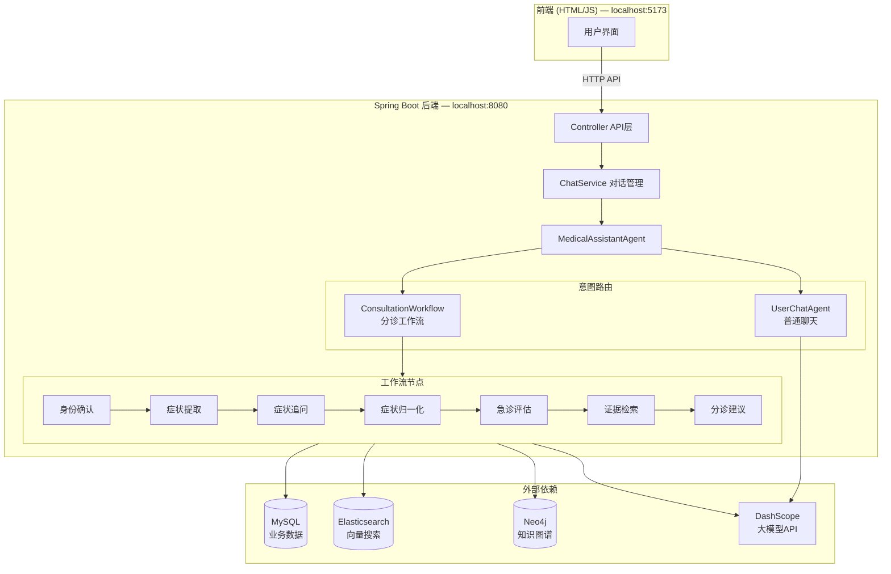
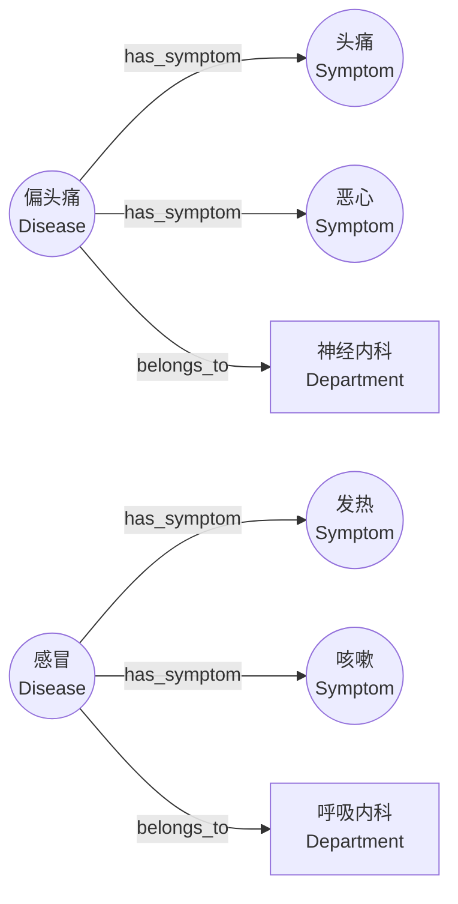
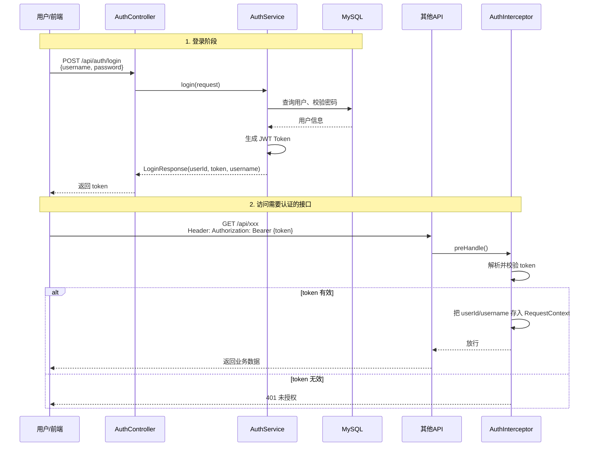

# 项目概述

## 项目介绍

本项目是一个**智能医疗分诊助手**，核心功能是帮助用户完成线上分诊，最终给出挂号科室建议。

围绕分诊，项目主要实现了两大块功能：

**1. 复杂的分诊工作流**

这是项目的核心功能。当用户描述自己的症状时，系统会通过一套完整的工作流来完成分诊：

- 病患身份确认（你是谁？给谁看病？）
- 获取用户的原始症状描述
- 症状追问（信息不够时继续追问细节）
- 症状归一化（将用户的口语化描述转为标准医学术语）
- 急症判断（判断是否需要紧急就医）
- 知识图谱查询（从医学知识图谱中检索相关疾病证据）
- 最终给出挂号科室建议

**2. 围绕分诊的辅助聊天功能**

除了分诊工作流之外，系统还支持一些日常对话，比如：
- "上次我头痛那个分诊结果是什么？"
- "你是谁？"
- ...

这些功能通过意图路由来区分：系统会判断用户的消息是要"做分诊"还是"普通聊天"，然后走不同的处理逻辑。

**3. 会话管理功能(简单的传统功能不让大家实现)**

系统支持类似 ChatGPT 的多会话管理：
- 用户可以创建多个独立的会话窗口（每个会话有独立的上下文、独立的分诊状态、独立的就诊人和病例）
- 可以查看历史会话列表（按最后消息时间倒序）
- 可以查看某个会话的完整消息记录
- 可以删除不需要的会话（逻辑删除）
- 同一用户的不同会话互相隔离，互不影响

## 项目架构图



## 项目代码结构

```
com.medical.assistant
├── controller          # Controller层，定义API接口（ChatController、ConversationController、AuthController）
├── dto                 # 数据传输对象，接口的请求和响应类
│   ├── auth            # 登录相关的请求/响应（LoginRequest、LoginResponse等）
│   └── chat            # 聊天相关的请求/响应（ChatRequest、ChatResponse等）
├── vo                  # 视图对象，用于前端展示的数据封装
├── entity              # 数据库实体类，与MySQL表一一对应（ConversationDO、ConsultationCaseDO等）
├── mapper              # MyBatis-Plus Mapper接口，负责数据库CRUD操作
├── service             # 业务逻辑层
│   ├── auth            # 认证服务（登录、JWT生成）
│   │   └── impl
│   ├── chat            # 聊天服务（对话管理、消息持久化、上下文组装）
│   │   └── impl
│   └── index           # 索引服务（症状向量索引的初始化和管理）
├── store               # 数据存储层，封装对各种存储的访问
│   ├── chat            # 对话摘要存储
│   ├── consultation    # 分诊状态存储（ConsultationStateStore、ConsultationCaseStore）
│   ├── history         # 历史病例搜索存储
│   └── kg              # 知识图谱存储（Neo4jKgStore）
├── workflow            # 分诊工作流核心代码
│   ├── agent           # Agent实现（MedicalAssistantAgentImpl、RouterAgent、UserChatAgent）
|   ├── node			# 工作流节点实现（症状提取、追问、归一化、急诊评估等）
│   └──MedicalTriageWorkflow # 自定义工作流             
|  
├── tool                # Agent工具定义
│   ├── chat            # 聊天相关工具
│   └── consultation    # 分诊相关工具（症状对齐工具、证据检索工具、急诊评估工具）
├── bo                  # 业务对象（Business Object），内部流转的数据结构
│   ├── agent           # Agent相关BO（AgentDispatchResult、AgentStreamEvent）
│   ├── chat            # 聊天相关BO（ChatContext）
│   └── consultation    # 分诊相关BO（ConsultationState —— 工作流核心状态对象）
├── config              # 配置类（VectorStoreConfig、Neo4jConfig、RedissonConfig等）
├── properties          # 配置属性类（对应application.yml中的自定义配置）
├── security            # 安全相关（JWT工具、认证拦截器）
├── constant            # 常量定义
├── exception           # 异常定义和全局异常处理
│   └── handler
└── util                # 工具类
    ├── chat            # 聊天相关工具类（ChatContextAssembler —— 上下文组装）
    └── consultation    # 分诊相关工具类
```

## 项目数据

###  MySQL 数据库表

项目使用的数据库名为 `medical`, 对应的数据库脚本在项目资料中

共包含以下 8 张表：

user_account（用户账号表）：存储系统的注册用户信息。

| 字段 | 类型 | 说明 |
|------|------|------|
| id | BIGINT | 主键自增 |
| user_id | VARCHAR(64) | 用户唯一标识（UUID） |
| username | VARCHAR(64) | 登录用户名 |
| password_hash | VARCHAR(128) | 密码哈希值 |
| nickname | VARCHAR(64) | 用户昵称 |
| status | TINYINT | 账号状态 |
| created_at / updated_at | DATETIME | 创建/更新时间 |
| deleted | TINYINT | 逻辑删除标记 |

conversation（会话表）：存储用户的对话会话，一个用户可以有多个会话。

| 列名                  | 数据类型     | 注释                           |
| --------------------- | ------------ | ------------------------------ |
| id                    | bigint       | 主键ID                         |
| user_id               | varchar(64)  | 用户ID                         |
| title                 | varchar(128) | 会话标题                       |
| triage_active         | tinyint      | 问诊流程是否进行中：1是，0否   |
| active_subject_id     | bigint       | 当前问诊对象ID                 |
| active_case_id        | bigint       | 当前问诊病例ID                 |
| active_triage_turn_id | bigint       | 当前问诊轮次ID                 |
| deleted               | tinyint      | 逻辑删除标记：0未删除，1已删除 |
| created_at            | datetime     | 创建时间                       |
| updated_at            | datetime     | 更新时间                       |
|                       |              |                                |

conversation_message（会话消息表）；存储每一条对话消息（用户消息、AI回复、工具调用结果等）。

| 列名               | 数据类型    | 注释                           |
| ------------------ | ----------- | ------------------------------ |
| id                 | bigint      | 主键ID                         |
| conversation_id    | tinyint     | 逻辑删除标记：0未删除，1已删除 |
| deleted            | varchar(64) | 请求追踪ID                     |
| turn_id            | bigint      | 会话轮次ID                     |
| role               | varchar(16) | 消息角色                       |
| content            | longtext    | 消息内容                       |
| tool_name          | varchar(64) | 工具名称                       |
| visible_in_ui      | tinyint     | 是否在界面展示：1是，0否       |
| include_in_context | tinyint     | 是否纳入上下文：1是，0否       |
| created_at         | datetime    | 创建时间                       |
|                    |             |                                |

conversation_chat_summary（对话摘要表）： 存储对话的摘要信息，用于长对话的上下文压缩。

| 列名                    | 数据类型    | 注释                           |
| ----------------------- | ----------- | ------------------------------ |
| id                      | bigint      | 主键ID                         |
| user_id                 | varchar(64) | 用户ID                         |
| conversation_id         | bigint      | 会话ID                         |
| summary_text            | longtext    | 会话摘要内容                   |
| last_summarized_turn_id | bigint      | 最后已摘要的轮次ID             |
| created_at              | datetime    | 创建时间                       |
| updated_at              | datetime    | 更新时间                       |
| deleted                 | tinyint     | 逻辑删除标记：0未删除，1已删除 |

consultation_subject（就诊人表）：存储就诊人信息（可以是用户本人，也可以是家属）。

| 列名         | 数据类型     | 注释                           |
| ------------ | ------------ | ------------------------------ |
| id           | bigint       | 主键ID                         |
| user_id      | varchar(64)  | 用户ID                         |
| subject_code | varchar(64)  | 问诊对象编码                   |
| display_name | varchar(128) | 问诊对象显示名称               |
| age_text     | varchar(64)  | 年龄描述                       |
| gender       | varchar(16)  | 性别                           |
| created_at   | datetime     | 创建时间                       |
| updated_at   | datetime     | 更新时间                       |
| deleted      | tinyint      | 逻辑删除标记：0未删除，1已删除 |

consultation_case（分诊病例表）：存储每次分诊的完整病例信息，是分诊工作流的核心数据表。

| 列名                            | 数据类型      | 注释                           |
| ------------------------------- | ------------- | ------------------------------ |
| id                              | bigint        | 主键ID                         |
| conversation_id                 | bigint        | 所属会话ID                     |
| subject_id                      | bigint        | 问诊对象ID                     |
| workflow_node                   | varchar(128)  | 当前工作流节点                 |
| normal_finished                 | tinyint       | 是否正常完成：1是，0否         |
| terminal_reason                 | varchar(128)  | 终止原因                       |
| raw_symptom                     | varchar(1024) | 原始症状描述                   |
| main_symptom_json               | json          | 主诉症状JSON                   |
| accompanying_symptoms_json      | json          | 伴随症状JSON                   |
| duration                        | varchar(128)  | 持续时间                       |
| severity                        | varchar(128)  | 严重程度                       |
| onset                           | varchar(128)  | 起病情况                       |
| provoking_factors_json          | json          | 诱发因素JSON                   |
| relieving_factors_json          | json          | 缓解因素JSON                   |
| symptom_quality                 | varchar(256)  | 症状性质                       |
| symptom_location                | varchar(256)  | 症状部位                       |
| radiation                       | varchar(256)  | 放射痛或扩散情况               |
| time_course                     | varchar(256)  | 病程变化                       |
| negative_danger_signs_json      | json          | 已否认危险信号JSON             |
| heart_rate                      | varchar(64)   | 心率                           |
| systolic_blood_pressure         | varchar(64)   | 收缩压                         |
| spo2                            | varchar(64)   | 血氧饱和度                     |
| axillary_temperature            | varchar(64)   | 腋温                           |
| blood_glucose                   | varchar(64)   | 血糖                           |
| blood_potassium                 | varchar(64)   | 血钾                           |
| emergency                       | tinyint       | 是否急症：1是，0否             |
| allergies_json                  | json          | 过敏史JSON                     |
| comorbidities_json              | json          | 合并疾病JSON                   |
| current_medications_json        | json          | 当前用药JSON                   |
| normalized_symptoms_json        | json          | 标准化症状JSON                 |
| normalized_symptom_details_json | json          | 标准化症状详情JSON             |
| advice_departments_json         | json          | 建议就诊科室JSON               |
| final_triage_advice             | text          | 最终分诊建议                   |
| last_question                   | text          | 最近一次追问内容               |
| created_at                      | datetime      | 创建时间                       |
| updated_at                      | datetime      | 更新时间                       |
| deleted                         | tinyint       | 逻辑删除标记：0未删除，1已删除 |


###  Elasticsearch 向量索引

项目使用 ES 存储两类向量索引：

 medical_case（医疗病例向量索引）

存储历史病例的向量表示，用于相似病例检索。当用户描述症状后，系统会通过向量相似度搜索找到历史上类似的病例作为参考。

- 索引名：`medical_case`
- 向量维度：1536（使用 text-embedding-v4 模型）
- 用途：历史病例的语义搜索，主要用在聊天功能中

medical_symptom（医学症状向量索引）

存储标准医学症状术语的向量表示，用于症状归一化。当用户说"头疼"时，系统通过向量搜索找到最匹配的标准术语（如"头痛-偏头痛"）。

- 索引名：`medical_symptom`
- 向量维度：1536（使用 text-embedding-v4 模型）
- 用途：将用户口语化的症状描述匹配到标准医学术语，主要用在分诊功能中

###  Neo4j 医疗知识图谱

项目使用 Neo4j 存储医疗知识图谱，用于"根据症状查询可能的疾病和挂号科室"。

**涉及的标签（3 个）：**

| 标签 | 含义 | 数量 |
|------|------|------|
| `Symptom` | 症状（如"头痛"、"发热"、"咳嗽"） | 5,998 |
| `Disease` | 疾病（如"偏头痛"、"感冒"、"肺炎"） | 8,807 |
| `Department` | 科室（如"神经内科"、"呼吸内科"） | 54 |

**节点的属性：**

| 节点类型 | 属性 | 说明 |
|---------|------|------|
| Symptom | `name` | 症状名称 |
| Disease | `name` | 疾病名称 |
| Disease | `desc` | 疾病描述 |
| Department | `name` | 科室名称 |

**涉及的关系（2 个）：**

| 关系类型 | 方向 | 含义 | 数量 |
|---------|------|------|------|
| `has_symptom` | Disease → Symptom | 某疾病具有某症状 | 5,998 |
| `belongs_to` | Disease → Department | 某疾病属于某科室 | 8,844 |

**数据示意图：**



知识图谱的初始数据通过项目资料中快照文件快速导入.

## 项目环境搭建

###  基础运行环境

项目依赖以下中间件，其中MySQL、ES 在之前的课程中已经安装过，这里不再赘述。

**Neo4j（知识图谱数据库）需要额外安装：**

```bash
# 拉取 Neo4j 镜像
docker pull neo4j:5.20.0

# 创建如下两个目录
sudo mkdir -p /opt/neo4j/data /opt/neo4j/neo4j-dumps

# 启动 Neo4j 容器
docker run -d \
  --name neo4j \
  --restart=always \
  -p 7474:7474 \
  -p 7687:7687 \
  -e NEO4J_AUTH=neo4j/123456 \
  -v /opt/neo4j/data:/data \
  -v /opt/neo4j/neo4j-dumps:/dumps \
  neo4j:5.20.0
```

启动后可以通过 `http://ip:7474` 访问 Neo4j 浏览器界面，用户名 `neo4j`，密码 `password123`。

然后，在项目资料中，我们还给大家提供了一个名为neo4j.dump的文件，这里面放的就是我们项目中所需要用到的医疗知识图谱数据，我们可以执行以下命令，将数据导入到我们的neo4j容器中

```bash
# 先停止容器的运行
docker stop neo4j

# 接着利用winscp将neo4j.dump文件上传到云服务器或者虚拟机的/opt/neo4j/neo4j-dumps目录

# 启动一个临时容器，在容器内执行 neo4j-admin database load neo4j --from-path=/dumps --overwrite-destination=true这个命令恢复文件中的数据
docker run --rm \
  --user root \
  --entrypoint neo4j-admin \
  -v /opt/neo4j/data:/data \
  -v /opt/neo4j/neo4j-dumps:/dumps \
  neo4j:5.20.0 \
  database load neo4j \
  --from-path=/dumps \
  --overwrite-destination=true

# 启动原来的容器
docker start neo4j
```


###  项目配置

项目的核心配置文件为 `src/main/resources/application.yml`，主要配置项如下：

```yaml
spring:
  application:
    name: medical-assistant
  datasource: # 数据库配置
    url: jdbc:mysql://192.168.150.109:3306/medical?useUnicode=true&characterEncoding=UTF-8&serverTimezone=Asia/Shanghai
    username: root
    password: 1234
    driver-class-name: com.mysql.cj.jdbc.Driver
    hikari: # 连接池配置
      maximum-pool-size: 10
      minimum-idle: 2
      connection-timeout: 30000
      validation-timeout: 5000
      keepalive-time: 120000
      idle-timeout: 300000
      max-lifetime: 600000
  data:
    redis: # redis配置
      host: 192.168.150.109
      port: 6379
    neo4j:
      database: neo4j
  neo4j: # neo4j配置
    uri: bolt://192.168.150.109:7687
    authentication:
      username: neo4j
      password: password123
    neo4j:
      database: neo4j
  jackson:
    default-property-inclusion: non_null
  ai:
    vectorstore:
      type: none # 不适用默认装配的vectorStore对象
    dashscope: # 模型配置
      api-key: ${API-KEY}
      base-url: https://dashscope.aliyuncs.com
      chat:
        options:
          model: qwen3.7-max
      embedding: # embedding模型配置
        options:
          model: text-embedding-v4
          dimensions: 1536
      rerank: # 重排模型配置
        options:
          model: gte-rerank-v2

mybatis-plus:
  configuration:
    map-underscore-to-camel-case: true

jwt:
  secret: cskaoyan #jwt秘钥
  issuer: medical-assistant #发行者
  expire-seconds: 72000 # 超时时间

app:
  chat-context:
    trigger-unsummarized-messages: 20 # 不触发压缩的最近消息轮次阈值
    keep-recent-messages-after-compact: 3 #触发压缩之后保留的最近消息轮次数量
  vectorstore:
    medical-case:
      initialize-schema: true # 如果不存在则自动创建
      index-name: medical_case # 病例库
    symptom:
      index-name: medical_symptom # 症状库

external:
  es:
    url: http://192.168.150.109:9200
    embedding-dims: 1536 # 维度与embeddin模型一致
  symptom-align:
    vector-top-k: 6
    vector-threshold: 0.5
    rerank-top-k: 3

```

> 注意：以上 IP 地址 `192.168.150.109` 需要替换为你自己的虚拟机或者服务器地址。

###  项目运行

项目采用**前后端分离架构**，前端和后端需要分别启动。

**后端启动：**

- 启动类：`com.medical.assistant.MedicalAssistantApplication`
- 默认端口：`9999`
- 直接在 IDE 中运行启动类即可

**前端启动：**

我们会在项目资料中给大家提供一个jar包启动前端，大家直接运行如下命令即可：

```
java -jar front.jar
```

- 启动后访问：`http://localhost:5173`
- 前端会自动代理 API 请求到后端的 9999 端口

## 登录与身份认证

### 默认用户

项目启动已经准备好一个可以登录的用户，方便我们直接登录测试：

| 字段 | 值 |
|------|----|
| 用户名 | `demo_user` |
| 密码 | `123456` |

### 认证方案：JWT  Token

项目采用 **JWT（JSON Web Token）** 进行身份认证，整体认证流程如下：



### 关键代码组件

**1. 登录接口（AuthController）：**

```java
@PostMapping("/login")
public ApiResponse<LoginResponse> login(@Valid @RequestBody LoginRequest request) {
    return ApiResponse.success(authService.login(request));
}
```

登录成功后返回 `LoginResponse`，其中包含：
- `userId`：用户唯一标识
- `token`：JWT Token（前端需保存，后续请求都要带上）
- `username`：用户名

**2. 认证拦截器（AuthInterceptor）：**

拦截器对所有 `/api/**` 接口生效（除了 `/api/auth/login`）。它做三件事：

```java
public boolean preHandle(HttpServletRequest request, ...) {
    // 1. 从请求头中取出 Bearer Token
    String authHeader = request.getHeader(HttpHeaders.AUTHORIZATION);
    if (authHeader == null || !authHeader.startsWith("Bearer ")) {
        throw new AuthException("missing bearer token");
    }

    // 2. 解析 token，校验签名和有效期
    String token = authHeader.substring("Bearer ".length());
    JwtTokenService.TokenPayload payload = jwtTokenService.parseToken(token);

    // 3. 将 userId、username 存入 RequestContext（线程上下文）
    RequestContext.set(payload.userId(), payload.username(), RequestContext.getTraceId());
    return true;
}
```

`RequestContext` 是基于 ThreadLocal 实现的请求上下文，后续业务代码可以通过 `RequestContext.getUserId()` 随时获取当前登录用户的 ID。

**3. JWT 配置（application.yml）：**

```yaml
jwt:
  secret: cskaoyan              # 签名密钥
  issuer: medical-assistant     # token 签发者
  expire-seconds: 72000         # token 有效期，20小时
```

### 前端如何使用 Token

前端登录成功后，需要把 token 保存（通常存到 localStorage），然后在后续所有请求的 HTTP Header 中带上：

```
Authorization: Bearer <token>
```

如果 token 过期或无效，后端会返回 401，前端需要引导用户重新登录。
