# 分诊功能

## 完整的分诊 Workflow

分诊工作流是本项目的核心功能。当用户描述症状时，系统会通过一套完整的工作流来完成分诊，最终给出挂号科室建议。

整个分诊流程分为以下 7 个阶段：

| 阶段 | 说明 |
|------|------|
| 确认病患 | 确定当前分诊的对象是谁（本人？家属？孩子？），如果是已有病患则绑定，否则创建新病患 |
| 确认原始症状 | 获取用户最初描述的症状信息，创建一个新的分诊病例（Case） |
| 追问收集症状槽 | 通过多轮追问，收集完整的症状信息（主症状、伴随症状、持续时间、严重程度、生命体征等） |
| 症状归一化 | 将用户口语化的症状描述转换为知识图谱中的标准医学术语 |
| 急症评估 | 根据生命体征和症状判断是否为急症，如果是急症则直接给出急诊建议 |
| 知识图谱查询 | 用归一化后的症状查询医疗知识图谱，获取匹配的疾病和对应科室 |
| 返回最终结果 | 综合所有信息，生成最终的分诊建议（推荐科室、理由等）返回给用户 |

下面是包含每个阶段细致步骤的流程图：

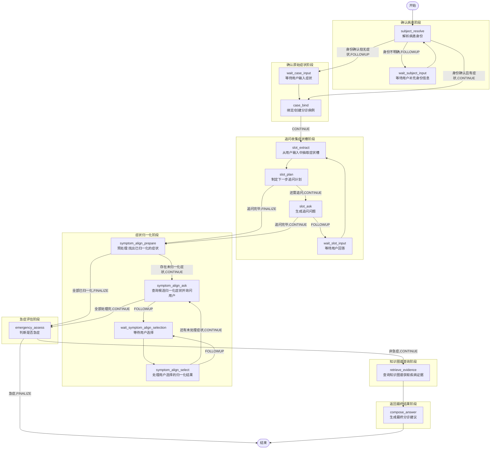

<!-- PLACEHOLDER_CONVENTIONS -->

大家需要注意的是完整的分诊过程分成三个大的阶段：

1. 确认病患阶段：先确认患者
2. 确定病例阶段：确认病患的症状
3. 分诊阶段：确认了病患，及其有效症状后，才开始真正的分诊


## 分诊 Workflow 实现的代码约定

在深入每个节点之前，先了解整个 Workflow 中使用的公共约定。

### OverAllState中的特殊Key

在分诊工作流的OverAllState对象中有个非常特殊的键值对：

- KEY_FLOW_OUTCOME：该属性值决定节点当前节点的边(下一个节点)，该属性的取值如下：

| Outcome            | 含义         | 说明                                                         |
| ------------------ | ------------ | ------------------------------------------------------------ |
| `OUTCOME_CONTINUE` | 继续         | 正常完成，流转到下一个业务节点                               |
| `OUTCOME_FOLLOWUP` | 等待用户输入 | 需要向用户提问并等待回答，图会中断（Human-In-Loop）          |
| `OUTCOME_FINALIZE` | 终止         | 分诊正常结束流转到 END                                       |
| `OUTCOME_CANCEL`   | 取消         | 用户主动取消当前分诊，或因达到重试上限等原因异常终止终止，跳转到 END |

- KEY_RESPONSE_MESSAGE: 该属性值存储要返回给前端(用户)看的消息，注意不是每个节点都需要返回给用户看的消息，一般来说需要给用户返回分诊结果，或者中断问题的节点需要设置该属性的值

每个节点执行完毕后，都会调用output方法，返回Map，Map中的数据会自动保存到OverAllState对象中，代码如下：

```java
public class XxxNodeAction {

	Map<String, Object> apply(OverAllState state) throws Exception {
        // .....
        return output(....);
    }

}    

protected Map<String, Object> output(ConsultationState state,
                                         String outcome,
                                         String message,
                                         Map<String, Object> extra) {
        Map<String, Object> map = new HashMap<>();
        // 表示本节点的执行结果, 该结果决定下一步走到哪个节点
        map.put(KEY_FLOW_OUTCOME, outcome);
        // 表示该节点执行后可能需要返回给用户的一条消息
        map.put(KEY_RESPONSE_MESSAGE, message);
        // 其他要放入OverAllState对象中的数据
        map.putAll(extra);
        return map;
 }
```

- KEY_WAIT_PROMPT: 该属性值保存最近一次给用户返回的中断问题

```java
  
public class XxxNodeAction {

	Map<String, Object> apply(OverAllState state) throws Exception {
        // .....
        return outputWaitPrompt(....);
    }

} 


  // 需要触发中断的节点会执行这个方法  
  protected Map<String, Object> outputWaitPrompt(ConsultationState state,
                                                   String resumeNode,
                                                   String question,
                                                   Map<String, Object> extra) {

        Map<String, Object> map = output(state, OUTCOME_FOLLOWUP, question, extra);
        // 保存追问的问题
        map.put(KEY_WAIT_PROMPT, question);  // 将给用户展示的问题，保存
        // 追问的节点
        map.put(KEY_WAIT_STAGE, resumeNode);
        return map;
    }
```

- KEY_USER_MESSAGE：每次用户回复的消息，在图恢复执行时，都会被保存到该属性中

### 中断节点的恢复状态处理

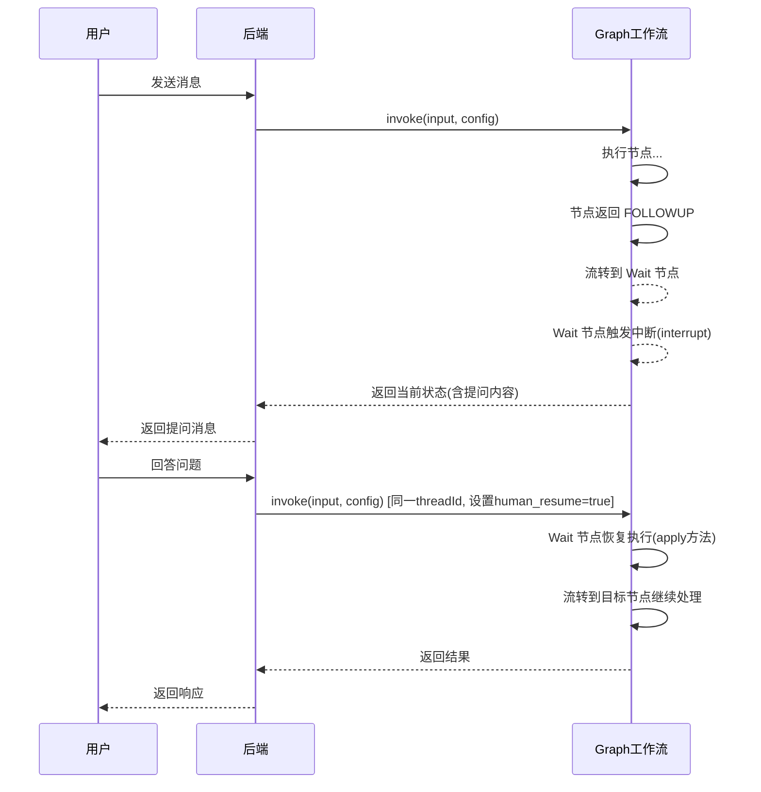


Wait 节点除了注入用户输入之外，还涉及**恢复状态的清理**问题。在我们的项目中，在恢复节点的apply方法中，我们还需要向OverAllState对象中放入一些数据如下：

```java
// 中断 节点 apply 方法（设置标记）
@Override
public CompletableFuture<Map<String, Object>> apply(OverAllState state, RunnableConfig config) {
    // ... 注入用户输入 ...
    Map<String, Object> output = new HashMap<>();
    output.put(KEY_HUMAN_RESUME, true);  // ★ 设置恢复标记，告诉下游业务节点"这是恢复执行"
    return CompletableFuture.completedFuture(output);
}
```

这样一来，在恢复节点所跳转到的那个节点中，可以做如下判断：

```java
// 读取 KEY_HUMAN_RESUME 标记，清理后判断用户是否要取消/重开
protected Map<String, Object> resumedControlOutputIfNeeded(OverAllState overallState,
                                                           ConsultationState state) {
    // 1. 如果不是恢复执行，直接返回 null，继续正常业务逻辑
    if (!read(overallState, KEY_HUMAN_RESUME, Boolean.class, false)) {
        return null;
    }
    // ★ 清理标记：将 KEY_HUMAN_RESUME 重置为 false，不影响后面的节点判断
    overallState.updateState(Map.of(KEY_HUMAN_RESUME, false));

    // 2. 调用 LLM 判断用户输入是否是"取消"指令
    //    如果是 → 执行相应清理并返回控制结果
    //    如果不是 → 返回 null，继续正常业务逻辑
    TriageControlOutcome decision = judgeTriageControl(state, ...);
    // ... CANCEL 处理 ...
    return null;
}
```

业务节点中的调用方式：

```java
// 
@Override
public Map<String, Object> apply(OverAllState overallState) {
    ConsultationState state = readSessionState(overallState);

    // ★ 恢复后首先检查用户是否要取消
    Map<String, Object> controlOutput = resumedControlOutputIfNeeded(overallState, state);
    if (controlOutput != null) {
        return controlOutput;  // 用户要取消，直接返回控制结果
    }

    // 正常业务逻辑....
}
```

###  Graph 状态

分诊工作流使用 `BaseCheckpointSaver`（项目中配置为 MySQL 实现）来持久化 Graph 的执行状态。

**threadId 的生成规则：**

```java
String threadId = conversationId;
```

同一个会话（conversation）的分诊工作流共用一个 threadId，这样：
- 用户发送新消息时，可以通过 threadId 恢复之前中断的工作流
- 工作流的完整状态（包括 ConsultationState）都保存在 checkpoint 中
- 同一个会话，同时只会运行一个分诊工作流
- 在一次分诊流程结束后，我们会释放Graph运行时所保存的状态

```java
// 如果分诊结束，则释放本次分诊过程中保存的所有状态
private void releaseWorkflowCheckpointIfCompleted(boolean completed, ConsultationState state) {
    try {
        // 释放本次分诊所保存的所有状态
        graphCheckpointStore.deleteWorkflowCheckpoint(String.valueOf(state.getConversationId()));
    } catch (Exception ex) {
        log.warn("Failed to release consultation workflow checkpoint. conversationId={}",
                state.getConversationId(), ex);
    }
}
```

###  ConsultationState（结构化记忆）

`ConsultationState` 是整个分诊过程的核心状态对象，存储在 Graph 状态的OverAllState对象。它记录了分诊的所有关键数据。

**为什么需要结构化记忆？**

分诊工作流不能像聊天那样依赖"对话历史"来维持上下文。因为：

- 分诊需要精确地知道"主症状是什么"、"持续时间多久"、"哪些症状已经归一化了"。如果只靠对话历史，模型需要从多轮对话中反复提取这些信息，容易遗漏或出错。
- 结构化记忆将这些信息以字段形式明确存储，每个节点直接读取字段即可，不存在歧义。

```java
public class ConsultationState {
    // ===== 会话级别 =====
    private Long conversationId;          // 会话ID
    private String userId;                // 用户ID
    private boolean triageActive;         // 是否正在分诊中

    // ===== 病患相关 =====
    private Long activeSubjectId;         // 当前活跃的就诊人ID
    private List<Subject> knownSubjects;  // 已知的所有就诊人列表
    private int subjectResolveRetryCount; // 病患解析重试次数

    // ===== 病例相关 =====
    private Long activeCaseId;            // 当前活跃的病例ID
    private CaseContext currentCaseContext;  // 当前正在进行的病例的详细上下文

    // ===== 临时数据 =====
    // 用户可能在一开始输入的症状信息
    private String pendingCaseSeedMessage;
    // 用户可能在一开始输入的年龄
    private String pendingSubjectAgeText;
    // 用户一开始输入的性别
    private String pendingSubjectGender;
}
```

其中 `CaseContext` 是单次分诊病例的完整上下文：

```java
public static class CaseContext {
    private Long subjectId;               // 就诊人ID
    private Long caseId;                  // 病例ID
    private String rawSymptom;            // 原始症状描述

    // ===== 症状槽位 =====
    private List<String> mainSymptom;     // 主症状
    private List<String> accompanyingSymptoms;  // 伴随症状
    private String duration;              // 持续时间
    private String severity;              // 严重程度
    private String onset;                 // 起病方式
    private List<String> provokingFactors;     // 加重因素
    private List<String> relievingFactors;     // 缓解因素
    private String symptomQuality;        // 症状性质
    private String symptomLocation;       // 症状部位
    private String radiation;             // 放射
    private String timeCourse;            // 时间进程

    // ===== 生命体征 =====
    private String heartRate;             // 心率
    private String systolicBloodPressure; // 收缩压
    private String spo2;                  // 血氧
    private String axillaryTemperature;   // 腋温

    // ===== 追问控制 =====
    private String slotPhase;             // 当前追问阶段（RAW/CORE/OPQRST/VITALS）
    private List<String> slotCurrentQuestionTargets;  // 当前轮次要追问的字段

    // ===== 归一化 =====
    private List<SymptomForNormalization> symptomsForNormalization;  // 待归一化的症状列表（含原始文本和类型）
    private List<ResolvedSymptom> normalizedSymptomDetails;          // 已完成归一化的详细记录
    private List<String> normalizedConfirmedSymptoms;                // 已确认的归一化症状名称列表
    private List<SymptomAlignmentSpan> normalizationPendingSpans;   // 待用户选择的归一化候选
    private Integer symptomAlignSelectRetryCount;                    // 归一化选择重试次数

    // ===== 结果 =====
    private boolean emergency;            // 是否急症
    private List<String> adviceDepartments;  // 建议科室
    private String finalAnswer;           // 最终分诊建议
}
```


## 分诊 Workflow 的 Graph 构建

### buildSpecificGraph 方法

`MedicalTriageWorkflow` 继承自 `FlowAgent`，通过 `buildSpecificGraph` 方法构建整个分诊工作流图：

```java
@Override
protected StateGraph buildSpecificGraph(FlowGraphBuilder.FlowGraphConfig flowGraphConfig) throws GraphStateException {
// 提前注册OverAllState对象中所要使用的两个key,
// 只有提前声明了在中断恢复的时候才能从恢复后的OverAllState对象中读取到这些key在中断之前的值
StateGraph graph = new StateGraph(() -> Map.of(
        KEY_SESSION_STATE, KeyStrategy.REPLACE,
        KEY_WAIT_PROMPT, KeyStrategy.REPLACE));
// 确认病患身份节点
graph.addNode(NODE_SUBJECT_RESOLVE, AsyncNodeAction.node_async(subjectResolveNode::apply));
// 绑定病患症状节点
graph.addNode(NODE_CASE_BIND, AsyncNodeAction.node_async(caseBindNode::apply));
// 抽取症状槽节点
graph.addNode(NODE_SLOT_EXTRACT, AsyncNodeAction.node_async(slotExtractNode::apply));
// 指定症状抽取计划节点
graph.addNode(NODE_SLOT_PLAN, AsyncNodeAction.node_async(slotPlanNode::apply));
// 生成症状抽取问题节点
graph.addNode(NODE_SLOT_ASK, AsyncNodeAction.node_async(slotAskNode::apply));
// 症状归一化准备节点
graph.addNode(NODE_SYMPTOM_ALIGN_PREPARE, AsyncNodeAction.node_async(symptomAlignPrepareNode::apply));
// 症状归一化问题节点
graph.addNode(NODE_SYMPTOM_ALIGN_ASK, AsyncNodeAction.node_async(symptomAlignAskNode::apply));
// 症状归一化选择节点
graph.addNode(NODE_SYMPTOM_ALIGN_SELECT, AsyncNodeAction.node_async(symptomAlignSelectNode::apply));
// 症状归一化急症评估节点
graph.addNode(NODE_EMERGENCY_ASSESS, AsyncNodeAction.node_async(emergencyAssessNode::apply));
// 知识图谱证据检索节点
graph.addNode(NODE_RETRIEVE_EVIDENCE, AsyncNodeAction.node_async(retrieveEvidenceNode::apply));
// 最终答案生成节点
graph.addNode(NODE_COMPOSE_ANSWER, AsyncNodeAction.node_async(composeAnswerNode::apply));

// 中断节点：等待输入有效的用户身份
graph.addNode(NODE_WAIT_SUBJECT_INPUT, new ConsultationWaitNodeAction());
// 中断节点：等待用户输入有效症状
graph.addNode(NODE_WAIT_CASE_INPUT, new ConsultationWaitNodeAction());
// 中断节点：等待用户输入有效的症状槽
graph.addNode(NODE_WAIT_SLOT_INPUT, new ConsultationWaitNodeAction());
// 中断节点：等待用户选择有效的归一化症状选项
graph.addNode(NODE_WAIT_SYMPTOM_ALIGN_SELECTION, new ConsultationWaitNodeAction());

graph.addEdge(StateGraph.START, NODE_SUBJECT_RESOLVE);
graph.addEdge(NODE_WAIT_SUBJECT_INPUT, NODE_SUBJECT_RESOLVE);
graph.addEdge(NODE_WAIT_CASE_INPUT, NODE_CASE_BIND);
graph.addEdge(NODE_WAIT_SLOT_INPUT, NODE_SLOT_EXTRACT);
graph.addEdge(NODE_WAIT_SYMPTOM_ALIGN_SELECTION, NODE_SYMPTOM_ALIGN_SELECT);

// subject_resolve 的条件边：
//   CONTINUE → case_bind（身份确认且有症状）
//   FOLLOWUP + 无activeSubjectId → wait_subject_input（身份不明确，追问身份）
//   FOLLOWUP + 有activeSubjectId → wait_case_input（身份确认但无症状，追问症状）
//   FINALIZE → END
graph.addConditionalEdges(NODE_SUBJECT_RESOLVE,
AsyncEdgeAction.edge_async(state -> {
  String outcome = read(state, KEY_FLOW_OUTCOME, String.class, OUTCOME_CONTINUE);
      if (OUTCOME_CANCEL.equals(outcome)) { // 超过重试次数
           return StateGraph.END;
       }
       if (OUTCOME_FOLLOWUP.equals(outcome)) { // 追问用户
             ConsultationState sessionState = read(state, KEY_SESSION_STATE, ConsultationState.class, new ConsultationState());

                return sessionState.getActiveSubjectId() == null ?
                        // 追问病患身份              追问用户症状
                        NODE_WAIT_SUBJECT_INPUT : NODE_WAIT_CASE_INPUT;
            }
            // 如果用户身份，症状都有，则进入CaseBind
            return NODE_CASE_BIND;
        }),
        Map.of(
                NODE_CASE_BIND, NODE_CASE_BIND,
                NODE_WAIT_CASE_INPUT, NODE_WAIT_CASE_INPUT,
                NODE_WAIT_SUBJECT_INPUT, NODE_WAIT_SUBJECT_INPUT,
                NODE_SUBJECT_RESOLVE, NODE_SUBJECT_RESOLVE,
                StateGraph.END, StateGraph.END));
// case_bind 的条件边：
//   CONTINUE → slot_extract（症状确认，进入追问）
//   FOLLOWUP → wait_case_input（非症状输入，继续追问）
//   FINALIZE/CANCEL → END
//   RESTART → subject_resolve
graph.addConditionalEdges(NODE_CASE_BIND,
        AsyncEdgeAction.edge_async(state -> switch (read(state, KEY_FLOW_OUTCOME, String.class, OUTCOME_CONTINUE)) {
            case OUTCOME_FOLLOWUP -> NODE_WAIT_CASE_INPUT; // 追问用户症状
            case OUTCOME_CANCEL -> StateGraph.END; // 超过重试次数
            default -> NODE_SLOT_EXTRACT; // 收集到了有效的原始症状输入则进入症状抽取节点
        }),
        Map.of(
                NODE_SLOT_EXTRACT, NODE_SLOT_EXTRACT,
                NODE_WAIT_CASE_INPUT, NODE_WAIT_CASE_INPUT,
                NODE_SUBJECT_RESOLVE, NODE_SUBJECT_RESOLVE,
                StateGraph.END, StateGraph.END));
// slot_extract 的条件边：
//   CONTINUE → slot_plan（抽取完成，进入计划）
//   OUTCOME_CANCEL -> 用户要求取消本次分诊
graph.addConditionalEdges(NODE_SLOT_EXTRACT,
        AsyncEdgeAction.edge_async(state -> switch (read(state, KEY_FLOW_OUTCOME, String.class, OUTCOME_CONTINUE)) {
            case OUTCOME_CANCEL -> StateGraph.END; // 超过重试次数
            default -> NODE_SLOT_PLAN; // 正常进入NODE_SLOT_PLAN
        }),
        Map.of(
                NODE_SLOT_PLAN, NODE_SLOT_PLAN,
                NODE_SUBJECT_RESOLVE, NODE_SUBJECT_RESOLVE,
                StateGraph.END, StateGraph.END));
// slot_plan 的条件边：
//   OUTCOME_CONTINUE: 1) 有待追问槽位 → slot_ask（继续追问） 2) 无待追问槽位 → symptom_align_prepare（追问完毕，进入归一化）
//   CANCEL → END
graph.addConditionalEdges(NODE_SLOT_PLAN,
        AsyncEdgeAction.edge_async(state -> {
            String outcome = read(state, KEY_FLOW_OUTCOME, String.class, OUTCOME_CONTINUE);
            if (OUTCOME_CANCEL.equals(outcome)) { // 超过追问轮次或者重复追问次数上限
                return StateGraph.END;
            }
            ConsultationState sessionState = read(state, KEY_SESSION_STATE, ConsultationState.class, new ConsultationState());
            List<String> questionTargets = sessionState.currentCaseContext().getSlotCurrentQuestionTargets();
            // 如果待收集的症状集合为空则进入NODE_SYMPTOM_ALIGN_PREPARE，否则进入NODE_SLOT_ASK
            return questionTargets == null || questionTargets.isEmpty() ? NODE_SYMPTOM_ALIGN_PREPARE : NODE_SLOT_ASK;
        }),
        Map.of(
                NODE_SLOT_ASK, NODE_SLOT_ASK,
                NODE_SYMPTOM_ALIGN_PREPARE, NODE_SYMPTOM_ALIGN_PREPARE,
                StateGraph.END, StateGraph.END));
// 触发中断
graph.addEdge(NODE_SLOT_ASK, NODE_WAIT_SLOT_INPUT);

// symptom_align_prepare 的条件边：
//   CONTINUE → symptom_align_ask（进入归一化问题节点）
//   CANCEL → END(无可用的重写症状)
graph.addConditionalEdges(NODE_SYMPTOM_ALIGN_PREPARE,
        AsyncEdgeAction.edge_async(state -> OUTCOME_CANCEL.equals(read(state, KEY_FLOW_OUTCOME, String.class, OUTCOME_CONTINUE))
                // 重写后得到的症状集合为空集合
                ? StateGraph.END
                // 针对未归一化的症状，生成选项问题，让用户选择
                : NODE_SYMPTOM_ALIGN_ASK),
        Map.of(
                NODE_SYMPTOM_ALIGN_ASK, NODE_SYMPTOM_ALIGN_ASK,
                StateGraph.END, StateGraph.END));
// symptom_align_ask 的条件边：
//   CONTINUE → emergency_assess（全部处理完）
//   FOLLOWUP → wait_symptom_align_selection（等待用户选择）
//   OUTCOME_CANCEL -> StateGraph.END 存在无法归一化的症状
graph.addConditionalEdges(NODE_SYMPTOM_ALIGN_ASK,
        AsyncEdgeAction.edge_async(state -> switch (read(state, KEY_FLOW_OUTCOME, String.class, OUTCOME_CONTINUE)) {
            case OUTCOME_FOLLOWUP -> NODE_WAIT_SYMPTOM_ALIGN_SELECTION; // 触发中断
            case OUTCOME_CANCEL -> StateGraph.END; // 用户没有选到合适的归一化症状
            default -> NODE_EMERGENCY_ASSESS; // 正常进入急症评估节点
        }),
        Map.of(
                NODE_EMERGENCY_ASSESS, NODE_EMERGENCY_ASSESS,
                NODE_WAIT_SYMPTOM_ALIGN_SELECTION, NODE_WAIT_SYMPTOM_ALIGN_SELECTION,
                StateGraph.END, StateGraph.END));
// symptom_align_select 的条件边：
// OUTCOME_FOLLOWUP -> NODE_WAIT_SYMPTOM_ALIGN_SELECTION(用户的选择无效，重新选择)
//  OUTCOME_CANCEL -> StateGraph.END(用户选择无效且超过重试次数)
//  CONTINUE → NODE_SYMPTOM_ALIGN_ASK（还有未处理的症状）
graph.addConditionalEdges(NODE_SYMPTOM_ALIGN_SELECT,
        AsyncEdgeAction.edge_async(state -> switch (read(state, KEY_FLOW_OUTCOME, String.class, OUTCOME_CONTINUE)) {
            case OUTCOME_FOLLOWUP -> NODE_WAIT_SYMPTOM_ALIGN_SELECTION; // 用户的选择无效
            case OUTCOME_CANCEL -> StateGraph.END; // 超过选择重试次数，或者用户要求取消本次分诊
            default -> NODE_SYMPTOM_ALIGN_ASK; // 正常进入下一个阶段
        }),
        Map.of(
                NODE_SYMPTOM_ALIGN_ASK, NODE_SYMPTOM_ALIGN_ASK,
                NODE_WAIT_SYMPTOM_ALIGN_SELECTION, NODE_WAIT_SYMPTOM_ALIGN_SELECTION,
                NODE_SUBJECT_RESOLVE, NODE_SUBJECT_RESOLVE,
                StateGraph.END, StateGraph.END));
// emergency_assess 的条件边：
//   CONTINUE → retrieve_evidence（非急症，继续查证据）
//   FINALIZE → END（急症，直接结束）
graph.addConditionalEdges(NODE_EMERGENCY_ASSESS,
        AsyncEdgeAction.edge_async(state -> switch (read(state, KEY_FLOW_OUTCOME, String.class, OUTCOME_CONTINUE)) {
            case OUTCOME_FINALIZE -> StateGraph.END;
            default -> NODE_RETRIEVE_EVIDENCE;
        }),
        Map.of(
                NODE_RETRIEVE_EVIDENCE, NODE_RETRIEVE_EVIDENCE,
                StateGraph.END, StateGraph.END));

// retrieve_evidence 的条件边：
//   CONTINUE → compose_answer
//   CANCEL -> StateGraph.END
graph.addConditionalEdges(NODE_RETRIEVE_EVIDENCE,
        AsyncEdgeAction.edge_async(state -> switch (read(state, KEY_FLOW_OUTCOME, String.class, OUTCOME_CONTINUE)) {
            case OUTCOME_CANCEL-> StateGraph.END;
            default -> NODE_COMPOSE_ANSWER;
        }),
        Map.of(
                NODE_COMPOSE_ANSWER, NODE_COMPOSE_ANSWER,
                StateGraph.END, StateGraph.END));

graph.addEdge(NODE_COMPOSE_ANSWER,StateGraph.END);
return graph;
}
```

## 聊天接口

用户发送消息后，请求经过 Controller → ChatServiceImpl → MedicalConversationManager，最终触发分诊工作流。

```java
@RestController
@RequestMapping("/api/chat")
public class ChatController {

    private final ChatService chatService;

    public ChatController(ChatService chatService) {
        this.chatService = chatService;
    }

    @PostMapping("/message")
    public ApiResponse<ChatResponse> chat(@RequestBody ChatRequest request) {
        return ApiResponse.success(chatService.chat(RequestContext.getUserId(), request));
    }
}

```

**ChatServiceImpl 中的核心逻辑：**

首先要说名的是，有一张数据库表conversation，存储了会话信息：

| 列名                  | 数据类型     | 注释                           |
| --------------------- | ------------ | ------------------------------ |
| id                    | bigint       | 主键ID                         |
| user_id               | varchar(64)  | 用户ID                         |
| title                 | varchar(128) | 会话标题                       |
| triage_active         | tinyint      | 问诊流程是否进行中：1是，0否   |
| active_subject_id     | bigint       | 当前问诊对象ID                 |
| active_case_id        | bigint       | 当前问诊病例ID                 |
| active_triage_turn_id | bigint       | 当前问诊轮次ID                 |
| deleted               | tinyint      | 逻辑删除标记：0未删除，1已删除 |
| created_at            | datetime     | 创建时间                       |
| updated_at            | datetime     | 更新时间                       |
|                       |              |                                |


```java
@Service
public class ChatServiceImpl implements ChatService {

    private final MedicalConversationManager conversationManager;
	
    @Override
    public ChatResponse chat(String userId, ChatRequest request) {
               // 解析会话
        ConversationDO conversation = resolveConversation(userId, request);

        // 执行分诊或者聊天
        ConversationDispatchResult dispatchResult = medicalConversationManager.dispatch(
                userId,
                conversation.getId(),
                request.message());

        // 返回响应
        return new ChatResponse(
                idText(conversation.getId()),
                dispatchResult.reply(),
                dispatchResult.completed());
    }
    
    private ConversationDO resolveConversation(String userId, ChatRequest request) {
        if (!StringUtils.hasText(request.conversationId())) {
            // 如果会话id不存在说明用户是在一个新建的会话中第一次发送消息，就创建这个会话，会话的标题默认为用户发送的第一条消息
            ConversationDO conversation = new ConversationDO();
            conversation.setUserId(userId);
            conversation.setTitle(buildTitle(request.message()));
            conversation.setTriageActive(0);
            conversation.setDeleted(0);
            conversation.setCreatedAt(LocalDateTime.now());
            conversation.setUpdatedAt(LocalDateTime.now());
            conversationMapper.insert(conversation);
            return conversation;
        }
        // 查询conversationId对应的会话信息
        Long conversationDbId = Long.parseLong(request.conversationId());
        return conversationMapper.selectById(conversationDbId);

    }
}
```

**MedicalConversationManager 的 dispatch 方法**

```java
@Service
public class MedicalConversationManagerImpl implements MedicalConversationManager {

    private final MedicalTriageWorkflow triageWorkflow;

    @Override
    public ConversationDispatchResult dispatch(String userId, Long conversationId, Long turnId,String message) {
        
        // 构造RunnableConfig对象, 主要是基于conversationId设置threadId
        RunnableConfig config = buildFlowConfig(conversationId);
        
        // 根据数据库中存储的会话状态判断，当前处于分诊状态中，继续执行分诊工作流（恢复执行）
        if (consultationStateStore.isTriageActive(conversationId)) {
            return executeResumedConsultation(config, conversationId,message);
        }

        // 否则，说明当前是一次新开启的分诊，创建一个新的ConsultationState对象
       ConsultationState consultationState = consultationStateStore.newConsultationState(userId, conversationId);
       return executeNewConsultation(consultationState, config, conversationId, message);
    }
    
    // 继续恢复执行进行中的分诊流程
    private ConversationDispatchResult executeResumedConsultation(RunnableConfig config,
                                                                  Long conversationId,
                                                                  String message) {
        // 针对中断恢复构造RunnableConfig对象
        RunnableConfig resumeConfig = buildResumeConfig(config, message);
        try {
            // 执行工作流
            Optional<OverAllState> maybeState = medicalTriageWorkflow.invoke((Map<String, Object>) null, resumeConfig);
            // 获取工作流返回的OverAllState对象，如果没有获取到OverAllState对象则抛出异常
            OverAllState finalState = maybeState.orElseThrow(
                    () -> new IllegalStateException("Resumed consultation workflow completed without final state."));
            // 构造最终响应的结果
            return completeFromFinalState(conversationId, finalState, reason);
        } catch (Exception ex) {
            log.warn("Failed to resume active consultation workflow. conversationId={}, threadId={}",
                     conversationId,
                     config.threadId().orElse(null),
                    ex);
            
            // 返回表示无效的分诊结果的ConversationDispatchResult对象
            // 如果抛出异常，则认为本次分诊过程终止，修改conversation表中记录的分诊状态为已结束，清理activeSubjectId，activeCaseId
            // 清理运行时状态
           return terminateInvalidTriage(conversationId);
        }
    }
    
        private ConversationDispatchResult completeFromFinalState(OverAllState finalState) {
        // 获取ConsultationState对象
        ConsultationState latestState = medicalTriageWorkflow.resolveSessionState(finalState);
        // 获取outcome
        String outcome = medicalTriageWorkflow.resolveOutcome(finalState);
        // 获取节点放入latestState的消息
        String message = medicalTriageWorkflow.resolveMessage(finalState);

        // 判断是不是流程结束了，OUTCOME_CANCEL表示异常终止，OUTCOME_FINALIZE表示正常终止
        boolean completed = MedicalTriageWorkflow.OUTCOME_FINALIZE.equals(outcome)
                || MedicalTriageWorkflow.OUTCOME_CANCEL.equals(outcome);

        // 返回结果
        ConversationDispatchResult result = new ConversationDispatchResult(
                message,
                completed);
       
        if (completed) {

            // 释放本次分诊所保存的所有状态
            graphCheckpointStore.deleteWorkflowCheckpoint(String.valueOf(latestState.getConversationId()));
        }
        return result;
    }
    
    private ConversationDispatchResult terminateInvalidTriage(Long conversationId) {
        ConversationDispatchResult invalidResult = invalidTriageStateResult();
        // 删除本次会话的turnId和活跃分诊指针
        consultationStateStore.clearConversationTriageState(conversationId);
        graphCheckpointStore.deleteWorkflowCheckpoint(conversationId.toString());;
        return invalidResult;
    }
    
    // 开启新的分诊工作流
     private ConversationDispatchResult executeNewConsultation(ConsultationState state,
                                                              RunnableConfig config,
                                                              Long conversationId,
                                                              String message) {

        try {
            // 设置ConsultationState对象的默认值，更新conversation表中的分诊状态等字段
            consultationStateStore.saveTriageStarted(state);
            // 构造输入的Map，主要包括用户当前的message以及ConsultationState对象
            Map<String, Object> input = buildWorkflowInput(state, message);
            // 执行分诊工作流
            Optional<OverAllState> maybeState = medicalTriageWorkflow.run(input, config);
            // 获取OverAllState对象，如果获取不到则抛出异常
            OverAllState finalState = maybeState.orElseThrow(
                    () -> new IllegalStateException("New consultation workflow completed without final state."));
            // 构造返回值
            return completeFromFinalState(finalState);
        } catch (Exception ex) {
            log.warn("Failed to start consultation workflow. conversationId={}, threadId={}",
                    conversationId,
                    config.threadId().orElse(null),
                    ex);
            
           // 返回表示无效的分诊结果的ConversationDispatchResult对象
            // 如果抛出异常，则认为本次分诊过程终止，修改conversation表中记录的分诊状态为已结束，清理activeSubjectId，activeCaseId
            // 清理运行时状态
           return terminateInvalidTriage(conversationId);
        }
    }
}
```

---

接下来，我们逐个介绍每个节点的实现。

## 解析病患

**节点名称：** `subject_resolve`，该节点的作用主要是确认病患身份，同一个用户，有可能为他自己，他的父母，朋友或者其他人分诊，所以我们需要首先确定病患身份，即分诊对象

###  节点输入

首先，用户的输入可能有多种情况：

1. **明确指定了病患 + 症状**：如"我女儿8岁，发烧两天了" → 创建新病患，同时记录症状
2. **明确指定了病患，无症状**：如"帮我妈看看" → 创建新病患，追问症状
3. **只有症状，没有明确病患**：如"发烧咳嗽两天" → 无法确定是谁，追问病患身份
4. **指定了已有病患**：如"还是上次那个孩子" → 绑定已有病患


**病患的表示与存储**

在代码层面，一个病患用 `ConsultationState.Subject` 类来表示，主要字段如下：

```java
public static class Subject {
    private String subjectCode;       // 病患编码（如 P0、P1，在当前会话内唯一）
    private Long subjectId;           // 数据库主键ID
    private String displayName;       // 显示名称（如"我"、"我妈"、"我女儿"）
    private String ageText;           // 年龄文本（如"8岁"、"35岁"）
    private String gender;            // 性别（MALE / FEMALE）
    private Integer caseBindRetryCount = 0;  // case_bind 失败重试次数
}
```

**在 ConsultationState 中的存储：**

`ConsultationState`中维护了两组与病患相关的数据：

```java
// 当前会话已知的所有病患列表（同一个会话可能有多个病患）
private List<Subject> knownSubjects = new ArrayList<>();

// 当前活跃病患的 ID（指向 knownSubjects 中的某一个）
private Long activeSubjectId;
```

- 当用户首次描述新病患时，`subject_resolve` 会创建一个新的 Subject 对象，加入 `knownSubjects`，并把 `activeSubjectId` 指向它
- 当用户切换到已有病患时（如"还是我妈"），`subject_resolve` 会从 `knownSubjects` 中查找对应的 Subject，更新 `activeSubjectId`

**对应的数据库表：**

病患信息持久化到 MySQL 的 `consultation_subject` 表，主要字段：

| 字段 | 类型 | 说明 |
|------|------|------|
| id | BIGINT | 主键，对应 Subject 的 subjectId |
| conversation_id | BIGINT | 所属会话 |
| subject_code | VARCHAR(64) | 病患编码（P0/P1...） |
| display_name | VARCHAR(128) | 显示名称 |
| age_text | VARCHAR(64) | 年龄文本 |
| gender | VARCHAR(16) | 性别 |

注意：`consultation_subject` 表是按会话隔离的（通过 `conversation_id`），不同会话之间的病患互不共享。


### 节点逻辑

基于以上可能的用户输入，其核心处理逻辑如下：

1. 调用 ReactAgent 解析用户输入，返回解析用户输入的病患结果（CREATE_NEW / BIND_EXISTING / UNKNOWN）
2. 如果是 CREATE_NEW ：创建新病患，保存到数据库，检查是否有症状描述
   - 有症状 → 返回 CONTINUE，直接进入 case_bind
   - 无症状 → 返回 FOLLOWUP，跳转到等待用户输入症状的中断节点，追问症状（恢复后进入 case_bind）
3. 如果是 BIND_EXISTING：绑定已有病患
   - 有症状 → 返回 CONTINUE，直接进入 case_bind
   - 无症状 → 返回 FOLLOWUP，跳转到等待用户输入症状的中断节点，追问症状（恢复后进入 case_bind）
4. 如果是 UNKNOWN：进入重试逻辑
   - 未达重试上限 → 返回 FOLLOWUP，跳转到追问身份的中断节点（恢复后回到 subject_resolve）
   - 达到重试上限（3次） → 返回 FINALIZE，终止分诊

下面是前后端交互的示意图：

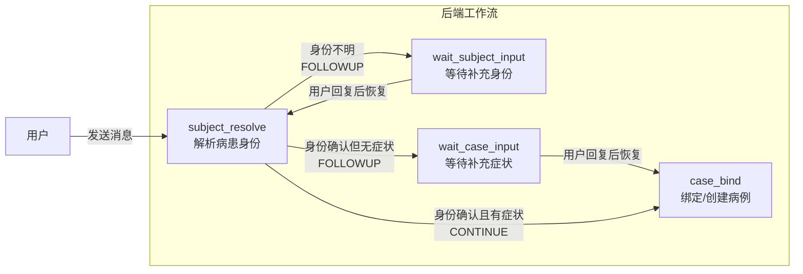

###  节点实现代码

**核心提示词与消息：**

subject_resolve 节点通过 ReactAgent 调用 LLM 完成病患解析。ReactAgent 在调用模型时主要由三部分构成：

**1. System Prompt（系统提示词）—— 定义角色和任务边界**

```text
你是医疗问诊流程中的病患对象解析节点（subject_resolve）。
任务：只判断当前用户消息在说哪一个患者/就诊对象，并在同一次返回中抽取基础信息和合并症状。

任务边界：
- 只解析"患者是谁"，不要做分诊、诊断、科室、疾病或急症等级判断。
- 患者对象只能是人或就诊对象，不能是疾病、症状、科室或诊断。
- 返回 JSON 只能包含字段清单中的字段，不要输出 candidates、disease、department、triageLevel 等额外字段。
```

**2. Instruction（指令）—— 定义具体行为规则**

```text
身份决策：
- intent 只能是 BIND_EXISTING、CREATE_NEW 或 UNKNOWN。
- 如果当前消息明确命中 knownSubjects 中已有对象，返回 BIND_EXISTING，并填写该对象已有 subjectCode。
- 如果当前消息明确出现新的患者对象且未命中 knownSubjects，返回 CREATE_NEW，同时，subjectCode 必须留空。
- 如果当前消息只有症状、年龄、性别、挂号/分诊意图，但没有明确患者对象，返回 UNKNOWN，不能默认理解为本人，并且还要返回追问患者身份的问题
- 一旦患者对象明确，不要追问症状，不要要求用户额外确认。

基础信息抽取：
- 输入中会提供message表示本次的用户输入
- 只从当前用户输入中抽取年龄、性别，不要从历史已知信息推断新值。
- displayName表示抽取出的病患的称呼，不能是“发烧咳嗽”“流感疑似”等症状、疾病或科室描述。
- ageText 必须返回不带单位的数值字符串。用户说“8岁”“30 years old”“八岁”时，ageText 分别写入 "8"、"30"、"8"。
- 如果年龄无法转换为数值字符串，ageText 返回空字符串。
- gender 只能返回 MALE、FEMALE 或空字符串；当当前输入中的亲属称谓、身份称谓或性别表达能明确确定性别时，可以据此推断性别；无法明确判断性别时必须返回空字符串。
症状合并：
- 输入中会提供 pendingSymptomDescription，表示前序 subject_resolve 轮次已保存的症状描述。
- 你必须基于 pendingSymptomDescription 和当前用户消息合并症状。
- 如果message中输入了补充的新症状，symptomDescription 返回旧症状+新症状的合并结果；不要简单重复、不要编造。
- 如果message中只是确认身份、没有新症状时，若 pendingSymptomDescription 非空，symptomDescription 返回 pendingSymptomDescription。
- “我女儿8岁女孩”且 pendingSymptomDescription 为空时，symptomDescription 为空。
- “还有咳嗽”且 pendingSymptomDescription 为“发烧两天”时，symptomDescription 可为“发烧两天，伴咳嗽”。

返回结构必须匹配配置的 schema。
```

**2. 用户消息（User Message）—— 每次调用时动态构造**

用户消息由 `buildSubjectResolveInput()` 方法构造，包含三部分关键信息：

```java
private String buildSubjectResolveInput(ConsultationState state) {
        return "TASK_REMINDER: 只解析患者对象。纯症状、年龄、性别或分诊意图但没有明确患者对象时，intent 必须是 UNKNOWN。\n"
                + "message: " + defaultText(userMessage) + "\n"
                + "pendingSymptomDescription: " + defaultText(state.getPendingCaseSeedMessage()) + "\n"
                + "knownSubjects: " + state.getKnownSubjects();
}
```

各字段含义：
- `message`：用户当前输入的原始文本
- `pendingSymptomDescription`：前面轮次中暂存的症状描述（用于合并多轮症状）
- `knownSubjects`：当前会话中已知的病患列表（供 LLM 判断是否绑定已有病患）

**4. 结构化输出**

为了让 LLM 返回严格的 JSON 格式，subject_resolve 使用了 ReactAgent 的 `outputType` 机制，输出类是 `SubjectResolveOutput`：

```java
this.subjectResolveAgent = createAgent(
    "consult_subject_resolve_agent",
    SUBJECT_RESOLVE_INSTRUCTION,
    "subject_resolve_decision",
    SubjectResolveOutput.class);  // 指定输出类型，框架会自动生成 JSON Schema 引导模型输出
```

**节点核心代码：**


```java
public class SubjectResolveNode extends AbstractConsultationWorkflowNode {

 public Map<String, Object> apply(OverAllState overallState) {
        // 读取OverAllState对象中的ConsultationState
        ConsultationState state = readSessionState(overallState);
        // 如果当前是从
        Map<String, Object> controlOutput = resumedControlOutputIfNeeded(overallState, state);
        if (controlOutput != null) {
            return controlOutput;
        }

        // 利用模型解析用户身份
        SubjectResolveOutcome outcome = resolveSubject(state, readUserMessage(overallState));
        // 从解析结果中获取用户可能输入的年龄，性别，以及症状描述
        captureSubjectResolveOutcome(state, outcome);
        // 如果模型判断这是一个新的病患
        if (isCreateNewIntent(outcome)) {
            // 创建新的subject分别添加到ConsultationState对象，以及数据库中
            applyCreatedSubject(state, outcome);
            // 重置重试次数
            state.setSubjectResolveRetryCount(0);
            // 根据是否读取到用户的症状输入，决定下一个节点时CaseBind节点，还是NODE_WAIT_CASE_INPUT节点
            return handleResolvedSubject(state, outcome.followupQuestion(), Map.of());
        }

        // 判断是否是已经存在的subject
        if (isBindExistingIntent(outcome)) {
            if (tryBindExistingSubject(state, outcome)) {
                // 复用已有的subject信息
                state.setSubjectResolveRetryCount(0);
                // 根据是否读取到用户的症状输入，决定下一个节点时CaseBind节点，还是NODE_WAIT_CASE_INPUT节点
                return handleResolvedSubject(state, outcome.followupQuestion(), Map.of());
            }
            // 模型认为subject存在，但是实际上没有找到对应的subject，则重试
            return handleSubjectResolveRetry(state,
                    overallState,
                    outcome.followupQuestion(),
                    Map.of());
        }

        // 如果模型无法判定subject是否存在，则重试
        return handleSubjectResolveRetry(state,
                overallState,
                outcome.followupQuestion(),
                Map.of());
    }
    
      protected void applyCreatedSubject(ConsultationState state, SubjectResolveOutput outcome) {
        // 生成P1, P2这样的病患编码
        String subjectCode = nextSubjectCode(state);
        String displayName = trimToNull(outcome.getDisplayName());
        String ageText = trimToNull(state.getPendingSubjectAgeText());
        String gender = trimToNull(firstNonBlank(state.getPendingSubjectGender(), outcome.getGender()));
        Long subjectId = null;

        // 在数据库中保存病患信息
        ConsultationSubjectDO row = consultationSubjectStore.create(
                state.getUserId(),
                subjectCode,
                displayName,
                ageText,
                gender);
        subjectId = row.getId();

        // 在ConsultationState对象中新增病患Subject
        addSubject(state, subjectCode, subjectId, displayName, ageText, gender);
        // 修改conversation表中记录的当前的activeSubject
        consultationStateStore.saveActiveSubjectState(state);
    }

// 根据是否读取到用户的症状输入，决定下一个节点时CaseBind节点，还是NODE_WAIT_CASE_INPUT节点
    protected Map<String, Object> handleResolvedSubject(ConsultationState state,
                                                        String followupQuestion) {
        // 获取用户可能输入的症状信息
        String seedMessage = trimToNull(state.getPendingCaseSeedMessage());
        Map<String, Object> outputExtra = new HashMap<>();
        if (!isBlank(seedMessage)) {
            state.setPendingCaseSeedMessage(seedMessage);
            // 将提取出的症状信息当做输入的症状消息，交给CaseBind节点处理
            outputExtra.put(KEY_USER_MESSAGE, seedMessage);
            // 跳转到CaseBind节点
            return output(state, OUTCOME_CONTINUE, null, outputExtra);
        }
        // 跳转到NODE_WAIT_CASE_INPUT节点
        return outputWaitPrompt(
                state,
                NODE_CASE_BIND,
                defaultQuestion(followupQuestion, "请描述当前症状或病情，我会继续为你分诊。"),
                outputExtra);
    }

    // 重试逻辑
    private Map<String, Object> handleSubjectResolveRetry(ConsultationState state, ...) {
        int nextRetry = defaultInt(state.getSubjectResolveRetryCount()) + 1;
        state.setSubjectResolveRetryCount(nextRetry);
        if (nextRetry >= SUBJECT_RESOLVE_MAX_RETRIES) {
            // 达到上限，终止分诊
            return terminalOutput(state, OUTCOME_FINALIZE,
                "无法确认当前症状对应的对象。请重新开始。", ...);
        }
        // 未达上限，追问身份，恢复后回到subject_resolve
        return outputWaitPrompt(state, NODE_SUBJECT_RESOLVE,
            "请再明确一次当前症状对应的对象（例如：我、我妈、孩子）。", nextRetry, ...);
    }

    // 尝试复用已有的病患信息
    protected boolean tryBindExistingSubject(ConsultationState state, SubjectResolveOutput outcome) {
        String subjectCode = trimToNull(outcome.subjectCode());
        if (isBlank(subjectCode)) {
            return false;
        }
        // 根据subjecCode 获取对应的subject
        ConsultationState.Subject subject = resolveSubjectByCode(state, subjectCode);
        if (subject == null) {
            // 获取不到则返回false
            return false;
        }

        // 设置当前Subject
        state.setCurrentSubject(subject);
        // 更新subject表的年龄，性别
        updateBoundSubjectProfileFromPending(state, subject);
        // 更新conversation表中的activeSujectId
        consultationStateStore.saveActiveSubjectState(state);
        return true;
    }
}
```

###  节点的边

**subject_resolve 可能返回的 outcome：**

| Outcome | 场景 | 下一个节点 |
|---------|------|-----------|
| OUTCOME_CONTINUE | 病患确认且有症状 | case_bind |
| OUTCOME_FOLLOWUP | 病患确认但无症状 | wait_case_input → case_bind |
| OUTCOME_FOLLOWUP | 病患不明确，需追问 | wait_subject_input → subject_resolve |
| OUTCOME_CANCEL | 重试达上限/用户取消 | END |

**图中的边定义：**

```java
// 普通边：Wait 节点恢复后流转到 subject_resolve
 graph.addEdge(NODE_WAIT_SUBJECT_INPUT, NODE_SUBJECT_RESOLVE);
 graph.addEdge(NODE_WAIT_CASE_INPUT, NODE_CASE_BIND);

// 条件边：subject_resolve 根据 outcome 决定下一步
graph.addConditionalEdges(NODE_SUBJECT_RESOLVE,
  AsyncEdgeAction.edge_async(state -> {
    String outcome = read(state, KEY_FLOW_OUTCOME, String.class, OUTCOME_CONTINUE);
    if (OUTCOME_CANCEL.equals(outcome)) { // 超过重试次数,或者用户要求取消
        return StateGraph.END;
    }
    if (OUTCOME_FOLLOWUP.equals(outcome)) { // 追问用户
        ConsultationState sessionState = read(state, KEY_SESSION_STATE, ConsultationState.class, new ConsultationState());

        return sessionState.getActiveSubjectId() == null ?
                // 追问病患身份              追问用户症状
                NODE_WAIT_SUBJECT_INPUT : NODE_WAIT_CASE_INPUT;
    }
    // 如果用户身份，症状都有，则进入CaseBind
    return NODE_CASE_BIND;
})
```

###  用户主动结束分诊

在用户在回答问题时，有可能会表达“结束本次分诊”这样的意图，所以在每次在中断恢复后，我们都应该首先分析用户是否有结束分诊的意图：

```java
public class SubjectResolveNode extends AbstractConsultationWorkflowNode {

    @Override
    public Map<String, Object> apply(OverAllState overallState) {
         // 从状态对象中获取分诊的结构化记忆
		 ConsultationState state = readSessionState(overallState);
        // 处理用户输入“结束本次分诊”的特殊情况，该方法会利用模型来分析用户的输入
        Map<String, Object> controlOutput = resumedControlOutputIfNeeded(overallState, state);
        if (controlOutput != null) {
            return controlOutput;
        }
      
        // .... 
    }
    
    // 该方法定义在AbstractConsultationWorkflowNode中
    protected Map<String, Object> resumedControlOutputIfNeeded(OverAllState overallState,
                                                                  ConsultationState state) {
        
        // 如果不是中断恢复，则不用处理
        if (!read(overallState, KEY_HUMAN_RESUME, Boolean.class, false)) {
            return null;
        }
  
        // 调用模型判断用户的输入，是否有重开或者终止分诊的意图
        TriageControlOutcome decision = judgeTriageControl(state, read(overallState, KEY_WAIT_PROMPT, String.class, null));
        String action = decision.action();
        if ("CANCEL".equals(action)) {
            String message = trimToNull(decision.reply());
            // 更新数据库表consultation_case中的case状态
            markActiveCaseTerminal(state, OUTCOME_CANCEL, message == null ? "本次分诊已结束。" : message);
            // 清理conversation表中的会话数据
            finishTriage(state);
            return output(state, OUTCOME_CANCEL, message == null ? "本次分诊已结束。" : message, Map.of());
        }
        return null;
    }


}
```


## 确认病患原始症状

**节点名称：** `case_bind`

当走到这个节点时，意味着已经确定了当前分诊的病患（activeSubjectId 已设置）。case_bind 节点的任务是：判断是否有有效的症状描述，如果有则创建一个新的分诊病例（Case）。

### 节点输入

走到该节点有两种情况：

**情况一：用户一次性输入了病患 + 症状**

此时 subject_resolve 节点在执行完后直接返回 CONTINUE，流转到 case_bind。症状信息存储在 `OverAllState对象中，key为KEY_USER_MESSAGE` 

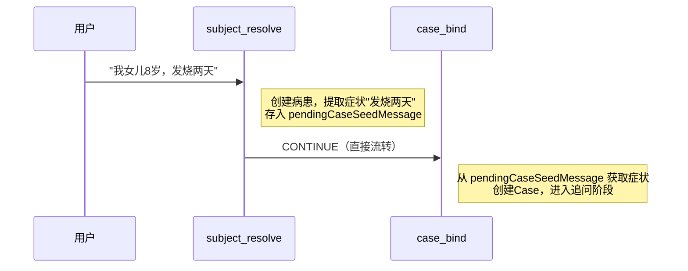

**情况二：用户先只输入了病患信息，未输入症状**

此时 subject_resolve 返回 FOLLOWUP，流转到 wait_case_input 等待用户输入。用户回答后恢复执行，流转到 case_bind。此时症状来自用户的最新消息 `OverAllState对象中，key为KEY_USER_MESSAGE`。

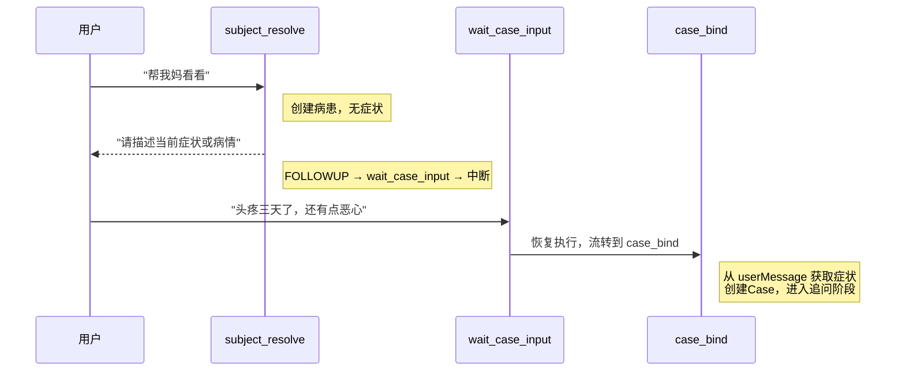

如果case_bind节点执行成功，那就意味着病患和症状绑定成功，意味着该病患有了一个初步的病例，在数据库中有consultation_case表来记录病患的病例，一旦case_bind执行成功，就可以在consultation_case表插入数据，新增该病患的病例了。当然，随着分诊工作的推进，后续还会在其他节点中更新病患的病例数据！！！！

| 列名                            | 数据类型      | 注释                           |
| ------------------------------- | ------------- | ------------------------------ |
| id                              | bigint        | 主键ID                         |
| conversation_id                 | bigint        | 所属会话ID                     |
| subject_id                      | bigint        | 问诊对象ID                     |
| workflow_node                   | varchar(128)  | 当前工作流节点                 |
| normal_finished                 | tinyint       | 是否正常完成：1是，0否         |
| terminal_reason                 | varchar(128)  | 终止原因                       |
| raw_symptom                     | varchar(1024) | 原始症状描述                   |
| main_symptom_json               | json          | 主诉症状JSON                   |
| accompanying_symptoms_json      | json          | 伴随症状JSON                   |
| duration                        | varchar(128)  | 持续时间                       |
| severity                        | varchar(128)  | 严重程度                       |
| onset                           | varchar(128)  | 起病情况                       |
| provoking_factors_json          | json          | 诱发因素JSON                   |
| relieving_factors_json          | json          | 缓解因素JSON                   |
| symptom_quality                 | varchar(256)  | 症状性质                       |
| symptom_location                | varchar(256)  | 症状部位                       |
| radiation                       | varchar(256)  | 放射痛或扩散情况               |
| time_course                     | varchar(256)  | 病程变化                       |
| negative_danger_signs_json      | json          | 已否认危险信号JSON             |
| heart_rate                      | varchar(64)   | 心率                           |
| systolic_blood_pressure         | varchar(64)   | 收缩压                         |
| spo2                            | varchar(64)   | 血氧饱和度                     |
| axillary_temperature            | varchar(64)   | 腋温                           |
| blood_glucose                   | varchar(64)   | 血糖                           |
| blood_potassium                 | varchar(64)   | 血钾                           |
| emergency                       | tinyint       | 是否急症：1是，0否             |
| created_at                      | datetime      | 创建时间                       |
| updated_at                      | datetime      | 更新时间                       |
| deleted                         | tinyint       | 逻辑删除标记：0未删除，1已删除 |
| normalized_symptoms_json        | json          | 标准化症状JSON                 |
| normalized_symptom_details_json | json          | 标准化症状详情JSON             |
| advice_departments_json         | json          | 建议就诊科室JSON               |
| final_triage_advice             | text          | 最终分诊建议                   |
| last_question                   | text          | 最近一次追问内容               |
|                                 |               |                                |
|                                 |               |                                |
|                                 |               |                                |


### 节点逻辑

**case_bind 节点的业务逻辑：**

1. 调用 LLM Agent 判断当前输入是否为有效的症状描述
2. 如果是有效症状：创建新的 Case（写入数据库），设置ConsultaionState对象中的rawSymptom，返回 CONTINUE
3. 如果不是有效症状（如闲聊、问候）：
   - 未达重试上限（3次）→ 返回 FOLLOWUP，追问症状
   - 达到重试上限 → 返回 FINALIZE，终止分诊

**前后端交互流程图：**

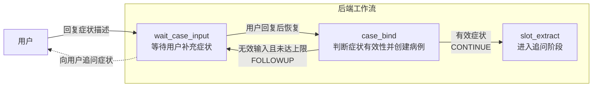


### 节点实现代码

**核心提示词与消息：**

case_bind 节点同样通过 ReactAgent 调用 LLM 来判断用户输入是否为有效的症状描述。

**1. System Prompt（系统提示词）：**

```text
你是医疗分诊流程中的病例绑定节点。
你的任务是判断当前输入是否包含足够的症状或病情信息，可以用于创建一次分诊病例。
不要做诊断，不要分诊到科室，也不要选择历史病例。
```

**2. Instruction（指令）：**

```text
 请返回符合配置 schema 的结构化结果。
判断规则：
- 只基于 userMessage 判断是否可以创建病例。
- 如果 userMessage 描述了症状或病情，isSymptomDescription 返回 true，并将可作为病例种子的症状或病情事实写入 caseSymptomDescription。
- caseSymptomDescription 只保留症状或病情事实，不要只包含患者身份信息。
- 如果 userMessage 不足以创建病例，isSymptomDescription 返回 false，caseSymptomDescription 留空，并在 followupQuestion 中请用户描述当前症状或病情。
```

**3. 用户消息（User Message）—— 每次调用时动态构造：**

```java
private String buildCaseBindInput(ConsultationState state, String userMessage) {
    return "userMessage: " + defaultText(userMessage) + "\n";
}
```

**节点核心代码：**

```java

    @Override
    public Map<String, Object> apply(OverAllState overallState) {
        // 读取OverAllState中的ConsultationState
        ConsultationState state = readSessionState(overallState);
        // 判断是否是中断恢复，并判断用户是否输入了重开，或者取消意图
        Map<String, Object> controlOutput = resumedControlOutputIfNeeded(overallState, state);
        if (controlOutput != null) {
            return controlOutput;
        }
        // 基于模型判断用户是否输入了有效的case 症状
        CaseBindOutcome outcome = bindCase(state, readUserMessage(overallState));
        // 获取CaseBind节点抽取出的症状信息
        String caseSymptomDescription = trimToNull(outcome.caseSymptomDescription());
        if (!outcome.isSymptomDescription() || isBlank(caseSymptomDescription)) {
            // 如果没有抽取到合适的症状信息，则出发中断追问
            return handleCaseBindRetry(state, outcome, Map.of());
        }
        // 针对当前的病患创建新的case
        applyNewCase(state, caseSymptomDescription);
        return output(state, OUTCOME_CONTINUE, null, Map.of());
    }

    // 创建新的case
    protected void applyNewCase(ConsultationState state, String rawSymptom) {
 Long subjectId = state.getActiveSubjectId();
        // 在数据库中保存case信息
        ConsultationCaseDO row = consultationCaseStore.create(
                state.getConversationId(),
                subjectId,
                rawSymptom);

        Long caseId = row.getId();
        state.setActiveCaseId(caseId);
        // 创建CaseContext对象存储分诊过程中的病例数据
        ConsultationState.CaseContext caseContext = state.currentCaseContext();
        caseContext.setSubjectId(subjectId);
        caseContext.setCaseId(caseId);
        caseContext.setRawSymptom(rawSymptom);
        // 清理之前在SubjectResolveNode中收集的性别，年龄，症状, 以及casebind重试次数
        clearState(state);
        // 更新conversation表中的activeCaseId
        consultationStateStore.updateActiveCase(state);
    }
}
```

### 节点的边

| Outcome | 场景 | 下一个节点 |
|---------|------|-----------|
| OUTCOME_CONTINUE | 症状确认，Case创建成功 | slot_extract |
| OUTCOME_FOLLOWUP | 非症状输入，继续追问 | wait_case_input → case_bind |
| CANCEL | 重试达上限/用户取消 | StateGraph.END |
| OUTCOME_RESTART | 用户重开 | subject_resolve |

**图中的边定义：**

```java
// 普通边：Wait 节点恢复后流转到 case_bind
graph.addEdge(NODE_WAIT_CASE_INPUT, NODE_CASE_BIND);

// 条件边：case_bind
graph.addConditionalEdges(NODE_CASE_BIND,
    AsyncEdgeAction.edge_async(state -> switch (read(state, KEY_FLOW_OUTCOME, String.class, OUTCOME_CONTINUE)) {
        case OUTCOME_FOLLOWUP -> NODE_WAIT_CASE_INPUT; // 追问用户症状
        case OUTCOME_CANCEL -> StateGraph.END; // 超过重试次数
        case OUTCOME_RESTART -> NODE_SUBJECT_RESOLVE; // 用户要求重新开始
        default -> NODE_SLOT_EXTRACT; // 收集到了有效的原始症状输入则进入症状抽取节点
    }),
    Map.of(
            NODE_SLOT_EXTRACT, NODE_SLOT_EXTRACT,
            NODE_WAIT_CASE_INPUT, NODE_WAIT_CASE_INPUT,
            NODE_SUBJECT_RESOLVE, NODE_SUBJECT_RESOLVE,
            StateGraph.END, StateGraph.END));
```


## 分诊

在确认了病患，以及病患的原始症状之后，就开始正式的分诊过程了，正式的分诊过程又分为以下几步：

1. 症状(槽)收集
2. 症状归一化
3. 急症判断
4. 知识图谱检索
5. 最终结果返回

### 追问收集症状槽

已经收集到了用户的原始症状描述（rawSymptom），为什么还要做追问？

因为用户最初描述的症状往往是不完整的。比如用户说"头疼三天了"，这只是一个粗略的描述。要做准确的分诊，我们还需要知道：
- 主症状具体是什么？有没有伴随症状？
- 持续多久了？严重程度如何？
- 有没有加重/缓解因素？
- 生命体征数据（体温、心率、血压、血氧）？

这些信息统称为"症状槽"（Slot），追问收集症状槽就是通过多轮对话，逐步补全这些信息。

追问收集症状槽由三个节点协作完成：

| 节点 | 职责 |
|------|------|
| `slot_extract` | 从用户的回答中**抽取**症状槽数据，更新到 CaseContext |
| `slot_plan` | 根据当前已收集的数据，**计划**下一轮要追问哪些字段 |
| `slot_ask` | 根据计划的字段，**生成**追问问题，发送给用户 |

三个节点的协作流程：

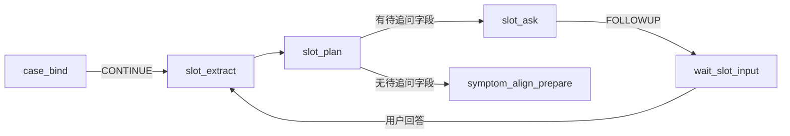

#### 症状槽抽取

**节点名称：** `slot_extract`。该节点从用户输入中抽取结构化的症状槽数据，并计算出在当前阶段，还有哪些症状槽尚未被抽取到

##### 节点输入


当前节点在抽取症状槽的时候，数据来源主要有两种情况

**RAW_INITIAL_EXTRACT**（从 case_bind 进入）：首次抽取由case_bind节点保存到ConsultationState中的 rawSymptom 中的

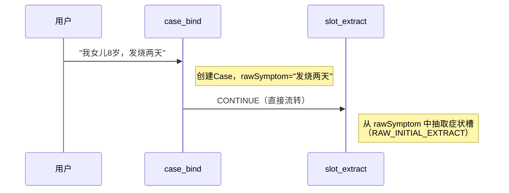

**FOLLOWUP_EXTRACT**（从 wait_slot_input 恢复进入）：处理用户对追问的回答，从 userMessage 中抽取

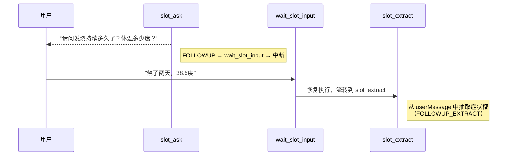

**抽取的字段包括：**

- RAW阶段: 从用户的原始症状中抽取病症槽
- 生命体征：axillaryTemperature、spo2、systolicBloodPressure、heartRate
- 核心字段：mainSymptom、accompanyingSymptoms、duration、severity、age、gender

- OPQRST 字段：onset、provokingFactors、relievingFactors、symptomQuality、symptomLocation、radiation、timeCourse

##### 节点逻辑

slot_extract 节点的核心逻辑分为两步：**抽取** 和 **计算缺失字段**。

**第一步：调用 LLM 抽取症状槽**

根据当前输入（rawSymptom），调用 ReactAgent 从文本中抽取结构化的症状槽数据，然后将抽取结果**合并**到 CaseContext 中（已有值的字段不会被覆盖，只补充新值）。

**第二步：计算缺失字段（missingSlots）**

抽取完成后，slot_extract 会计算"本轮追问了哪些字段，但用户没有给出有效回答"的字段列表（missingSlots）。这个列表会传递给 slot_plan，帮助它决定下一轮是否还需要追问。

计算逻辑：

- 症状的追问和抽取都是分阶段的，这个阶段是由slot_plan来控制，阶段及其顺序为RAW -> VITALS -> CORE -> OPQRST
- 如果是RAW阶段，即节点执行路径为case_bind -> slot_extract, 此时missing_slot默认为空，因为slot_plan还未开始规划
- 如果是VITALS阶段，此时missing_slot默认为空，因为我们要求针对生命体征只追问收集一次
- 如果是其他阶段，则根据slot_plan提前规划的本轮追问的目标字段（questionTargets）和抽取后 CaseContext 中的实际值，如果questionTargets中某个字段仍然为null，就加入 missingSlots视为未收集到的slot集合

这里需要格外注意的是，对于CaseContext中存储的症状槽，其值为空值比如“”, 或者[]，表示用户回复了这些症状槽位，比如没有，不确定

但是，如果CaseContext中存储的症状槽，其值为null，则表示这个症状槽，用户还未给出过有效回复

##### 节点实现代码

**核心提示词与消息：**

**1. System Prompt：**

```text
你是医疗问诊流程中的 NODE_SLOT_EXTRACT 节点。
只从当前 case 输入中抽取结构化临床事实。
```

**2. Instruction（核心规则摘要）：**

```text
输入模式：
- mode=RAW_INITIAL_EXTRACT：病例创建后的初始抽取。rawSymptom 是唯一的症状收集来源。
- mode=FOLLOWUP_EXTRACT：只从一轮追问回答中抽取。
  question 是上一轮问题。
  latestUserMessage 是用户最新回答，也是主要的症状收集来源。

slotUpdates表示本次症状收集的结果，可以包含针对如下字段：
- age: 年龄
- gender: 性别
- mainSymptom: 主诉症状数组
- accompanyingSymptoms: 伴随症状数组
- duration：症状持续时间。
- severity：症状严重程度。
- onset：症状起病方式或起病时间。
- provokingFactors：诱发或加重因素。
- relievingFactors：缓解因素。
- symptomQuality：症状性质，例如刺痛、绞痛、烧灼样疼痛。
- symptomLocation：症状部位。
- radiation：放射部位或牵涉部位。
- timeCourse：症状变化过程，例如持续、阵发、逐渐加重。
- axillaryTemperature：腋温。
- heartRate：心率。
- systolicBloodPressure：收缩压。
- spo2：血氧饱和度。


字段收集规则:
- 未收集到的字段必须省略；不要返回 null 值，也不要返回[]，""这样的空值。
- 如果用户明确表示未知、未测量、没有或无法提供，mainSymptom 和 accompanyingSymptoms返回[]，其他字段返回""。
- 对于mainSymptom 或 accompanyingSymptoms 将不同的症状或明确的症状短语拆分为单独的值放入症状数组，即使只有一个值。不要把持续时间、严重程度、部位或修饰词放入症状数组。
- gender 必须为 "MALE"、"FEMALE"。
- age必须转换为不带单位的数值字符串。例如，"8岁"、"8 years old" 和 "八岁" 都应返回 "8"。如果年龄无法转换为数值字符串。
- severity 包括用户对严重程度的肯定或否定描述，例如“一般”“中等”“不剧烈”“没有明显加重”“没有影响日常活动”都应作为已收集到的严重程度事实返回。
- symptomLocation 可以通过rawSymptom 或 latestUserMessage推断；例如“头痛”symptomLocation为“头部”，“腹痛”symptomLocation为“腹部”。
- 如果既不能推断部位，也不能明确判断为无固定部位，则省略 symptomLocation。
- 对 systolicBloodPressure，只抽取收缩压/高压值。如果用户给出 "120/80"，将 systolicBloodPressure 设为 "120 mmHg" 或 "120"；不要包含舒张压或完整的 "120/80"。
- 不要为缺失的生命体征编造正常值。
```

**3. 用户消息（动态构造）：**

```java
protected String buildSlotInput(ConsultationState state, String userMessage, String lastQuestion) {
    ConsultationState.CaseContext context = state.currentCaseContext();
    if (SLOT_PHASE_RAW.equals(normalizeSlotPhase(context.getSlotPhase()))) {
        // 如果是RAW阶段，针对用户输入的原始症状抽取症状Slot
        return "mode: RAW_INITIAL_EXTRACT\n"
                + "rawSymptom: " + defaultText(context.getRawSymptom()) + "\n";
    }
    // 如果是在其他阶段，追问用户相关的症状Slot
    return "mode: FOLLOWUP_EXTRACT\n"
            + "question: " + defaultText(lastQuestion) + "\n"
            + "latestUserMessage: " + defaultText(userMessage) + "\n";
}
```

**节点核心代码：**

```java
public class SlotExtractNode extends AbstractSlotWorkflowNode {

    public Map<String, Object> apply(OverAllState overallState) {
        ConsultationState state = readSessionState(overallState);

        // 判断当前是否是中断恢复，用户是否具有重开或者是取消本次分诊的意图
        Map<String, Object> controlOutput = resumedControlOutputIfNeeded(overallState, state);
        if (controlOutput != null) {
            return controlOutput;
        }

        // 获取本轮需要收集的症状slot列表
        List<String> activeQuestionTargets = state.currentCaseContext().getSlotCurrentQuestionTargets();
        String lastQuestion = read(overallState, KEY_WAIT_PROMPT, String.class, null);
        // 从用户的输入中抽取本轮的症状Slot
        SlotExtractOutcome extractOutcome = extractSlotState(state, readUserMessage(overallState), lastQuestion);
        // 将模型抽取的症状slot写入CaseContext对象，并且更新到数据库
        mergeSlotFields(state, extractOutcome.slotPayload());

        // 计算本轮未收集到的症状slot集合
        List<String> missingSlots = computeMissingQuestionTargetsForTurn(
                activeQuestionTargets,
                extractOutcome.slotPayload(),
                state.currentCaseContext().getSlotPhase());

        // 注意，这里将missingSlots集合放入到OverAllState对象中，传递给下一个SlotPlan节点
        return output(state, OUTCOME_CONTINUE, null, Map.of("missingSlots", missingSlots));
    }
}
```

**mergeSlotFields 方法实现（合并抽取结果到 CaseContext + CaseDO）：**

```java
 // 从模型返回的响应中取出有效的症状Slot值并保存
private void mergeSlotFields(ConsultationState state, JsonNode root) {
    ConsultationState.CaseContext context = state.currentCaseContext();
    // 将JonNode转化为Map，map的key为字段名称，value为封装了节点值的JsonNode
    Map<String, JsonNode> presentFields = collectPresentFields(root);
    // 创建用于更新case表的实体类对象
    ConsultationCaseDO caseDO = newCaseDO(state);
    // 获取本轮要收集的症状slot名称的集合
    List<String> activeQuestionTargets = context.getSlotCurrentQuestionTargets();
    // 更新年龄和性别
    mergeSubjectProfileFields(state, presentFields);
    // 从模型返回的响应中，针对抽取到的每个症状slot值，将其分别写入到CaseContext对象，以及caseDO对象中
    boolean casePatchChanged = mergeCaseSlotFields(context, presentFields, caseDO, activeQuestionTargets);
    // 如果收集到了case slot则需要更新数据库
    if (casePatchChanged) {
        consultationCaseStore.updateSlotExtractedFields(caseDO);
    }
}

// 针对收集到的年龄和性别单独处理
private void mergeSubjectProfileFields(ConsultationState state, Map<String, JsonNode> presentFields) {
    ConsultationState.Subject subject = state.currentSubject();
    boolean subjectProfileUpdated = false;
    // 如果取到了年龄
    if (presentFields.containsKey("age")) {
        String age = textValue(presentFields.get("age"));
        if (hasNumericText(age)) {
            subject.setAgeText(age);
            subjectProfileUpdated = true;
        }
    }
    // 如果取到了性别
    if (presentFields.containsKey("gender")) {
        // 如果收集到了性别
        String gender = normalizeGender(textValue(presentFields.get("gender")));
        if (hasText(gender)) {
            subject.setGender(gender);
            subjectProfileUpdated = true;
        }
    }
    if (subjectProfileUpdated) {
        // 更新数据库中病患的年龄或者性别
        consultationSubjectStore.updateFromIdentity(state.getUserId(), subject);
    }
}

    // 将收集到的其他症状slot的有效值写入CaseDO, 以及CaseContext对象的对应字段中
    private boolean mergeCaseSlotFields(ConsultationState.CaseContext context,
                                        Map<String, JsonNode> presentFields,
                                        ConsultationCaseDO casePatch,
                                        List<String> activeQuestionTargets) {
        // 标记是否成功收集到有效的症状slot
        boolean changed = false;
        for (CaseSlotSpec spec : CASE_SLOT_SPECS) {
            // 遍历所有的症状slot，根据症状slot名称获取对应的JsonNode
            JsonNode node = presentFields.get(spec.slotName());
            if (node == null) {
                // 如果为null，说明本轮未收集或者未收集到该症状Slot的值
                continue;
            }
            // 根据收集到的症状slot值的不同类型分别处理: 字符串类型和数组类型
            changed |= switch (spec.kind()) {
                // 将字符串类型的有效值写入CaseContex和CaseDO对象
                case TEXT -> applyTextSlot(spec, context, casePatch, node);
                // 将list类型的有效值写入CaseContex和CaseDO对象
                case LIST -> applyListSlot(spec, context, casePatch, node, activeQuestionTargets);
            };
        }
        return changed;
    }
```

核心要点：每个字段的合并都是**双写**——既更新内存中的 `CaseContext`，又设置数据库补丁对象 `casePatch`，最后一次性调用 `consultationCaseStore.updateById(casePatch)` 批量写入数据库。

**computeMissingQuestionTargetsForTurn 方法实现（计算缺失字段）：**

```java
 private List<String> computeMissingQuestionTargetsForTurn(List<String> questionTargets,
                                                              JsonNode slotPayload,
                                                              String phase) {
        if (SLOT_PHASE_RAW.equals(phase) || SLOT_PHASE_VITALS.equals(phase)) {
            // 如果是SLOT_PHASE_RAW，针对的是用户输入的原始症状收集，不存在未收集到的症状slot
            // 如果是SLOT_PHASE_VITALS，针对用户的生命体征，只收集一次，所以也米有未收集到的症状slot
            return List.of();
        }
        List<String> missing = new ArrayList<>();
        // 遍历本轮要收集的目标症状slot
        for (String target : questionTargets) {
            // 判断当前收集到的目标症状slot值是否为有效值
            if (!isTargetCollectedThisTurn(target, slotPayload, phase)) {
                // 如果未收集到有效值就添加到missing集合中
                missing.add(target);
            }
        }
        return missing;
    }

// 判断某个字段在本轮是否被成功抽取
 private boolean isTargetCollectedThisTurn(String target, JsonNode slotPayload, String phase) {
        // 获取收集到的目标slot对应JsonNode
        JsonNode field = slotPayloadField(slotPayload, target);
        if (field == null || field.isNull()) {
            // 未收集到有效值
            return false;
        }

        // CORE阶段除了伴随症状可以为[]，其他的症状slot都不能为默认空值
        if (SLOT_PHASE_CORE.equals(normalizeSlotPhase(phase))) {
            if ("gender".equals(target)) {
                return isKnownGender(field.asText(null));
            }
            if ("age".equals(target)) {
                return hasNumericAge(field);
            }
            if (field.isArray()) {
                if ("mainSymptom".equals(target)) {
                    return !field.isEmpty();
                }
                // accompanyingSymptoms可以为[]
                return true;
            }
            return hasText(field.asText(null));
        }
        // 其他阶段的症状slot只要不为null，就算收集到了有效值
        return true;
    }
```

计算逻辑总结：对比"本轮追问了哪些字段"（questionTargets）和"LLM 实际抽取到了什么"（slotPayload），如果某个字段在 slotPayload 中为空或不存在，就加入 missingSlots。这个列表会传给 slot_plan，帮助它决定是否需要再追问一轮。

##### 节点的边

| Outcome | 场景 | 下一个节点 |
|---------|------|-----------|
| CONTINUE | 抽取完成 | slot_plan |
| OUTCOME_CANCEL | 用户取消 | END |
| OUTCOME_RESTART | 用户重开 | subject_resolve |

**图中的边定义：**

```java
# 可以由中断节点跳转到NODE_SLOT_EXTRACT节点
graph.addEdge(NODE_WAIT_SLOT_INPUT, NODE_SLOT_EXTRACT);
    graph.addConditionalEdges(NODE_SLOT_EXTRACT,
            AsyncEdgeAction.edge_async(state -> switch (read(state, KEY_FLOW_OUTCOME, String.class, OUTCOME_CONTINUE)) {
                case OUTCOME_CANCEL -> StateGraph.END; // 超过重试次数
                case OUTCOME_RESTART -> NODE_SUBJECT_RESOLVE; // 用户要求重开
                default -> NODE_SLOT_PLAN; // 正常进入NODE_SLOT_PLAN
            }),
            Map.of(
                    NODE_SLOT_PLAN, NODE_SLOT_PLAN,
                    NODE_SUBJECT_RESOLVE, NODE_SUBJECT_RESOLVE,
                    StateGraph.END, StateGraph.END));
```

#### 症状槽追问计划制定

**节点名称：** `slot_plan`, 该节点根据当前已收集的数据，决定下一轮要追问哪些字段。

##### 节点输入

slot_plan的节点输入，来自于slot_extract在抽取本轮症状槽后所计算出的当前阶段还未收集到的症状槽名称集合，该集合存储在OverAllState中，key值为missing_slot

##### 节点逻辑

slot_plan 节点的核心任务是：根据当前阶段（phase）和本轮的缺失字段（missingSlots），计算出**下一轮要追问的字段列表**（questionTargets）。

**追问阶段（Phase）及其优先级顺序：**

| 阶段 | 包含字段 | 窗口大小 | 说明 |
|------|---------|---------|------|
| RAW | — | — | 初始阶段，slot_extract 从 rawSymptom 做首次抽取，不追问 |
| VITALS | axillaryTemperature、spo2、systolicBloodPressure、heartRate | 全部（4个） | 生命体征，优先级最高（影响急症判断），一次性全部追问 |
| CORE | mainSymptom、duration、severity、accompanyingSymptoms | 3 | 核心症状信息，每轮最多追问 3 个 |
| EXTENDED | onset、provokingFactors、relievingFactors、symptomQuality、symptomLocation、radiation、timeCourse | 3 | OPQRST 扩展信息，每轮最多追问 3 个 |
| END | — | — | 追问结束，进入症状归一化 |

**阶段流转顺序：RAW → VITALS → CORE → EXTENDED → END**

**计划逻辑（planSlotCollection 方法）：**

**1. RAW 阶段的特殊处理：**

RAW 阶段是首次抽取后的第一次计划。此时 slot_plan 不看 missingSlots（因为 RAW 阶段不计算 missing），而是直接检查生命体征是否缺失：
- 如果生命体征有缺失 → 进入 VITALS 阶段，把所有缺失的生命体征字段作为 questionTargets（一次性全问）
- 如果生命体征已完整 → 跳过 VITALS，直接进入 CORE 阶段

**2. VITALS 阶段的特殊处理：**

VITALS 阶段的窗口大小等于所有生命体征字段数（4个），即一次性把所有缺失的生命体征都问完。VITALS 阶段完成后，自动进入 CORE 阶段。

**3. CORE / EXTENDED 阶段的通用计划逻辑（buildNextQuestionTargets 方法）：**

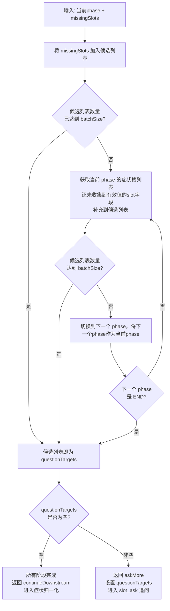

**4. 终止条件：**

- 追问轮数达到上限（5轮）→ 如果 CORE 字段仍不完整则终止分诊（FINALIZE_RESTART），否则跳过剩余追问进入归一化
- 无效输入连续超限 → 终止分诊
- LLM 建议停止（stopSuggested=true）且 CORE 字段已完整 → 提前结束追问，进入归一化

##### 节点实现代码

```java
public class SlotPlanNode extends AbstractSlotWorkflowNode {

    @Override
    public Map<String, Object> apply(OverAllState overallState) {
        ConsultationState state = readSessionState(overallState);

        // 获取有SlotExtract节点计算出的missingSlot
        List<String> missingSlots = read(overallState, "missingSlots", List.class, List.of());
        // 获取上一轮要收集的目标症状slot集合
        List<String> previousQuestionTargets = state.currentCaseContext().getSlotCurrentQuestionTargets();

        // 计算是否还有下一轮收集，如果还有的话，计算出下一轮要收集的目标症状slot集合
        SlotPlanDecision decision = planSlotCollection(overallState, state, previousQuestionTargets, missingSlots);

        // 如果发现追问轮次达到上限，或者无效追问次数达到上限，则终止分诊流程
        if (decision.decision() == SlotPlanDecisionType.CANCEL) {
            // 更新case表数据
            markActiveCaseTerminal(state, OUTCOME_CANCEL, decision.finalMessage());
            // 更新conversation表数据
            return terminalOutput(state, OUTCOME_CANCEL, decision.finalMessage(), Map.of());
        }
        return output(state, OUTCOME_CONTINUE, null, Map.of());
    }

}
```

**planSlotCollection 方法（计算下一轮 questionTargets 的核心逻辑）：**

```java
protected SlotPlanDecision planSlotCollection(OverAllState overallState,
                                                  ConsultationState state,
                                                  List<String> previousQuestionTargets,
                                                  List<String> missingSlots) {
        ConsultationState.CaseContext context = state.currentCaseContext();
        boolean rawPhase = SLOT_PHASE_RAW.equals(normalizeSlotPhase(context.getSlotPhase()));
        if (rawPhase) {
            // 如果是raw阶段，则计算下一个阶段
            List<String> pendingTargets = computePendingTargetsByPhase(state, SLOT_PHASE_VITALS);
            if (!pendingTargets.isEmpty()) {
                // 如果生命体征数据还未收集完全，则下一个阶段就是SLOT_PHASE_VITALS
                context.setSlotPhase(SLOT_PHASE_VITALS);
                context.setSlotRoundCount(defaultInt(context.getSlotRoundCount()) + 1);
                context.setSlotCurrentQuestionTargets(new ArrayList<>(pendingTargets));
                return SlotPlanDecision.askMore(
                        SLOT_PHASE_VITALS,
                        pendingTargets,
                        "initial_" + SLOT_PHASE_VITALS.toLowerCase() + "_targets");
            }
            // 否则，假设下一个阶段就是SLOT_PHASE_CORE
            context.setSlotPhase(SLOT_PHASE_CORE);
        }

        boolean vitalsRound = isVitalsCollectionAnswer(context);
        if (vitalsRound) {
            // 如果当前阶段是SLOT_PHASE_VITALS, 则下一个阶段是SLOT_PHASE_CORE
            context.setSlotPhase(SLOT_PHASE_CORE);
        }

        // 计算CORE阶段的case slot是否已经收集完毕
        List<String> corePendingTargets = computePendingTargetsByPhase(state, SLOT_PHASE_CORE);
        if (context.getSlotRoundCount() >= SLOT_MAX_QUESTION_ROUNDS) {
            if (!corePendingTargets.isEmpty()) {
                // 达到最大询问轮次，但是CORE阶段的slot还未收集完成
                return SlotPlanDecision.cancel(
                        normalizeSlotPhase(context.getSlotPhase()),
                        corePendingTargets,
                        "slot_round_limit_core_incomplete",
                        "症状信息仍不完整。请重新开始，并尽量完整描述主诉症状、持续时间、严重程度、年龄和伴随症状。");
            }
            // CORE阶段的slot已经收集完成, 可以继续进入到下一个阶段
            clearCurrentQuestionTargets(state); // 清理本轮要收集的case slot
            return SlotPlanDecision.continueDownstream(context.getSlotPhase(), List.of(), "slot_round_limit_reached");
        }

        // 继续计算下一个阶段所要收集的症状slot
        SlotPlanTargets nextTargets = buildNextQuestionTargets(state, context.getSlotPhase(), missingSlots);
        List<String> questionTargets = nextTargets.questionTargets();
        if (questionTargets.isEmpty()) {
            // 下一个阶段要收集的case slot为空，说明全部收集完毕，可以进入到下一个阶段了
            return SlotPlanDecision.continueDownstream(nextTargets.phase(), questionTargets, "all_slot_targets_handled");
        }

        // 既没有达到重复收集上限，有没有达到最大收集轮次
        if (corePendingTargets.isEmpty()) {
            // CORE阶段的症状已经收集完毕，询问模型是否可以停止收集
            boolean canStop = shouldStopCollectionAfterCoreComplete(overallState, state, questionTargets);

            if (canStop) {
                clearCurrentQuestionTargets(state); // 清理本轮要收集的case slot
                // 如果模型认为可以停止收集，则进入下一个阶段
                return SlotPlanDecision.continueDownstream(
                        normalizeSlotPhase(context.getSlotPhase()),
                        questionTargets,
                        "slot_plan_stop_after_core_complete");
            }

        }

        // 更新数据，进入下一次追问
        context.setSlotPhase(nextTargets.phase());
        context.setSlotRoundCount(defaultInt(context.getSlotRoundCount()) + 1);
        context.setSlotCurrentQuestionTargets(new ArrayList<>(questionTargets));
        return SlotPlanDecision.askMore(nextTargets.phase(), questionTargets, "ask_more_slot_targets", invalidInputStreak);
    }
```

**buildNextQuestionTargets 方法（计算下一轮具体要追问哪些字段）：**

```java
 private SlotPlanTargets buildNextQuestionTargets(ConsultationState state,
                                                     String phase,
                                                     List<String> missingSlots) {
        String planningPhase = phase;
        LinkedHashSet<String> orderedTargets = new LinkedHashSet<>();
        // 本轮要收集的case slot应该首先包含上一轮的missing slot
        for (String target : missingSlots) {
            orderedTargets.add(target);
        }

        // 向orderTargets中在添加当前phase中还未收集到的case slot(这里不用担心重复，因为用的是set)
        addPhasePendingTargets(state, planningPhase, orderedTargets);
        // 如果当前阶段还未收集到的症状slot都放入了orderedTargets, 但是orderTargets还是为达到上限
        while (orderedTargets.size() < SLOT_PHASE_BATCH_SIZE) {
            // 计算下一个phase
            String nextPlanningPhase = nextPlanningPhase(planningPhase);
            if (nextPlanningPhase.equals(SLOT_PHASE_END)) {
                break;
            }
            // 添加下一个phase中未收集到的case slot
            addPhasePendingTargets(state, nextPlanningPhase, orderedTargets);
            // 更新当前的阶段
            planningPhase = nextPlanningPhase;
        }
        return new SlotPlanTargets(planningPhase, new ArrayList<>(orderedTargets));
    }


     private void addPhasePendingTargets(ConsultationState state,
                                        String phase,
                                        LinkedHashSet<String> targets) {
        // 遍历当前阶段所有还未收集到有效值的症状slot
        for (String target : computePendingTargetsByPhase(state, phase)) {
            if (targets.size() >= SLOT_PHASE_BATCH_SIZE) {
                // 如果已经达到窗口大小则结束
                return;
            }
            // 添加该症状slot到目标集合
            targets.add(target);
        }
    }
```

##### 节点的边

| Outcome | 场景 | 下一个节点 |
|---------|------|-----------|
| CONTINUE + 有待追问字段 | 还需继续追问 | slot_ask |
| CONTINUE + 无待追问字段 | 追问完毕 | symptom_align_prepare |
| OUTCOME_CANCEL | 无效输入超限 | StateGraph.END |

**图中的边定义：**

```java
graph.addConditionalEdges(NODE_SLOT_PLAN,
    AsyncEdgeAction.edge_async(state -> {
        String outcome = read(state, KEY_FLOW_OUTCOME, String.class, OUTCOME_CONTINUE);
        if (OUTCOME_CANCEL.equals(outcome)) { // 超过追问轮次或者重复追问
            return StateGraph.END;
        }
        ConsultationState sessionState = read(state, KEY_SESSION_STATE, ConsultationState.class, new ConsultationState());
        List<String> questionTargets = sessionState.currentCaseContext().getSlotCurrentQuestionTargets();
        // 如果待收集的症状集合为空则进入NODE_SYMPTOM_ALIGN_PREPARE，否则进入NODE_SLOT_ASK
        return questionTargets == null || questionTargets.isEmpty() ? NODE_SYMPTOM_ALIGN_PREPARE : NODE_SLOT_ASK;
    }),
    Map.of(
            NODE_SLOT_ASK, NODE_SLOT_ASK,
            NODE_SYMPTOM_ALIGN_PREPARE, NODE_SYMPTOM_ALIGN_PREPARE,
            StateGraph.END, StateGraph.END));
```

#### 症状槽追问

**节点名称：** `slot_ask`，该节点根据 slot_plan 制定的追问字段列表，调用 LLM 生成自然语言的追问问题，然后通过返回out_come值为FOLLOWUP 触发Human-In-Loop，将问题返回给用户。

##### 节点输入

该节点处理的数据，主要是由slot_plan节点计算得到的本轮待收集的症状槽列表(存储在CaseContext中，key值为questionTargets)

##### 节点实现代码

**核心提示词与消息：**

**1. System Prompt：**

```text
你是问诊流程中的 NODE_SLOT_ASK 节点。
你的唯一任务是根据输入的 questionTargets 生成追问。
```

**2. Instruction（核心规则摘要）：**

```text
输入只有 questionTargets：本轮期望询问的字段。

字段含义：
- mainSymptom：主诉症状，用户最主要的不适。
- accompanyingSymptoms：伴随症状，和主诉同时出现或相关的其他症状。
- age：年龄。gender：性别。
- duration：症状持续时间。severity：症状严重程度或强度。
- onset：起病方式，只表示突然出现、逐渐出现、逐渐加重等方式，不再询问起病时间点。
- provokingFactors：诱发或加重因素。
- relievingFactors：缓解因素。
- symptomQuality：症状性质，例如刺痛、钝痛、压迫感。
- symptomLocation：症状部位。radiation：放射或牵涉部位。
- timeCourse：症状进展、频率和变化过程。
- axillaryTemperature：腋温或体温。
- spo2：血氧饱和度。
- systolicBloodPressure：收缩压或高压，只问收缩压。
- heartRate：心率。
- bloodGlucose：血糖。bloodPotassium：血钾。
- negativeDangerSigns：用户明确否认的危险表现。

规则：
- 只能针对 questionTargets 中的字段询问，不要新增 target。
- 输出中的 askedTargets 必须是输入 questionTargets 的子集。
- askedTargets 只表示本轮问题覆盖了哪些字段，不用于流程计算。
- 追问时不要默认称呼“您”，因为当前用户不一定是病患本人；优先使用“病患”“当前病患”或“患者”等中性表达。
- 询问 mainSymptom 或 accompanyingSymptoms 时，引导用户分开列出不同症状。
- 询问 severity 时，可询问强度、快速加重、功能受限、严重疼痛等危险特征。
- 询问 accompanyingSymptoms 时，可询问呼吸困难、胸痛、意识混乱、肢体无力、言语异常、出血、脱水、抽搐、自伤风险等急症相关症状。
- 询问 timeCourse、onset、symptomLocation、radiation 或 symptomQuality 时，可使用 OPQRST 框架。
- duration 是必问字段，已经覆盖“持续多久/开始多久”；询问 onset 时不要再问“什么时候开始”，只询问“突然出现还是逐渐发生/逐渐加重”等起病方式。
- 询问生命体征时，优先问 SpO2、收缩压、心率和体温；如果暂时没有数据，可以让用户回答不知道或未测。
- 生成一次简短、清晰、自然的追问；当 questionTargets 有多个字段时，可以在同一次追问中自然覆盖多个目标字段。
```

**3. 用户消息（动态构造）：**

```java
 protected String buildSlotAskInput(ConsultationState state) {
      ConsultationState.CaseContext context = state.currentCaseContext();
      return "questionTargets: " + toJson(context.getSlotCurrentQuestionTargets()) + "\n";
 }
```

**节点核心代码：**

```java
public class SlotAskNode extends AbstractSlotWorkflowNode {

     public Map<String, Object> apply(OverAllState overallState) {
        ConsultationState state = readSessionState(overallState);
        // 让模型基于SlotPlan节点计算出的，本轮要收集的目标症状Slot生成合适的追问问题
        SlotAskOutcome askOutcome = askSlotQuestion(state);
        // 得到模型生成的问题
        String followupQuestion = askOutcome.followupQuestion();

        // 触发中断
        return outputWaitPrompt(
                state,
                NODE_SLOT_EXTRACT,
                followupQuestion,
                Map.of());
    }
}
```

##### 节点的边

**图中的边定义：**

```java
// 触发中断
graph.addEdge(NODE_SLOT_ASK, NODE_WAIT_SLOT_INPUT);
```

### 症状归一化

用户输入的症状往往是口语化的，比如"脑袋疼"、"体温39度"、"浑身没劲"。但我们最后查询知识图谱时，是根据标准医学术语做**精确匹配**的。如果不把用户的口语化描述转换成知识图谱中的标准术语，查询通常无法命中正确的疾病和科室。

**归一化的两个步骤：**

1. **找出本身就是标准术语的症状**：比如用户说"头痛"，而知识图谱中恰好有"头痛"这个标准术语，那就直接确认
2. **对非标准术语做向量语义搜索**：比如用户说"脑袋疼"，通过向量搜索找到语义最接近的标准术语候选（如"头痛"、"偏头痛"），如果候选较多则让用户选择

归一化过程由三个节点完成：

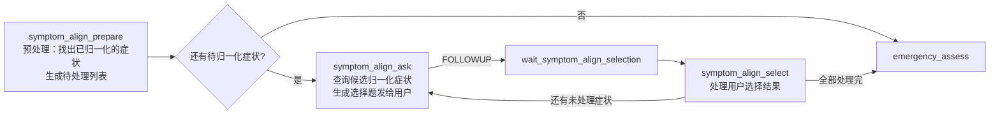

#### 症状归一化 Prepare 节点

**节点名称：** `symptom_align_prepare`, 负责归一化的预处理工作, 将用户输入的主诉症状，以及伴随症状结合生命体征， 以及OPQRST 扩展信息进行适当重写，并从中找出本来就是归一化的症状描述

##### 节点输入

该节点处理的输入数据，是经过追问收集症状槽介绍后，存储在ConsultationState对象中的CaseContext对象中的全部症状信息。

##### 节点逻辑


1. **收集待归一化的症状列表**：从 CaseContext 中的 mainSymptom 和 accompanyingSymptoms 收集所有症状
2. **调用 LLM 做症状重写**：结合生命体征数据，以及OPQRST 扩展信息，对mainSymptom 和 accompanyingSymptoms 症状进行适当重写（如"体温39度" → "高烧"，“头痛”，“严重程度为:高” —> "严重头痛"），以获取更完整的主诉症状和伴随症状
3. **字典精确匹配**：对每个症状，在内存中的标准症状字典（Map）中查找是否有精确匹配
   - 匹配成功 → 直接加入已归一化列表（normalizedConfirmedSymptoms）
   - 匹配失败 → 加入待处理列表（normalizationPendingSpans）

**标准症状字典从哪来？**

项目启动时，`SymptomNormalizationCache` 会从 Neo4j 知识图谱中加载所有标准症状名称到内存 Map 中。后续的精确匹配就是在这个 Map 中查找。

##### 节点实现代码

**核心提示词与消息：**

symptom_align_prepare 节点中调用 LLM 的目的是**症状重写**（把口语化症状重写为适合检索的短语），而不是做归一化匹配本身。

**1. System Prompt：**

```text
你是问诊流程中的症状重写节点。
你的任务不是诊断疾病，而是把已经采集到的用户表达改写成更适合医学知识图谱或向量检索的症状短语。
只能基于输入信息改写，不要编造疾病、体征或用户没有表达过的症状。
```

**2. Instruction（核心规则摘要）：**

```text
输入字段说明：
- rewriteCandidates：可被改写的原始症状列表。每项包含 rawSymptom 和 symptomType。symptomType 只用于代码侧保留主诉/伴随症状类型，你不需要返回。
- duration：症状持续时间。
- severity：症状严重程度。
- onset：症状起病方式或起病时间。
- provokingFactors：诱发或加重因素。
- relievingFactors：缓解因素。
- symptomQuality：症状性质，例如刺痛、绞痛、烧灼样疼痛。
- symptomLocation：症状部位。
- radiation：放射部位或牵涉部位。
- timeCourse：症状变化过程，例如持续、阵发、逐渐加重。
- axillaryTemperature：腋温。
- heartRate：心率。
- systolicBloodPressure：收缩压。
- spo2：血氧饱和度。

改写方向：
- 异常生命体征或检查数值如果能直接转换为常见症状/体征短语，可以改写，例如“体温39度”改写为“高热”。
- 针对异常生命体征，比如腋温，心率，收缩压，血氧饱和度，如果 rewriteCandidates 中已经存在某个生命体征相对应症状，则不要再改写该生命体征，避免重复，例如已有“发热”时不要再把“体温39度”改写为“高热”。
- OPQRST 信息如果能让原症状更适合检索，可以与原症状结合改写，例如“胸痛”结合“放射到左肩”改写为“放射性胸痛”。
- 可以将用户的口语化症状描述改写成医学上比较规范的症状描述，比如用户说“我的胃像火烧一样疼”可以改写为“胃灼痛”
- rawSymptom原样返回。
- querySymptom 是改写后的检索短语，应简短、稳定、规范。
- 只返回确实发生改写的项目；没有改写价值、或原文症状描述已经比较规范的项目不要返回，不要新增 rewriteCandidates 中不存在的症状。

返回结构必须匹配配置的 schema；如果没有任何需要改写的项目，rewrites 返回空列表。
```

**3. 用户消息（动态构造）：**

```java
private String buildSymptomRewriteInput(ConsultationState state,
                                        List<SymptomForNormalization> sourceSymptoms) {
    CaseContext context = state.currentCaseContext();
    Map<String, Object> input = new LinkedHashMap<>();
    input.put("rewriteCandidates", sourceSymptoms);  // 待重写的症状列表
    input.put("duration", context.getDuration());
    input.put("severity", context.getSeverity());
    input.put("onset", context.getOnset());
    input.put("symptomLocation", context.getSymptomLocation());
    input.put("radiation", context.getRadiation());
    input.put("timeCourse", context.getTimeCourse());
    input.put("axillaryTemperature", context.getAxillaryTemperature());
    input.put("heartRate", context.getHeartRate());
    input.put("systolicBloodPressure", context.getSystolicBloodPressure());
    input.put("spo2", context.getSpo2());
    return toJson(input);
}
```

LLM 会结合这些上下文信息（持续时间、严重程度、生命体征等）来辅助重写。例如"体温39度" + severity="高" → querySymptom="高热"。

**4. 标准症状字典的加载（SymptomNormalizationCache）：**

```java
@Service
public class SymptomNormalizationCache {

    // 内存中的标准症状字典：key = 症状名称（小写），value = 知识图谱中的原始名称
    private final Map<String, String> normalizedVocabulary = new ConcurrentHashMap<>();
    private final KgStore kgStore;

    // 项目启动时自动从 Neo4j 加载所有标准症状名称
    @PostConstruct
    public void preloadVocabulary() {
        List<String> allSymptoms = kgStore.listAllSymptoms();
        for (String symptom : allSymptoms) {
            normalizedVocabulary.putIfAbsent(canonical(symptom), symptom);
        }
    }

    // 精确匹配：传入重写后的症状，在字典中查找
    public String resolveExact(String query) {
        return normalizedVocabulary.get(canonical(query));
    }
}
```

**节点核心代码：**

```java
    @Override
    public Map<String, Object> apply(OverAllState overallState) {
        ConsultationState state = readSessionState(overallState);

        // 收集当前subject的主诉症状，以及伴随症状
        List<SymptomRewriteCandidate> rawSymptoms = collectRawSymptoms(state);
        // 收集当前subject的主诉症状, 伴随症状，体征数据，其中体征数据暂且作为伴随症状
        List<SymptomRewriteCandidate> rewriteCandidates = collectRewriteCandidates(state);
        if (rewriteCandidates.isEmpty()) {
            String message = "未能提取可用的症状，请线下就医或咨询导诊台。";
            return cancelActiveCaseWithMessage(state, message, Map.of());
        }

        // 基于模型实现对主诉，伴随症状，体征数据所表示的伴随症状进行重写
        List<ConsultationState.SymptomForNormalization> symptomsForNormalization =
                rewriteSymptomsForNormalization(state, rewriteCandidates, rawSymptoms);
        // 将重写之后的症状集合放入CaseContext中
        state.currentCaseContext().setSymptomsForNormalization(new ArrayList<>(symptomsForNormalization));

        List<ConsultationState.SymptomAlignmentSpan> pendingSpans = new ArrayList<>();
        for (ConsultationState.SymptomForNormalization sourceSymptom : symptomsForNormalization) {
            // 针对症状集合中的每一个症状，原始症状和改写之后的检索词都尝试精确匹配
            // 判断症状本身是否是标准的描述(内存Map存储了医疗知识图谱中包含的所有标准的症状)
            String direct = resolveExactSymptomForNormalization(sourceSymptom);
            if (hasText(direct)) {
                // 如果症状本身就是标准的描述，则添加到归一化的症状集合中，该集合存储在CaseContext中
                addResolvedSymptom(state, sourceSymptom.getRawSymptom(), sourceSymptom.getQuerySymptom(), sourceSymptom.getSymptomType(),
                        direct);
                continue;
            }
            // 否则，说明症状本身不是标准的归一化描述，则添加到带归一化的症状集合中
            pendingSpans.add(newPendingSpan(sourceSymptom));
        }
        // 将未归一化的症状集合放入CaseContext对象
        state.currentCaseContext().setNormalizationPendingSpans(pendingSpans);
        return output(state, OUTCOME_CONTINUE, null, Map.of());
    }
```

**rewriteSymptomsForNormalization 方法（如何得到最终的 symptomsForNormalization）：**

```java
protected List<SymptomForNormalization> rewriteSymptomsForNormalization(
        ConsultationState state,
        List<SymptomForNormalization> rewriteCandidates,
        List<SymptomForNormalization> originalSymptoms) {

    // 第一步：调用 LLM 做重写
    SymptomRewriteOutcome outcome = callSymptomRewriteForNormalization(state, rewriteCandidates);
    List<SymptomForNormalization> rewritten = outcome.symptoms();  // LLM 返回的重写结果

    // 第二步：后处理——合并重写结果和原始症状，确保类型安全
    return applySymptomRewriteTypeRules(rewriteCandidates, originalSymptoms, rewritten);
}


 /*
           rewriteCandidatesSymptoms: 包含了客观体征的症状集合，重写就是针对这个集合中的症状
           rawSymptoms：只包原来的含主诉和伴随症状的症状集合
           rewrittenSymptoms: 重写之后的症状集合
     */
  private List<ConsultationState.SymptomForNormalization> mergeRewrittenSymptomsWithFallback(
            List<SymptomRewriteCandidate> rewriteCandidatesSymptoms,
            List<SymptomRewriteCandidate> rawSymptoms,
            List<ConsultationState.SymptomForNormalization> rewrittenSymptoms) {


        /*
            为了方便后续的处理，将rewriteCandidatesSymptoms转化为map，key为原始症状名称
         */
        Map<String, SymptomRewriteCandidate> sourcesByRaw
                = indexTraceableSourcesByRaw(rewriteCandidatesSymptoms);

        LinkedHashMap<String, ConsultationState.SymptomForNormalization> result = new LinkedHashMap<>();
        if (rewrittenSymptoms != null && !rewrittenSymptoms.isEmpty()) {
            // 针对重写后的每一个症状，判断这个症状是不是真的是我们要重写的症状
            for (ConsultationState.SymptomForNormalization item : rewrittenSymptoms) {
                // 根据重写后的症状所对应的原始症状，判断rewriteCandidatesSymptoms中有没有
                SymptomRewriteCandidate source = sourcesByRaw.get(trimToNull(item.getRawSymptom()));
                if (source == null) {
                    // 没有，说明这个症状是模型自己加的，忽略
                    continue;
                }
                String query = trimToNull(item.getQuerySymptom());
                if (!hasText(query) || query.equals(trimToNull(source.getRawSymptom()))) {
                    // 如果未重写，或者重写前后一样，也认为为重写，则忽略
                    continue;
                }
                // 将真正重写过的症状添加到result中
                addSymptomForNormalization(result, source.getRawSymptom(), query, source.getSymptomType());
            }
        }
        for (SymptomRewriteCandidate source : rawSymptoms) {
            // 将最原始的主诉症状和伴随症状添加到result，result使用的put方法为putIfAbsent(). 所以不会覆盖已有症状
            addSymptomForNormalization(result, source.getRawSymptom(), null, source.getSymptomType());
        }
        return new ArrayList<>(result.values());
    }
```

最终得到的 `symptomsForNormalization` 列表中，每个元素包含：
- `rawSymptom`：用户原始表达（如"体温39度"）
- `querySymptom`：LLM 重写后的检索词（如"高热"），如果没有重写则为 null（此时用 rawSymptom 本身去匹配）
- `symptomType`：MAIN 或 ACCOMPANYING（始终来自源，不受 LLM 影响）

##### 节点的边

| Outcome | 场景 | 下一个节点 |
|---------|------|-----------|
| CONTINUE | 需要向量搜索 | symptom_align_ask |
| OUTCOME_CANCEL | 重写后得到的症状集合为空集合 | StateGraph.END |

**图中的边定义：**

```java
graph.addConditionalEdges(NODE_SYMPTOM_ALIGN_PREPARE,
AsyncEdgeAction.edge_async(state -> OUTCOME_CANCEL.equals(read(state, KEY_FLOW_OUTCOME, String.class, OUTCOME_CONTINUE))
        // 重写后得到的症状集合为空集合
        ? StateGraph.END 
        // 针对未归一化的症状，生成选项问题，让用户选择
        : NODE_SYMPTOM_ALIGN_ASK),
Map.of(
        NODE_SYMPTOM_ALIGN_ASK, NODE_SYMPTOM_ALIGN_ASK,
        StateGraph.END, StateGraph.END));
```

#### 症状归一化 Ask 节点

**节点名称：** `symptom_align_ask`，该节点处理剩余非归一化症状normalizationPendingSpans，针对每一个非归一化症状，找到和它语义近似的归一化症状的候选，以HITL的方式让用户选择一个合适的作为该非归一化症状对应的归一化症状


##### 症状知识库的创建

每一个非归一化症状，找到和它语义近似的归一化症状的候选依赖一个前提——Elasticsearch 中已经存在症状向量库。这个知识库的数据来源是 Neo4j 知识图谱中的所有标准症状名称。

**执行时机：** 症状知识库的构建是一个**一次性的初始化操作**，通过管理接口手动触发（不是每次分诊都执行）。当知识图谱中的症状数据更新后，需要重新执行一次 rebuild 来同步向量库。

```java
@RestController
@RequestMapping("/api/admin/symptom-index")
public class AdminSymptomIndexController {

    private final SymptomVectorIndexService symptomVectorIndexService;

    public AdminSymptomIndexController(SymptomVectorIndexService symptomVectorIndexService) {
        this.symptomVectorIndexService = symptomVectorIndexService;
    }

    @PostMapping("/rebuild")
    public ApiResponse<SymptomVectorIndexService.SymptomVectorIndexResult> rebuild() {
        return ApiResponse.success(symptomVectorIndexService.rebuild());
    }
}
```

**symptomVectorIndexService核心代码：**

```java
@Service
public class SymptomVectorIndexService {

    private final KgStore kgStore;           // Neo4j 知识图谱
    private final VectorStore vectorStore;   // Elasticsearch 向量库

    public SymptomVectorIndexResult rebuild(RebuildRequest request) {
        // 1. 从 Neo4j 知识图谱中获取所有标准症状名称
        List<String> rawSymptoms = kgStore.listAllSymptoms();
        // 去重、排序
        List<String> symptoms = normalizeSymptoms(rawSymptoms);

        // 2. 分批写入向量库
        for (int from = 0; from < symptoms.size(); from += batchSize) {
            List<String> batch = symptoms.subList(from, Math.min(from + batchSize, symptoms.size()));
            vectorStore.add(toDocuments(batch));
        }
        return new SymptomVectorIndexResult(...);
    }

    // 将症状名称转换为 Document 对象
    private List<Document> toDocuments(List<String> symptoms) {
        List<Document> documents = new ArrayList<>();
        for (String symptom : symptoms) {
            documents.add(Document.builder()
                    .id("symptom:" + i)  
                    .text(symptom)      // ★ 只有 text 字段会被 embedding
                    .build());
        }
        return documents;
    }
}
```

关键点：`Document.builder().text(symptom)` 中的 `text` 字段是唯一会被 embedding 模型向量化的内容。当调用 `vectorStore.add()` 时，Spring AI 会自动将每个 Document 的 `text` 字段发送给配置的 embedding 模型（如 text-embedding-v3），得到一个高维向量后存入 Elasticsearch。

在这个场景中，`text` 的内容就是一个标准症状名称，例如："发热(体温升高)"、"咳嗽(干咳)"、"胸痛"。后续归一化搜索时，用户的口语化描述（如"发烧"）也会被同一个 embedding 模型向量化，然后在向量空间中找到语义最接近的标准症状。

##### 节点输入

该节点处理的数据主要来自于，symptom_align_prepare节点处理之后，存储在CaseContext中的剩下的那些非归一化症状

##### 节点逻辑

该节点每次只处理 `normalizationPendingSpans` 列表中的**第一个**待归一化症状，流程如下：

1. **取出第一个待处理症状**：从 pendingSpans 中取 index=0 的 SymptomAlignmentSpan
2. **向量语义搜索候选**：调用 `SymptomAlignTool.retrieveSymptomCandidates(rawSymptom)`，在 Elasticsearch 向量库中做相似度搜索，找出语义最接近的标准症状候选列表
3. **可能的 ReRank**：如果候选较多，调用 ReRank 模型对候选重新排序，取 Top 结果
4. **生成选择题**：将候选归一化症状组装成带序号的选择题（含"以上都不是"选项），通过 返回out_come为FOLLOWUP 触发HIL,让用户选择
5. **特殊情况**：如果向量搜索无结果（candidates 为空），直接终止分诊

##### 节点代码实现

**节点核心代码：**

```java
public class SymptomAlignAskNode extends AbstractSymptomAlignWorkflowNode {

    @Override
    public Map<String, Object> apply(OverAllState overallState) {
        ConsultationState state = readSessionState(overallState);
        // 从CaseContext对象中获取待归一化的症状
        List<ConsultationState.SymptomAlignmentSpan> pending =
                state.currentCaseContext().getNormalizationPendingSpans();
        // 当所有的症状都被归一化之后
        if (pending.isEmpty()) {
            // 更新数据库中的归一化症状集合
            consultationCaseStore.updateNormalizationResult(state, state.currentCaseContextOrNull(), nodeId());
            // 归一化阶段结束，进入下一个阶段
            return output(state, OUTCOME_CONTINUE, null, Map.of());
        }

        // 接下来就要针对每一个症状实现归一化了，取一个待归一化的症状
        ConsultationState.SymptomAlignmentSpan current = pending.get(0);
        // 查询症状知识库，如果近似归一化症状数 >6 还会reRank重排
        List<String> candidates = retrieveSymptomCandidates(state, firstNonBlank(current.getQuerySymptom(), current.getRawSymptom()));
        if (candidates.isEmpty()) {
            String message = "症状无法安全归一化，本次分诊失败。请线下就医或咨询导诊台。";
            return cancelActiveCaseWithMessage(state, message, Map.of());
        }

        // 设置从症状知识库重查出来的语义相似的归一化症状
        current.setCandidateSymptoms(candidates);
        // 根据症状和候选构造问题
        String question = buildSelectionQuestion(current, 0, pending.size());
        // 触发中断
        return outputWaitPrompt(
                state,
                NODE_SYMPTOM_ALIGN_SELECT,
                ensureQuestion(question, "请选择一个症状候选项，或选择“以上都不是”。"),
                Map.of());
}
```

**retrieveSymptomCandidatesByTool 方法（向量搜索 + ReRank）：**

```java
  private List<String> retrieveSymptomCandidates(String rawSymptom) {
        // 构造查询请求
        SearchRequest request = SearchRequest.builder()
                .query(rawSymptom)
                .topK(Math.max(1, symptomAlignProperties.getVectorTopK()))
                .similarityThreshold(symptomAlignProperties.getVectorThreshold())
                .build();
        // 查询症状知识库
        List<Document> documents = symptomVectorStore.similaritySearch(request);
        if (CollectionUtils.isEmpty(documents)) {
            return List.of();
        }
        List<String> candidates = documents.stream()
                .map(Document::getText)
                .filter(this::hasText)
                .collect(Collectors.toCollection(ArrayList::new));

        int keep = Math.max(1, symptomAlignProperties.getRerankTopK());
        if (candidates.size() > keep) {
            // 如果归一化症状数 > 6则重排
            candidates = rerank(rawSymptom, candidates);
        }
        return candidates.size() > keep ? new ArrayList<>(candidates.subList(0, keep)) : candidates;
    }

	private List<String> rerank(String query, List<String> candidates) {
        try {
            List<Document> docs = new ArrayList<>();
            for (int i = 0; i < candidates.size(); i++) {
                // 针对知识库中查询出的症状构造文档
                docs.add(Document.builder()
                        .id("symptom-" + i)
                        .text(candidates.get(i))
                        .build());
            }
            // 发起重排请求
            List<DocumentWithScore> results = rerankModel.call(new RerankRequest(query, docs)).getResults();
            List<String> sorted = new ArrayList<>();
            for (DocumentWithScore result : results) {
                String text = result.getOutput().getText();
                if (hasText(text) && !sorted.contains(text)) {
                    sorted.add(text);
                }
            }
            return sorted.isEmpty() ? candidates : sorted;
        } catch (Exception ex) {
            return candidates;
        }
    }
```

##### 节点的边

| Outcome | 场景 | 下一个节点 |
|---------|------|-----------|
| CONTINUE | 全部处理完毕 | emergency_assess |
| FOLLOWUP | 生成选择题，等待用户选择 | wait_symptom_align_selection → symptom_align_select |
| OUTCOME_CANCEL | 用户没选到合适的归一化症状 | StateGraph.END |

**图中的边定义：**

```java
graph.addConditionalEdges(NODE_SYMPTOM_ALIGN_ASK,
        AsyncEdgeAction.edge_async(state -> switch (read(state, KEY_FLOW_OUTCOME, String.class, OUTCOME_CONTINUE)) {
            case OUTCOME_FOLLOWUP -> NODE_WAIT_SYMPTOM_ALIGN_SELECTION; // 触发中断
            case OUTCOME_CANCEL -> StateGraph.END; // 用户没有选到合适的归一化症状
            default -> NODE_EMERGENCY_ASSESS; // 正常进入急症评估节点
        }),
        Map.of(
                NODE_EMERGENCY_ASSESS, NODE_EMERGENCY_ASSESS,
                NODE_WAIT_SYMPTOM_ALIGN_SELECTION, NODE_WAIT_SYMPTOM_ALIGN_SELECTION,
                StateGraph.END, StateGraph.END));
```

#### 症状归一化 Select 节点

**节点名称：** `symptom_align_select`，该节点处理用户从候选归一化症状中选择的结果，如果做出了有效的选择，则将用户的选择当成症状的归一化结果


##### 节点输入

用户回复的选项，其值保存在OverAllState中，key为KEY_USER_MESSAGE

##### 节点逻辑

**节点名称：** `symptom_align_select`

该节点处理用户从候选归一化症状中选择的结果：

1. 解析用户的选择（可能是序号、文字或"都不是"）
2. 将用户选中的归一化症状加入 normalizedConfirmedSymptoms
3. 从 normalizationPendingSpans 中移除已处理的症状
4. 判断是否还有未处理的症状：
   - 有 → 返回 CONTINUE，流转回 symptom_align_ask 处理下一个
   - 无 → 全部处理完毕

##### 节点代码实现

**核心提示词与消息：**

该节点调用 LLM 来**解析用户的选择意图**（用户可能回复序号、文字或"都不是"）。

**1. System Prompt：**

```text
你是问诊流程中的症状候选选择解析节点。
判断用户回答是选择某个候选、选择以上都不是，还是无效回答。
候选项已经写在 questionText 中，不得编造症状。
```

**2. Instruction：**

```text
规则：
- selectionType 只能是 PICK、NONE、INVALID。
- selectionType 为 PICK 时，selectedSymptom 直接返回用户选择的候选文本，不要带序号或选项前缀。
- selectedSymptom 必须来自 questionText 中的候选项。
- selectionType 为 NONE 或 INVALID 时，selectedSymptom 置空。
- 只有用户明确拒绝全部候选时才使用 NONE。
- 用户意图无法安全映射时使用 INVALID。
```

**3. 用户消息（动态构造）：**

```java
    private String buildSymptomAlignChoiceInput(String userMessage, String questionText) {
        Map<String, Object> input = new LinkedHashMap<>();
        input.put("userMessage", defaultText(userMessage));
        input.put("questionText", defaultText(questionText));
        return toJson(input);
    }
```

**节点核心代码：**

```java
public class SymptomAlignSelectNode extends AbstractSymptomAlignWorkflowNode {

    @Override
	public Map<String, Object> apply(OverAllState overallState) {
        ConsultationState state = readSessionState(overallState);
        // 判断当前是否是中断恢复，以及用户是否有重开，取消分诊的意图
        Map<String, Object> controlOutput = resumedControlOutputIfNeeded(overallState, state);
        if (controlOutput != null) {
            return controlOutput;
        }

        // 获取待归一化的症状
        List<ConsultationState.SymptomAlignmentSpan> pending = state.currentCaseContext().getNormalizationPendingSpans();
        // 获取刚刚SymptomAlianAsk节点生成问题的那个归一化症状
        ConsultationState.SymptomAlignmentSpan current = pending.get(0);
        // 获取SymptomAlianAsk刚刚生成的问题
        String question = read(overallState, KEY_WAIT_PROMPT, String.class, null);
        // 解析用户的选择：1）首先通过代码解析   2) 代码解析不成功在通过模型解析
        SymptomSelection selection = resolveSelection(state, readUserMessage(overallState), current, question);
        if (selection.type() == SymptomSelectionType.INVALID) {
            // 如果是无效输入且没超过重试上限，则出发中断重新收集用户输入，否则结束分诊流程
            return repeatOrFinalizeInvalidSelection(state, question);
        }
        if (selection.type() == SymptomSelectionType.NONE) {
            // 如果用户没有选择到一个合适的归一化症状,则直接终止分诊流程
            String message = "症状无法安全归一化，本次分诊失败。请线下就医或咨询导诊台。";
            state.currentCaseContext().setSymptomAlignSelectRetryCount(0);
            return cancelActiveCaseWithMessage(state, message, Map.of());
        }
        // 成功的解析除了用户的有效选择，将用户的选择作为归一化症状的结果，保存到CaseContext
        addResolvedSelection(state, current, selection.selectedSymptom());
        // 重置重试次数
        state.currentCaseContext().setSymptomAlignSelectRetryCount(0);
        // 从待归一化的集合中删除已经成功归一化的这个症状
        pending.remove(0);
        return output(state, OUTCOME_CONTINUE, null, Map.of());
    }

}
```

##### 节点的边

| Outcome | 场景 | 下一个节点 |
|---------|------|-----------|
| CONTINUE | 还有未处理的症状 | symptom_align_ask |
| FOLLOWUP | 等待用户继续选择 | wait_symptom_align_selection → symptom_align_select |

**图中的边定义：**

```java
// 普通边：Wait 节点恢复后流转到 symptom_align_select
graph.addEdge(NODE_WAIT_SYMPTOM_ALIGN_SELECTION, NODE_SYMPTOM_ALIGN_SELECT);

// 条件边：symptom_align_select
graph.addConditionalEdges(NODE_SYMPTOM_ALIGN_SELECT,
        AsyncEdgeAction.edge_async(state -> switch (read(state, KEY_FLOW_OUTCOME, String.class, OUTCOME_CONTINUE)) {
            case OUTCOME_FOLLOWUP -> NODE_WAIT_SYMPTOM_ALIGN_SELECTION; // 用户的选择无效
            case OUTCOME_CANCEL -> StateGraph.END; // 超过选择重试次数，或者用户要求取消本次分诊
            case OUTCOME_RESTART -> NODE_SUBJECT_RESOLVE; // 用户要求重新开始
            default -> NODE_SYMPTOM_ALIGN_ASK; // 正常进入下一个阶段
        }),
        Map.of(
                NODE_SYMPTOM_ALIGN_ASK, NODE_SYMPTOM_ALIGN_ASK,
                NODE_WAIT_SYMPTOM_ALIGN_SELECTION, NODE_WAIT_SYMPTOM_ALIGN_SELECTION,
                NODE_SUBJECT_RESOLVE, NODE_SUBJECT_RESOLVE,
                StateGraph.END, StateGraph.END));
```

### 急症评估

**节点名称：** `emergency_assess`该节点判断当前病例是否为急症。


#### 节点输入

前面症状槽收集的所有症状槽

#### 节点功能


急症判断分两种方式：

**1. 客观体征判断（工具方法）：**

通过 `EmergencyAssessByVitalsTool` 工具，根据生命体征数据（体温、心率、血压、血氧）做客观判断。这是一个基于规则的工具方法，不依赖 LLM：

```java
// 工具方法的判断逻辑示例：
// - 体温 >= 40°C → 急症
// - 心率 > 150 或 < 40 → 急症
// - 收缩压 < 80 或 > 200 → 急症
// - 血氧 < 90% → 急症
```

**2. 主观症状判断（LLM Agent）：**

通过 LLM Agent 综合分析主症状、伴随症状、严重程度、危险信号等信息，判断是否存在急症风险。

**最终判断：** 取两种方式中更紧急的结果。只要任一方式判定为急症，最终结果就是急症。

**急症处理：**
- 急症 → 直接给出"请立即前往急诊就医"的建议，返回 FINALIZE，分诊结束
- 非急症 → 返回 CONTINUE，继续进入知识图谱查询

系统角色提示词

```
你是医疗问诊流程中的急症评估节点。
你的任务是基于当前已收集信息做一次性二分类判断：是否存在急症风险。
```

Instruction

```
 判断原则：
    - 采取保守策略：只要疑似急症，或无法安全排除急症，就判定 emergency=true。
    - 不允许追问，不允许返回 UNKNOWN。
    - triageLevel 只能是 EMERGENCY 或 NON_EMERGENCY。
    - finalTriageLevel 必须只使用 1、2、3、4、5，其中数字越小越紧急，5 才是非急症。
    - 1级急危、2级急重、3级急症、4级亚急症都属于紧急情况；finalTriageLevel 为 1、2、3、4 时，必须返回 emergency=true 且 triageLevel="EMERGENCY"。
    - 只有 5级非急症 才能返回 emergency=false 且 triageLevel="NON_EMERGENCY"。
    - 不要输出“中度关注”“优先门诊”“专科评估”这类不属于本系统的分级。

    工具调用规则：
    - 如果输入中 heartRate、systolicBloodPressure、spo2、axillaryTemperature 至少一个有值，必须调用 `emergency_assess_by_vitals_tool`。
    - 如果上述四项都没有值，不要调用工具，objectiveTriageLevel、objectiveDataSummary、objectiveTriageReason 返回 null 或空字符串。
    - 工具只用于客观生命体征评级；不要自行估算、改写或编造工具结果。
    - 心率、收缩压、SpO2、腋温相关客观评级必须以工具结果为准，不能由模型自行按阈值判断。
    - 工具返回后，objectiveTriageLevel 必须等于工具返回 triageLevel。
    - objectiveDataSummary 必须复述工具返回 objectiveDataSummary，表示每个用到的客观数据。
    - objectiveTriageReason 必须复述工具返回 reason。
    - 工具返回 5 级只说明当前客观生命体征未命中 1-3 级指标，不代表整体一定非急症。

人工标准评估规则：
- manualTriageLevel 只能基于用户症状、主诉、伴随症状、严重程度、危险信号、年龄、发病情况、部位、既往病等信息判断。
- manualTriageReason 必须说明命中的人工评定指标或为什么未命中高危人工指标。
- finalTriageLevel 使用 objectiveTriageLevel 与 manualTriageLevel 中更紧急的等级；如果只有一个等级可用，则使用可用等级。
- 患者级别以其中任一最高级别指标确定；1mmHg=0.133kPa。

急诊分诊标准：
1级 急危：正在或即将发生生命威胁或病情恶化，需要立即积极干预。
人工评定指标：心搏/呼吸停止或节律不稳定；气道不能维持；休克；明确心肌梗死；急性意识障碍/无反应或仅有疼痛刺激反应（GCS < 9）；癫痫持续状态；复合伤（需要快速团队应对）；急性药物过量；严重精神行为异常，正在自伤或他伤且需立即药物控制；严重休克的儿童/婴儿；小儿惊厥等。

2级 急重：病情危重或迅速恶化，短时间内不治疗可危及生命或造成严重器官功能衰竭；或短时间治疗可对预后产生重大影响，如溶栓、解毒等。
客观评估指标：发热伴粒细胞减少；POCT ECG提示急性心肌梗死。
人工评定指标：气道风险，严重呼吸困难/气道不能保护；循环障碍，皮肤湿冷花斑，灌注差/怀疑脓毒症；昏睡（强烈刺激下有防御反应）；急性脑卒中；类似心脏因素的胸痛；不明原因严重疼痛伴大汗（脐以上）；胸腹疼痛且已有证据表明或高度怀疑急性心梗、急性肺栓塞、主动脉夹层、主动脉瘤、急性心肌炎/心包炎、心包积液、异位妊娠、消化道穿孔、睾丸扭转；所有原因所致严重疼痛（7~10分）；活动性或严重失血；严重局部创伤-大的骨折、截肢；过量接触或摄入药物、毒物、化学物质、放射物质等；严重精神行为异常（暴力或攻击），直接威胁自身或他人，需要被约束。

3级 急症：存在潜在生命威胁，短时间不干预可进展至威胁生命或产生不利结局。
人工评定指标：急性哮喘但血压、脉搏稳定；嗜睡（可唤醒，无刺激情况下转入睡眠）；间断癫痫发作；中等程度非心源性胸痛；中等程度或年龄 > 65岁无高危因素的腹痛；任何原因出现中重度疼痛，需要止疼（4~6分）；任何原因导致中度失血；头外伤；中等程度外伤，肢体感觉运动异常；持续呕吐/脱水；精神行为异常：有自残风险/急性精神错乱或思维混乱/焦虑/抑郁/潜在攻击性；稳定的新生儿。

4级 亚急症：存在潜在严重性，一定时间内未治疗可能恶化或出现不利结局；症状可能加重或持续时间延长。
客观评估指标：生命体征平稳。
人工评定指标：吸入异物，无呼吸困难；吞咽困难，无呼吸困难；呕吐或腹泻，无脱水；中等程度疼痛，有一些危险特征；无肋骨疼痛或呼吸困难的胸部损伤；非特异性轻度腹痛；轻微出血；轻微头部损伤，无意识丧失；小的肢体创伤，生命体征正常，轻中度疼痛；关节热胀，轻度肿痛；精神行为异常，但对自身或他人无直接威胁。

5级 非急症：慢性或非常轻微症状，即便等待一段时间治疗也不会对结局产生大的影响。
客观评估指标：生命体征平稳。
人工评定指标：病情稳定，症状轻微；低危病史且目前无症状或症状轻微；无危险特征的微疼痛；微小伤口-不需要缝合的小擦伤、裂伤；熟悉的慢性症状患者；轻微精神行为异常；稳定恢复期或无症状复诊/仅开药；仅开具医疗证明。

返回匹配 schema 的结构化结果。
```

#### 节点实现代码

```java
public class EmergencyAssessNode extends AbstractConsultationWorkflowNode {

    @Override
     public Map<String, Object> apply(OverAllState overallState) {
        ConsultationState state = readSessionState(overallState);

        // 基于模型完成急症评估，同时提供客观体征数据评估的工具给模型
        EmergencyOutcome emergency = assessEmergency(state);
        // 在CaseContext对象中设置急症评估结果
        state.currentCaseContext().setEmergency(emergency.emergency());
        // case表急症评估的结果
        if (emergency.emergency()) {
            // 如果是急症，则直接终止分诊流程
            String message = "已识别到急症风险，请立即前往急诊就医。";
            state.currentCaseContext().setFinalAnswer(message);
            // 更新case表中的数据
            finishActiveCaseWithFinalAnswer(state, OUTCOME_FINALIZE);
            return terminalOutput(state, OUTCOME_FINALIZE, message, Map.of());
        }
        return output(state, OUTCOME_CONTINUE, null, Map.of());
    }
}
```

工具定义如下：

```java
 @Tool(
            name = "emergency_assess_by_vitals_tool",
            description = "根据用户已提供的腋温/体温、心率、收缩压、SpO2等生命体征客观数据判断急症分级。"
    )
    public VitalsEmergencyAssessResult emergencyAssessByVitals(
            @ToolParam(description = "腋温或体温原始表达，例如36.5、36.5℃、41.2度。未提供则留空。", required = false)
            String axillaryTemperature,
            @ToolParam(description = "只传收缩压/高压值，例如120或120 mmHg。若用户说120/80，只传120。不要传舒张压或完整血压。未提供则留空。", required = false)
            String systolicBloodPressure,
            @ToolParam(description = "心率原始表达，例如82、82 bpm、185次/分。未提供则留空。", required = false)
            String heartRate,
            @ToolParam(description = "SpO2或血氧饱和度原始表达，例如98、98%、92%。未提供则留空。", required = false)
            String spo2) {

        List<String> matchedCriteria = new ArrayList<>();
        // 分别解析用户输入的腋温，血压，心率，血氧数据，并放入一个ParsedVitals对象中
        ParsedVitals parsedVitals = new ParsedVitals(
                // 解析腋温
                parseSingleNumber(axillaryTemperature),
                // 解析血压
                parseSystolicBloodPressure(systolicBloodPressure),
                // 解析心率
                parseSingleNumber(heartRate),
                // 解析血氧
                parseSingleNumber(spo2));

        int level = 5;
        String levelName = "非急症";

        // 客观分级按最高风险优先匹配：一旦命中 1 级，就不再降级检查 2/3 级。
        if (matchesLevel1(parsedVitals, matchedCriteria)) {
            level = 1;
            levelName = "急危";
        } else if (matchesLevel2(parsedVitals, matchedCriteria)) {
            level = 2;
            levelName = "急重";
        } else if (matchesLevel3(parsedVitals, matchedCriteria)) {
            level = 3;
            levelName = "急症";
        }

        boolean emergency = level <= 4;
        String reason = matchedCriteria.isEmpty()
                ? "未命中1-3级生命体征客观急症指标"
                : "命中" + level + "级客观指标：" + String.join("；", matchedCriteria);
        // 拼接解析出的血压，血氧，心率，腋温值
        String objectiveDataSummary = buildObjectiveDataSummary(parsedVitals);
        return new VitalsEmergencyAssessResult(
                emergency,
                level,
                levelName,
                objectiveDataSummary,
                reason);
    }

    private String buildObjectiveDataSummary(ParsedVitals parsedVitals) {
        List<String> values = new ArrayList<>();
        // 这里保留解析后的客观数值，方便 EmergencyAssessNode 把模型使用到的客观数据写入最终解释。
        addObjectiveData(values, "心率", parsedVitals.heartRate());
        addObjectiveData(values, "收缩压", parsedVitals.systolicBloodPressure());
        addObjectiveData(values, "SpO2", parsedVitals.spo2());
        addObjectiveData(values, "腋温", parsedVitals.axillaryTemperature());
        return values.isEmpty() ? "未提供心率、收缩压、SpO2、腋温" : String.join("；", values);
    }

 private boolean matchesLevel1(ParsedVitals vitals, List<String> matchedCriteria) {
        // 1级为立即威胁生命的客观指标，任何一项命中都足以返回急危。
        boolean matched = false;
        // 判断1级指标中的心率范围
        if (below(vitals.heartRate(), 40) || above(vitals.heartRate(), 180)) {
            matchedCriteria.add("心率 > 180次/min 或 < 40次/min");
            matched = true;
        }
        // 判断1级指标中的血压中的收缩压
        if (anyBelow(vitals.systolicBloodPressure(), 70)) {
            matchedCriteria.add("收缩压 < 70 mmHg");
            matched = true;
        }
        // 判断1级指标中的血氧
        if (below(vitals.spo2(), 80)) {
            matchedCriteria.add("SpO2 < 80%");
            matched = true;
        }
        // 判断1级指标中的腋温
        if (above(vitals.axillaryTemperature(), 41)) {
            matchedCriteria.add("腋温 > 41℃");
            matched = true;
        }
        return matched;
    }

    private boolean matchesLevel2(ParsedVitals vitals, List<String> matchedCriteria) {
        // 2级覆盖明显异常但未达到 1 级阈值的生命体征。
        boolean matched = false;
        // 判断2级指标中的心率范围
        if (betweenInclusive(vitals.heartRate(), 150, 180)
                || betweenInclusive(vitals.heartRate(), 40, 50)) {
            matchedCriteria.add("心率 150~180次/min 或 40~50次/min");
            matched = true;
        }
        // 判断2级指标中的收缩压
        if (anyAbove(vitals.systolicBloodPressure(), 200)
                || anyBetweenInclusive(vitals.systolicBloodPressure(), 70, 80)) {
            matchedCriteria.add("收缩压 > 200 mmHg 或 70~80 mmHg");
            matched = true;
        }
        // 判断2级指标中的血氧
        if (betweenInclusive(vitals.spo2(), 80, 90)) {
            matchedCriteria.add("SpO2 80%~90%");
            matched = true;
        }
        return matched;
    }

    private boolean matchesLevel3(ParsedVitals vitals, List<String> matchedCriteria) {
        // 3级表示存在潜在风险，需要急诊优先处理，但客观指标严重程度低于 1/2 级。
        boolean matched = false;
        // 判断3级指标中的心率
        if (betweenInclusive(vitals.heartRate(), 100, 150)
                || betweenInclusive(vitals.heartRate(), 50, 55)) {
            matchedCriteria.add("心率 100~150次/min 或 50~55次/min");
            matched = true;
        }
        // 判断3级指标中的收缩压
        if (anyBetweenInclusive(vitals.systolicBloodPressure(), 180, 200)
                || anyBetweenInclusive(vitals.systolicBloodPressure(), 80, 90)) {
            matchedCriteria.add("收缩压 180~200 mmHg 或 80~90 mmHg");
            matched = true;
        }
        // 判断3级指标中的血氧
        if (betweenInclusive(vitals.spo2(), 90, 94)) {
            matchedCriteria.add("SpO2 90%~94%");
            matched = true;
        }
        return matched;
    }
    
    // ...
}
```

#### 节点的边

| Outcome | 场景 | 下一个节点 |
|---------|------|-----------|
| CONTINUE | 非急症 | retrieve_evidence |
| FINALIZE | 急症 | END |

**图中的边定义：**

```java
// 条件边：emergency_assess 使用通用 OutcomeDispatcher
graph.addConditionalEdges(NODE_EMERGENCY_ASSESS,
    AsyncEdgeAction.edge_async(state -> switch (read(state, KEY_FLOW_OUTCOME, String.class, OUTCOME_CONTINUE)) {
        case OUTCOME_FINALIZE -> StateGraph.END;
        default -> NODE_RETRIEVE_EVIDENCE;
    }),
    Map.of(
            NODE_RETRIEVE_EVIDENCE, NODE_RETRIEVE_EVIDENCE,
            StateGraph.END, StateGraph.END));
```

### 知识图谱查询

**节点名称：** `retrieve_evidence`，该节点使用归一化后的症状查询 Neo4j 医疗知识图谱，获取匹配的疾病和对应科室。

#### 节点输入

该节点处理的数据，主要是前面归一化完毕，存储到CaseContext对象中的归一化症状

#### 节点逻辑


**查询过程：**

1. 从 CaseContext 中获取归一化后的症状列表（normalizedConfirmedSymptoms）
2. 区分主症状和伴随症状
3. 调用 `EvidenceRetrieveTool` 执行知识图谱查询

**查询的核心逻辑（在图数据库课件中已详细讲解）：**

- 输入：归一化症状列表、主症状列表、伴随症状列表
- 过程：匹配包含这些症状的疾病，查出对应科室
- 输出：按主症状匹配数、总匹配数降序排列的疾病-科室列表

**查询结果的后处理：**

1. 性别过滤：排除与患者性别不符的疾病（如男性排除妇科疾病）
2. 提取 Top3 科室：从排序后的结果中取前 3 个不重复的科室作为建议
3. 更新数据库：将建议科室写入 consultation_case 表

#### 节点实现代码

**核心提示词与消息：**

该节点的 LLM 调用不是用来检索，而是对已检索到的疾病候选列表做**严重程度排序**（将更紧急的疾病排在前面）。

**1. System Prompt：**

```text
你是医疗分诊工作流中的疾病排序节点。
```

**2. Instruction：**

```text
输入包含 diseases 数组，每个元素是一个候选疾病。

字段含义：
- disease：疾病名称，是候选疾病的唯一标识。
- diseaseDesc：疾病描述，用于判断疾病可能的严重程度和紧急性；为空时表示没有额外描述依据。

任务：
- 仅根据 disease 和 diseaseDesc，对候选疾病按照严重程度和紧急性从高到低排序。
- 优先排列可能危及生命、可能快速恶化、需要立即处理或紧急干预的疾病。
- 其次排列可能造成明显器官损害、需要尽快处理的急性或较重疾病。
- 最后排列病情相对稳定、进展较慢或通常不需要紧急处理的疾病。
- 疾病描述提供的信息优先于仅根据疾病名称作出的推断。
- 只能对输入中已有的疾病进行排序，不得新增、删除、合并、改写或翻译 disease 名称。
- 如果多个疾病严重程度无法区分，保持它们在输入中的原始顺序。        
返回结构必须匹配配置的 schema。
orderedDiseases 必须包含输入中的全部 disease 名称，且每个名称只出现一次。
```

**3. 用户消息（动态构造）：**

```java
private String diseaseRankInput(List<DiseaseEvidenceResult> kgDiseaseResults) {

    List<Map<String, String>> items = kgDiseaseResults.stream().map(disease -> Map.of(
                    "disease", trimToEmpty(disease.disease()),
                    "diseaseDesc", disease.diseaseDesc()))
            .collect(Collectors.toList());
    return toJson(Map.of("diseases", items));
}
```

**节点核心代码：**

```java
public class RetrieveEvidenceNode extends AbstractConsultationWorkflowNode {

    @Override
   public Map<String, Object> apply(OverAllState overallState) {
        ConsultationState state = readSessionState(overallState);
        // 查询医疗知识图谱，找到可能得疾病，并按照规则进一步过滤
        List<DiseaseEvidenceResult> kgDiseaseResults = retrieveEvidenceByTool(state);
        if (kgDiseaseResults.isEmpty()) {
            String message = "未检索到可靠证据，请线下就医以进一步明确情况。";
            return cancelActiveCaseWithMessage(state, message, Map.of());
        }
        // 根据按照疾病的重症优先顺序，取出疾病集合所属的前三个科室
        List<String> departments = topDepartment(kgDiseaseResults, 3);
        state.currentCaseContext().setAdviceDepartments(departments);
        // 更新数据库
        consultationCaseStore.updateAdviceDepartments(state, departments, nodeId());
        return output(state, OUTCOME_CONTINUE, null, Map.of());
    }
}
```

**retrieveEvidenceByTool 方法（检索 + 后处理的完整流程）：**

```java
 public List<DiseaseEvidenceResult> retrieveEvidenceByTool(ConsultationState state) {
        List<ConsultationState.ResolvedSymptom> details = state.currentCaseContext().getNormalizedSymptomDetails();
        String gender = state.currentSubject().getGender();
        // 获取归一化症状结合
        List<String> normalizedSymptoms = new ArrayList<>(state.currentCaseContext().getNormalizedConfirmedSymptoms());
        // 主诉症状集合
        List<String> normalizedMainSymptoms = new ArrayList<>();
        // 伴随症状集合
        List<String> normalizedAccompanyingSymptoms = new ArrayList<>();
        // 分别获取主诉症状和伴随症状集合
        collectNormalizedSymptomsByType(details, normalizedMainSymptoms, normalizedAccompanyingSymptoms);
        // 查询出最有可能的疾病集合
        List<DiseaseEvidenceResult> kgResults
            = retrieveKgEvidence(gender, normalizedSymptoms, normalizedMainSymptoms, normalizedAccompanyingSymptoms);

        if (kgResults.isEmpty()) {
            return kgResults;
        }
        // 对从知识图谱查询得到的疾病集合，按照规则过滤之后，在使用模型按照重症优先原则排序
        List<DiseaseEvidenceResult> sortedDisease = rankEvidenceByModel(state, kgResults);
        return sortedDisease;
    }

     private List<DiseaseEvidenceResult> retrieveKgEvidence(String gender,
                                                           String age,
                                                           List<String> normalizedSymptoms,
                                                           List<String> normalizedMainSymptoms,
                                                           List<String> normalizedAccompanyingSymptoms) {

        // 从知识库中查询命中了主诉症状的疾病及其对应的科室信息
        List<DiseaseEvidenceResult> rawResults = kgStore.searchDiseaseEvidenceBySymptoms(
                normalizedSymptoms,
                normalizedMainSymptoms,
                normalizedAccompanyingSymptoms,
                RAW_DISEASE_LIMIT);
        if (CollectionUtils.isEmpty(rawResults)) {
            return List.of();
        }
        // 根据患者画像过滤一些不合适的疾病
        List<DiseaseEvidenceResult> subjectMatched = rawResults.stream()
                .filter(result -> matchesSubjectProfile(gender, age, result))
                .collect(Collectors.toList());
        if (CollectionUtils.isEmpty(subjectMatched)) {
            return List.of();
        }

        /*
             以科室为单位对疾病数据做聚合：
             1. 分别算出同一个科室的疾病中，最高命中主诉的数量topMainHit, 最高命中症状数量topHit，
                以及top3MainHit，top3MainHitSum
             2. 科室排序，顺序为： top3MainHitSum，top3MainHit，topMainHit，topHit
             3. 取排名前6的科室
         */
        List<DepartmentScore> departments = scoreDepartments(subjectMatched);
        // 收集排名前6的科室的疾病
        return subjectMatched.stream()
                .filter(item -> departments.contains(trimToEmpty(item.department())))
                .limit(MODEL_CANDIDATE_LIMIT)
                .toList();
    }
	
    private List<DepartmentScore> scoreDepartments(List<DiseaseEvidenceResult> diseases) {
        // 按照科室构造Map, key为科室名称，value为科室包含的疾病列表
        Map<String, List<DiseaseEvidenceResult>> byDepartment
                = diseases.stream().collect(Collectors.groupingBy(disease -> disease.department()));

        // 计算每个科室的top3MainHitSum，top3HitSum，maxMainHit，maxHit
        return byDepartment.entrySet().stream()
                .map(entry -> {
                    // 针对同一个科室的疾病按照mainSymptomMatchedCount排序
                    List<DiseaseEvidenceResult> mainSymptomSorted = entry.getValue().stream()
                            .sorted(Comparator.comparingLong(DiseaseEvidenceResult::mainSymptomMatchedCount).reversed())
                            .toList();
                    // 针对同一个科室的疾病按照hit总命中症状数排序
                    List<DiseaseEvidenceResult> allSymptomSorted = entry.getValue().stream()
                            .sorted(Comparator.comparingLong(DiseaseEvidenceResult::hit).reversed())
                            .toList();
                    // 获取科室最高的mainSymptomMatchedCount
                    DiseaseEvidenceResult topMain = mainSymptomSorted.get(0);
                    // 获取科室最高的hit
                    DiseaseEvidenceResult topAll = allSymptomSorted.get(0);
                    // 获取科室排名前三的mainSymptomMatchedCount之和
                    long top3HitSum = allSymptomSorted.stream().limit(DEPARTMENT_TOP_DISEASE_COUNT).mapToLong(DiseaseEvidenceResult::hit).sum();
                    // 获取科室排名前三的hit之和
                    long top3MainHitSum = mainSymptomSorted.stream().limit(DEPARTMENT_TOP_DISEASE_COUNT).mapToLong(DiseaseEvidenceResult::mainSymptomMatchedCount).sum();


                    return new DepartmentScore(entry.getKey(),
                            // 科室最高主诉命中数
                            topMain.mainSymptomMatchedCount(),
                            // 科室命中症状最高命中数
                            topAll.hit(),
                            // 科室top3最高主诉命中数
                            top3MainHitSum,
                            // 科室top3症状最高命中数
                            top3HitSum);

                })
                // 针对科室，按照top3MainHitSum，top3HitSum，maxMainHit，maxHit的顺序排序
                .sorted(
                        Comparator
                            .comparingLong(DepartmentScore::top3MainHitSum).reversed()
                            .thenComparing(Comparator.comparingLong(DepartmentScore::top3HitSum).reversed())
                            .thenComparing(Comparator.comparingLong(DepartmentScore::maxMainHit).reversed())
                            .thenComparing(Comparator.comparingLong(DepartmentScore::maxHit).reversed()))
                // 最多取前10的科室
                .limit(FINAL_DEPARTMENT_LIMIT)
                .collect(Collectors.toList());
    }
```

整体流程总结：
1. 从 CaseContext 中取出归一化症状，在按照类型，获取主诉症状，以及伴随症状集合
2. 调用 EvidenceRetrieveTool 执行 Neo4j 查询出和症状相关的疾病
3. 针对查询结果，先按照性别过滤，再根据科室统计数据排序(top3MainHit,top3Hit，topMainHit, topHit)，取前六个科室
4. 收集前6个科室中包含的疾病，调用 LLM 按疾病严重程度对结果重新排序（不增删改任何数据，只调整顺序）
5. 从排序后的结果中提取前 3 个不重复的科室作为最终建议

#### 节点的边

| Outcome | 场景 | 下一个节点 |
|---------|------|-----------|
| CONTINUE | 检索成功 | compose_answer |
| CANCEL | 检索失败或无结果 | END |

**图中的边定义：**

```java
graph.addConditionalEdges(NODE_RETRIEVE_EVIDENCE,
        AsyncEdgeAction.edge_async(state -> switch (read(state, KEY_FLOW_OUTCOME, String.class, OUTCOME_CONTINUE)) {
            case OUTCOME_CANCEL-> StateGraph.END;
            default -> NODE_COMPOSE_ANSWER;
        }),
        Map.of(
                NODE_COMPOSE_ANSWER, NODE_COMPOSE_ANSWER,
                StateGraph.END, StateGraph.END));
```

### 最终结果返回

#### 节点功能

**节点名称：** `compose_answer`

这是分诊工作流的最后一个业务节点，负责综合所有信息生成最终的分诊建议。

该节点调用 LLM Agent，输入归一化后的症状列表和建议科室列表，生成一段自然语言的分诊建议返回给用户，在最终的建议中删掉与用户症状关联较弱的科室。

注意：LLM 只负责生成推荐科室的建议文本，**不会输出疾病诊断、用药建议或治疗方案**。

系统角色提示词：

```
你是医疗分诊工作流中的最终回复节点。
```

instruction:

```
只使用输入中的 normalizedSymptoms 和 department 来提供建议就诊科室。
department 是候选科室列表，默认保留并输出候选科室。
只有当你能根据 normalizedSymptoms 明确判断某个候选科室与当前症状低相关时，才忽略该科室。
对于无法明确判断是否低相关的候选科室，继续保留。
不要提及、比较或解释被忽略的低相关科室。
不要输出疾病诊断、用药建议、治疗方案。
如果 department 为空或信息不足，建议线下就医或咨询导诊台。
在生成回复后的最后追加标准免责声明。
返回符合已配置 schema 的结构化输出。
```


#### 节点实现代码

```java
public class ComposeAnswerNode extends AbstractConsultationWorkflowNode {

    @Override
    public Map<String, Object> apply(OverAllState overallState) {
        ConsultationState state = readSessionState(overallState);

        // 1. 调用LLM生成最终分诊建议
        ComposeOutcome composeOutcome = composeAnswer(state);
        String finalAnswer = composeOutcome.answer();

        // 2. 保存最终答案到 CaseContext
        state.currentCaseContext().setFinalAnswer(finalAnswer);

        // 3. 标记Case正常完成，更新数据库
        finishActiveCaseWithFinalAnswer(state, OUTCOME_FINALIZE);

        // 4. 返回最终结果，结束分诊
        return terminalOutput(state, OUTCOME_FINALIZE, finalAnswer, bundle, ...);
    }

    // 构建LLM输入
    private String buildComposeInput(ConsultationState state) {
        return "normalizedSymptoms: "
            + state.currentCaseContext().getNormalizedConfirmedSymptoms() + "\n"
            + "department: "
            + state.currentCaseContext().getAdviceDepartments() + "\n";
    }
}
```

#### 节点的边

| Outcome | 场景 | 下一个节点 |
|---------|------|-----------|
| FINALIZE | 生成最终建议 | END |

**图中的边定义：**

```java
// 条件边：compose_answer 返回 FINALIZE 直接结束
OutcomeDispatcher composeAnswerDispatcher = new OutcomeDispatcher(
    KEY_FLOW_OUTCOME, StateGraph.END, StateGraph.END, "subject_resolve");

graph.addConditionalEdges("compose_answer",
        AsyncEdgeAction.edge_async(composeAnswerDispatcher),
        composeAnswerDispatcher.routeMap());
```
